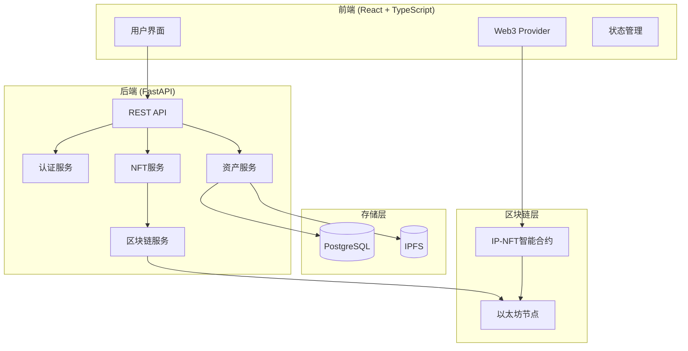
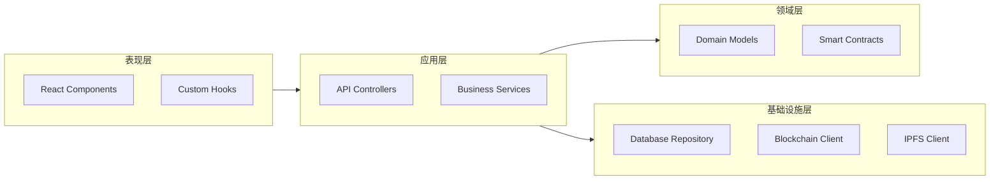
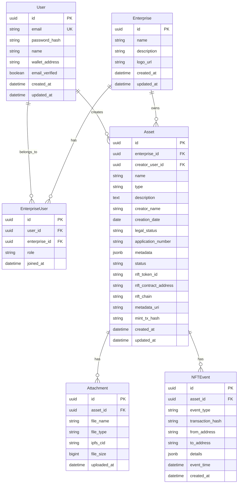

# Design Document

## Overview

本系统是一个基于Web3的企业知识产权管理DApp，采用前后端分离架构。系统通过NFT技术实现IP资产的数字化确权、管理和商业化运营。

**核心设计原则：**
- 前后端完全分离，通过RESTful API通信
- 链上数据与链下数据协同存储
- 智能合约负责核心资产逻辑，后端负责业务编排
- 传统认证系统与区块链钱包绑定分离

## Architecture

### 系统架构图



### 分层架构



## Components and Interfaces

### 前端组件结构

```
src/
├── components/
│   ├── auth/           # 认证相关组件
│   ├── asset/          # 资产管理组件
│   ├── dashboard/      # 仪表板组件
│   ├── nft/            # NFT操作组件
│   └── common/         # 通用组件
├── hooks/
│   ├── useAuth.ts      # 认证Hook
│   ├── useAsset.ts     # 资产Hook
│   ├── useNFT.ts       # NFT操作Hook
│   └── useWeb3.ts      # Web3连接Hook
├── services/
│   ├── api.ts          # API客户端
│   ├── auth.ts         # 认证服务
│   └── blockchain.ts   # 区块链交互
├── store/              # 状态管理
├── types/              # TypeScript类型定义
└── utils/              # 工具函数
```

### 后端模块结构

```
app/
├── api/
│   ├── v1/
│   │   ├── auth.py         # 认证接口
│   │   ├── users.py        # 用户接口
│   │   ├── enterprises.py  # 企业接口
│   │   ├── assets.py       # 资产接口
│   │   └── nft.py          # NFT接口
│   └── deps.py             # 依赖注入
├── core/
│   ├── config.py           # 配置管理
│   ├── security.py         # 安全工具
│   └── blockchain.py       # 区块链客户端
├── models/                 # SQLAlchemy模型
├── schemas/                # Pydantic模式
├── services/               # 业务服务
├── repositories/           # 数据访问层
└── utils/                  # 工具函数
```

### 核心API接口

#### 认证接口

```typescript
// POST /api/v1/auth/register
interface RegisterRequest {
  email: string;
  password: string;
  name: string;
}

// POST /api/v1/auth/login
interface LoginRequest {
  email: string;
  password: string;
}

interface LoginResponse {
  access_token: string;
  refresh_token: string;
  token_type: string;
  expires_in: number;
}

// POST /api/v1/auth/bind-wallet
interface BindWalletRequest {
  wallet_address: string;
  signature: string;  // 签名验证钱包所有权
  message: string;    // 签名的原始消息
}
```

#### 资产接口

```typescript
// POST /api/v1/assets
interface CreateAssetRequest {
  name: string;
  type: 'PATENT' | 'TRADEMARK' | 'COPYRIGHT' | 'TRADE_SECRET' | 'DIGITAL_WORK';
  description: string;
  creator: string;
  creation_date: string;
  legal_status: 'PENDING' | 'GRANTED' | 'EXPIRED';
  application_number?: string;
  attachments: string[];  // IPFS CID列表
  metadata: Record<string, any>;
}

// GET /api/v1/assets
interface AssetListResponse {
  items: Asset[];
  total: number;
  page: number;
  page_size: number;
}

// GET /api/v1/assets/{asset_id}
interface Asset {
  id: string;
  name: string;
  type: AssetType;
  description: string;
  creator: string;
  creation_date: string;
  legal_status: LegalStatus;
  application_number?: string;
  attachments: Attachment[];
  metadata: Record<string, any>;
  nft_token_id?: string;
  nft_contract_address?: string;
  status: 'DRAFT' | 'MINTED' | 'TRANSFERRED' | 'LICENSED' | 'STAKED';
  created_at: string;
  updated_at: string;
}
```

#### NFT接口

```typescript
// POST /api/v1/nft/mint
interface MintNFTRequest {
  asset_id: string;
  chain: 'ETHEREUM' | 'POLYGON' | 'BSC';
}

interface MintNFTResponse {
  token_id: string;
  contract_address: string;
  transaction_hash: string;
  metadata_uri: string;
}

// POST /api/v1/nft/transfer
interface TransferNFTRequest {
  token_id: string;
  to_address: string;
}

// GET /api/v1/nft/{token_id}/history
interface NFTHistoryResponse {
  events: NFTEvent[];
}

interface NFTEvent {
  event_type: 'MINT' | 'TRANSFER' | 'LICENSE' | 'STAKE' | 'UNSTAKE';
  timestamp: string;
  transaction_hash: string;
  from_address?: string;
  to_address?: string;
  details: Record<string, any>;
}
```

### 智能合约接口

```solidity
// SPDX-License-Identifier: MIT
pragma solidity ^0.8.19;

interface IIPNFTContract {
    // 事件
    event NFTMinted(uint256 indexed tokenId, address indexed owner, string metadataURI);
    event NFTTransferred(uint256 indexed tokenId, address indexed from, address indexed to);
    event RoyaltySet(uint256 indexed tokenId, address receiver, uint96 feeNumerator);
    
    // 铸造函数
    function mint(address to, string memory metadataURI) external returns (uint256);
    
    // 查询函数
    function tokenURI(uint256 tokenId) external view returns (string memory);
    function ownerOf(uint256 tokenId) external view returns (address);
    
    // 转移函数
    function safeTransferFrom(address from, address to, uint256 tokenId) external;
    
    // 版税函数 (ERC-2981)
    function royaltyInfo(uint256 tokenId, uint256 salePrice) 
        external view returns (address receiver, uint256 royaltyAmount);
    function setTokenRoyalty(uint256 tokenId, address receiver, uint96 feeNumerator) external;
}
```

## Data Models

### 数据库模型 (PostgreSQL)



### NFT元数据结构 (IPFS存储)

```json
{
  "name": "资产名称",
  "description": "资产描述",
  "image": "ipfs://Qm.../preview.png",
  "external_url": "https://app.example.com/assets/{asset_id}",
  "attributes": [
    {"trait_type": "Asset Type", "value": "PATENT"},
    {"trait_type": "Creator", "value": "创作人姓名"},
    {"trait_type": "Creation Date", "value": "2024-01-15"},
    {"trait_type": "Legal Status", "value": "GRANTED"},
    {"trait_type": "Application Number", "value": "CN202410001234.5"}
  ],
  "properties": {
    "ip_metadata": {
      "creator": "创作人姓名",
      "creation_date": "2024-01-15",
      "rights_declaration": "版权声明内容",
      "attachments": [
        {"name": "patent_doc.pdf", "cid": "Qm..."},
        {"name": "design.png", "cid": "Qm..."}
      ]
    }
  }
}
```


## Correctness Properties

*A property is a characteristic or behavior that should hold true across all valid executions of a system-essentially, a formal statement about what the system should do. Properties serve as the bridge between human-readable specifications and machine-verifiable correctness guarantees.*

### Property 1: 认证凭据验证一致性
*For any* 用户凭据组合（邮箱和密码），如果凭据有效（邮箱存在且密码匹配），认证系统应返回有效JWT令牌；如果凭据无效，系统应拒绝登录并返回错误信息。
**Validates: Requirements 1.1, 1.2**

### Property 2: JWT令牌有效性
*For any* JWT令牌，如果令牌未过期且签名有效，系统应接受该令牌进行认证；如果令牌过期或签名无效，系统应拒绝认证。
**Validates: Requirements 1.5**

### Property 3: 用户注册唯一性
*For any* 注册请求，如果邮箱未被使用，系统应创建新用户账户并返回唯一用户标识；如果邮箱已存在，系统应拒绝注册。
**Validates: Requirements 1.3**

### Property 4: 企业标识唯一性
*For any* 企业创建操作，系统应生成全局唯一的企业标识，且创建者自动成为该企业的管理员。
**Validates: Requirements 2.1**

### Property 5: 角色权限一致性
*For any* 用户和企业角色组合，系统分配的操作权限应与角色定义完全匹配，不同角色的权限集合应正确区分。
**Validates: Requirements 2.3**

### Property 6: 资产元数据验证完整性
*For any* 资产创建请求，如果所有必填字段（名称、类型、描述、创作人、创作日期）都已填写，系统应保存资产并返回唯一标识；如果缺少必填字段，系统应拒绝保存并指明缺失字段。
**Validates: Requirements 3.2, 3.3**

### Property 7: IPFS存储一致性
*For any* 上传的文件，存储到IPFS后返回的CID应能够用于检索到原始文件内容，且内容哈希应与CID一致。
**Validates: Requirements 3.1**

### Property 8: NFT元数据序列化Round-Trip
*For any* 有效的NFT元数据对象，序列化为JSON后再反序列化应得到与原始对象等价的结构化数据。
**Validates: Requirements 5.5, 5.6**

### Property 9: NFT铸造所有权正确性
*For any* 成功的NFT铸造操作，铸造后的NFT所有者应为发起铸造的用户绑定的钱包地址，且tokenId应全局唯一。
**Validates: Requirements 4.1, 4.2, 5.2**

### Property 10: NFT铸造记录完整性
*For any* 成功的NFT铸造操作，系统应记录有效的交易哈希，且该哈希应能在区块链上查询到对应的交易。
**Validates: Requirements 4.3**

### Property 11: 资产筛选结果正确性
*For any* 资产列表筛选操作（按类型、状态或时间范围），返回的所有资产应满足筛选条件，且不应遗漏任何满足条件的资产。
**Validates: Requirements 6.2, 6.3, 6.4**

### Property 12: NFT转移权限验证
*For any* NFT转移请求，只有当前NFT所有者才能成功发起转移；非所有者的转移请求应被拒绝。
**Validates: Requirements 7.1, 7.5**

### Property 13: NFT转移完整性
*For any* 成功的NFT转移操作，链上所有权应更新为目标地址，本地数据库记录应同步更新，且转移事件应被记录到资产历史中。
**Validates: Requirements 7.2, 7.3, 7.4**

### Property 14: 资产历史完整性
*For any* IP-NFT资产，查询其历史记录应返回从铸造开始的所有事件，每个事件应包含事件类型、时间戳和交易哈希。
**Validates: Requirements 8.1, 8.2**

### Property 15: 资产看板完整性
*For any* 企业用户访问权属看板，返回的资产列表应包含该企业名下的所有IP-NFT资产，不应遗漏或包含其他企业的资产。
**Validates: Requirements 6.1**

## Error Handling

### 前端错误处理策略

```typescript
// 统一错误类型定义
interface APIError {
  code: string;
  message: string;
  details?: Record<string, any>;
}

// 错误处理层级
// 1. 网络层错误 - 连接超时、网络不可用
// 2. HTTP层错误 - 4xx客户端错误、5xx服务端错误
// 3. 业务层错误 - 验证失败、权限不足、资源不存在
// 4. 区块链层错误 - 交易失败、Gas不足、合约调用失败
```

### 后端错误处理策略

```python
# 自定义异常类
class IPNFTException(Exception):
    def __init__(self, code: str, message: str, status_code: int = 400):
        self.code = code
        self.message = message
        self.status_code = status_code

class AuthenticationError(IPNFTException):
    """认证相关错误"""
    pass

class AuthorizationError(IPNFTException):
    """授权相关错误"""
    pass

class AssetNotFoundError(IPNFTException):
    """资产不存在错误"""
    pass

class BlockchainError(IPNFTException):
    """区块链交互错误"""
    pass

class IPFSError(IPNFTException):
    """IPFS存储错误"""
    pass
```

### 区块链错误处理

| 错误类型 | 处理策略 |
|---------|---------|
| Gas不足 | 提示用户充值Gas费用 |
| 交易被拒绝 | 记录错误详情，提示用户重试 |
| 合约调用失败 | 解析revert原因，返回具体错误信息 |
| 网络拥堵 | 建议提高Gas价格或稍后重试 |
| 钱包未连接 | 引导用户连接钱包 |

## Testing Strategy

### 测试框架选择

| 层级 | 框架 | 用途 |
|-----|------|-----|
| 前端单元测试 | Jest + React Testing Library | 组件和Hook测试 |
| 前端属性测试 | fast-check | 属性基测试 |
| 后端单元测试 | pytest | API和服务测试 |
| 后端属性测试 | Hypothesis | 属性基测试 |
| 智能合约测试 | Hardhat + Chai | 合约功能测试 |
| 合约属性测试 | Foundry (forge) | 模糊测试和属性测试 |
| E2E测试 | Playwright | 端到端流程测试 |

### 双重测试策略

**单元测试职责：**
- 验证特定示例和边界情况
- 测试组件间集成点
- 验证错误处理逻辑
- 测试具体业务场景

**属性基测试职责：**
- 验证跨所有输入的通用属性
- 发现边界条件和极端情况
- 验证数据转换的正确性（如序列化round-trip）
- 测试不变量保持

### 属性基测试配置

```python
# Hypothesis配置 - 后端
from hypothesis import settings, Phase

@settings(
    max_examples=100,  # 每个属性至少运行100次
    phases=[Phase.generate, Phase.target, Phase.shrink],
    deadline=None
)
def test_property():
    pass
```

```typescript
// fast-check配置 - 前端
import fc from 'fast-check';

fc.assert(
  fc.property(
    fc.string(),
    (input) => {
      // 属性断言
    }
  ),
  { numRuns: 100 }  // 每个属性至少运行100次
);
```

### 测试注释规范

每个属性基测试必须包含以下注释格式：
```
**Feature: ip-nft-management, Property {number}: {property_text}**
```

示例：
```python
def test_metadata_round_trip():
    """
    **Feature: ip-nft-management, Property 8: NFT元数据序列化Round-Trip**
    """
    pass
```

### 智能合约测试策略

```solidity
// Foundry模糊测试示例
contract IPNFTTest is Test {
    IPNFT public nft;
    
    function setUp() public {
        nft = new IPNFT();
    }
    
    // 模糊测试：铸造后所有权正确
    function testFuzz_MintOwnership(address to, string memory uri) public {
        vm.assume(to != address(0));
        uint256 tokenId = nft.mint(to, uri);
        assertEq(nft.ownerOf(tokenId), to);
    }
    
    // 模糊测试：tokenId唯一性
    function testFuzz_TokenIdUniqueness(uint256 count) public {
        vm.assume(count > 0 && count < 100);
        uint256[] memory tokenIds = new uint256[](count);
        for (uint256 i = 0; i < count; i++) {
            tokenIds[i] = nft.mint(address(this), "uri");
        }
        // 验证所有tokenId唯一
        for (uint256 i = 0; i < count; i++) {
            for (uint256 j = i + 1; j < count; j++) {
                assertTrue(tokenIds[i] != tokenIds[j]);
            }
        }
    }
}
```
