# IP-NFT 企业资产管理系统

## 系统架构设计文档

> 用于学术论文的系统架构图

---

## 目录

1. [系统整体架构](#1-系统整体架构)
2. [前端应用架构](#2-前端应用架构)
3. [后端服务架构](#3-后端服务架构)
   - [3.1 后端架构图（垂直布局）](#31-后端架构图垂直布局)
   - [3.2 后端技术栈](#32-后端技术栈)
   - [3.3 API端点一览表](#33-api端点一览表)
   - [3.4 核心服务依赖关系](#34-核心服务依赖关系)
4. [智能合约架构](#4-智能合约架构)
5. [数据流架构](#5-数据流架构)
   - [5.1 数据流时序图](#51-数据流时序图)
   - [5.2 用户认证数据流](#52-用户认证数据流)
   - [5.3 企业管理数据流](#53-企业管理数据流)
   - [5.4 资产管理数据流](#54-资产管理数据流)
   - [5.5 NFT铸造数据流](#55-nft铸造数据流)
   - [5.6 审批流程数据流](#56-审批流程数据流)
   - [5.7 文件上传数据流](#57-文件上传数据流)
   - [5.8 核心数据模型关系](#58-核心数据模型关系)
   - [5.9 状态流转图](#59-状态流转图)
   - [5.10 权限控制数据流](#510-权限控制数据流)
6. [系统部署架构](#6-系统部署架构)
7. [安全架构](#7-安全架构)

---

## 1. 系统整体架构

### 1.1 架构概览图

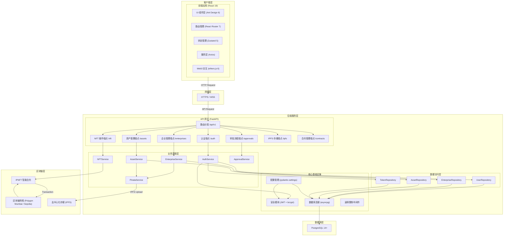
```mermaid
graph TB
    subgraph Client Layer ["客户端层"]
        subgraph Frontend ["前端应用 (React 19)"]
            UI["UI 组件层 (Ant Design 6)"]
            Router["路由管理 (React Router 7)"]
            State["状态管理 (Zustand 5)"]
            Services["服务层 (Axios)"]
            Web3["Web3 交互 (ethers.js 6)"]
        end
    end
    
    subgraph Network ["网络层"]
        HTTPS["HTTPS / WSS"]
    end
    
    subgraph Backend Layer ["后端服务层"]
        subgraph API ["API 网关 (FastAPI)"]
            Router_B["路由分发 /api/v1"]
            Auth_API["认证端点 /auth"]
            Enterprise_API["企业管理端点 /enterprises"]
            Asset_API["资产管理端点 /assets"]
            NFT_API["NFT 操作端点 /nft"]
            Approval_API["审批流程端点 /approvals"]
            IPFS_API["IPFS 存储端点 /ipfs"]
            Contract_API["合约管理端点 /contracts"]
        end
        
        subgraph Services_Layer ["业务逻辑层"]
            Auth_Svc["AuthService"]
            Enterprise_Svc["EnterpriseService"]
            Asset_Svc["AssetService"]
            NFT_Svc["NFTService"]
            Approval_Svc["ApprovalService"]
            Pinata_Svc["PinataService"]
        end
        
        subgraph Data_Layer ["数据访问层"]
            User_Repo["UserRepository"]
            Enterprise_Repo["EnterpriseRepository"]
            Asset_Repo["AssetRepository"]
            Token_Repo["TokenRepository"]
        end
        
        subgraph Core ["核心基础设施"]
            Security["安全模块 (JWT + bcrypt)"]
            DB["数据库连接 (asyncpg)"]
            Rate_Limiter["速率限制中间件"]
            Config["配置管理 (pydantic-settings)"]
        end
    end
    
    subgraph Blockchain Layer ["区块链层"]
        BC_Network["区块链网络 (Polygon Mumbai / Sepolia)"]
        IPNFT_Contract["IPNFT 智能合约"]
        IPFS_Storage["去中心化存储 (IPFS)"]
    end
    
    subgraph Database ["数据库层"]
        PostgreSQL["PostgreSQL 14+"]
    end
    
    %% Frontend connections
    Frontend -->|HTTP Request| HTTPS
    HTTPS -->|API Request| Router_B
    
    %% Backend internal
    Router_B --> Auth_API
    Router_B --> Enterprise_API
    Router_B --> Asset_API
    Router_B --> NFT_API
    Router_B --> Approval_API
    Router_B --> IPFS_API
    Router_B --> Contract_API
    
    Auth_API --> Auth_Svc
    Enterprise_API --> Enterprise_Svc
    Asset_API --> Asset_Svc
    NFT_API --> NFT_Svc
    Approval_API --> Approval_Svc
    
    Auth_Svc --> Security
    Auth_Svc --> User_Repo
    Auth_Svc --> Token_Repo
    
    Enterprise_Svc --> Enterprise_Repo
    Asset_Svc --> Asset_Repo
    
    Enterprise_Svc --> Pinata_Svc
    Asset_Svc --> Pinata_Svc
    
    Pinata_Svc -->|IPFS Upload| IPFS_Storage
    
    NFT_Svc --> IPNFT_Contract
    IPNFT_Contract -->|Transaction| BC_Network
    BC_Network --> IPNFT_Contract
    
    %% Database connections
    User_Repo --> DB
    Enterprise_Repo --> DB
    Asset_Repo --> DB
    Token_Repo --> DB
    DB --> PostgreSQL
    
    %% Config
    Config --> Security
    Config --> DB
```

### 1.2 技术栈总览

| 层次 | 技术栈 |
|------|--------|
| **前端框架** | React 19 + TypeScript + Vite |
| **后端框架** | FastAPI + Python 3.12 |
| **数据库** | PostgreSQL 14+ + SQLAlchemy 2.0 + asyncpg |
| **智能合约** | Solidity 0.8.20 + Hardhat + OpenZeppelin |
| **区块链** | Polygon Mumbai + Sepolia + BSC Testnet |
| **去中心化存储** | IPFS + Pinata Cloud |

### 1.3 系统特性

- **分布式架构**：前端与后端松耦合，便于独立部署和扩展
- **区块链集成**：使用以太坊虚拟机兼容链进行NFT铸造和所有权管理
- **异步处理**：后端采用异步I/O，提高并发处理能力
- **多角色权限**：基于RBAC的企业成员权限管理体系

---

## 2. 前端应用架构

### 2.1 前端架构图


```mermaid
graph TB
    subgraph Pages ["页面层"]
        Auth["认证页面 /auth"]
        Dashboard["权属看板 /dashboard"]
        Enterprise["企业管理 /enterprises"]
        Enterprise_Detail["企业详情 /enterprises/:id"]
        Assets["资产管理 /assets"]
        NFT["NFT 管理 /nft"]
        NFT_Dashboard["NFT 看板 /nft/dashboard"]
        NFT_Minting["NFT 铸造 /nft/minting"]
        NFT_History["NFT 历史 /nft/history"]
        NFT_Contracts["合约管理 /nft/contracts"]
        Approvals["审批流程 /approvals"]
        BlockExplorer["区块链浏览器 /blockchain-explorer"]
    end
    
    subgraph Components ["组件层"]
        Layout["Layout 布局组件"]
        Protected["ProtectedRoute 路由守卫"]
        Auth_Components["LoginForm RegisterForm"]
        Enterprise_Components["EnterpriseList EnterpriseForm MemberList"]
        Asset_Components["AssetList AssetForm FileUpload"]
        NFT_Components["NFTDashboard NFTMinting NFTHistory"]
        Common["ErrorNotification"]
    end
    
    subgraph Store ["Zustand 状态管理"]
        Auth_Store["useAuthStore 用户认证状态"]
        Web3_Store["useWeb3Store 区块链连接状态"]
        Enterprise_Store["useEnterpriseStore 企业管理状态"]
    end
    
    subgraph Services ["服务层"]
        API["apiClient (Axios 实例)"]
        Auth_Service["authService 认证服务"]
        Enterprise_Service["enterpriseService 企业服务"]
        Asset_Service["assetService 资产服务"]
        NFT_Service["nftService NFT 服务"]
    end
    
    subgraph Web3_Module ["Web3 模块"]
        ethers["ethers.js v6"]
        Wallet["MetaMask 钱包"]
        Contract["合约 ABI 交互"]
    end
    
    %% Page to Component
    Auth --> Auth_Components
    Enterprise --> Enterprise_Components
    Assets --> Asset_Components
    NFT --> NFT_Components
    NFT_Dashboard --> NFT_Components
    NFT_Minting --> NFT_Components
    
    %% Layout connections
    Layout --> Protected
    Protected --> Pages
    
    %% Store connections
    Auth_Components --> Auth_Store
    Enterprise_Components --> Enterprise_Store
    NFT_Minting --> Web3_Store
    
    %% Services
    Auth_Store --> Auth_Service
    Enterprise_Store --> Enterprise_Service
    Asset_Components --> Asset_Service
    NFT_Components --> NFT_Service
    
    Auth_Service --> API
    Enterprise_Service --> API
    Asset_Service --> API
    NFT_Service --> API
    
    %% Web3
    NFT_Minting --> ethers
    ethers --> Wallet
    ethers --> Contract
```

### 2.2 前端技术栈

| 模块 | 技术选型 |
|------|----------|
| UI框架 | Ant Design 6.2.3 |
| 状态管理 | Zustand 5.0.9 |
| 路由 | React Router 7.10.1 |
| HTTP客户端 | Axios 1.13.2 |
| Web3 | ethers.js 6.16.0 |
| 构建工具 | Vite 7.2.4 |

### 2.3 核心模块

#### 状态管理 (Zustand)

- **useAuthStore**: 用户认证状态管理，包含登录状态和JWT令牌
- **useWeb3Store**: 区块链连接状态，管理钱包连接和链信息
- **useEnterpriseStore**: 企业状态管理，包含企业列表和成员管理

#### 路由管理 (React Router)

- **受保护路由**：未登录用户自动重定向至登录页
- **嵌套路由**：支持多级布局嵌套

---

## 3. 后端服务架构

### 3.1 后端架构图（垂直布局）

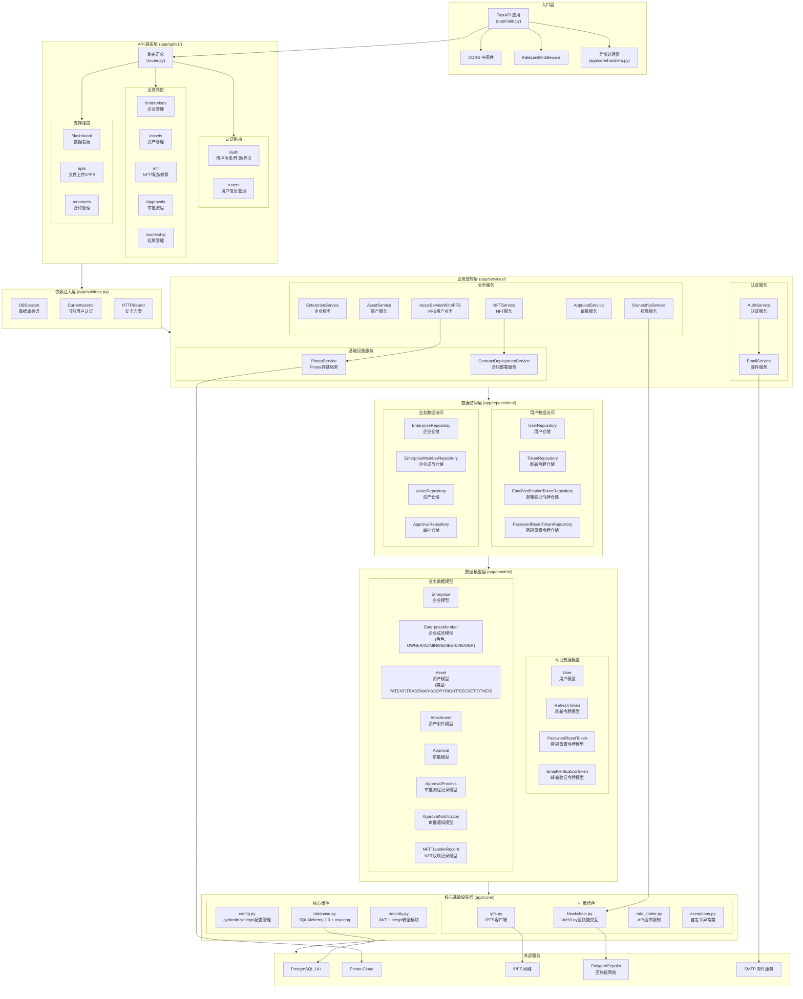
```mermaid
graph TB
    subgraph Entry["入口层"]
        direction TB
        App["FastAPI 应用<br/>(app/main.py)"]
        CORS["CORS 中间件"]
        RateLimit["RateLimitMiddleware"]
        ExceptionH["异常处理器<br/>(app/core/handlers.py)"]
    end

    subgraph APILayer["API 路由层 (app/api/v1/)"]
        direction TB
        Router["路由汇总<br/>(router.py)"]
        
        subgraph AuthRoutes["认证路由"]
            direction LR
            auth["/auth<br/>用户注册/登录/登出"]
            users["/users<br/>用户信息管理"]
        end
        
        subgraph BusinessRoutes["业务路由"]
            direction LR
            enterprises["/enterprises<br/>企业管理"]
            assets["/assets<br/>资产管理"]
            nft["/nft<br/>NFT铸造/转移"]
            approvals["/approvals<br/>审批流程"]
            ownership["/ownership<br/>权属管理"]
        end
        
        subgraph SupportRoutes["支撑路由"]
            direction LR
            dashboard["/dashboard<br/>数据看板"]
            ipfs["/ipfs<br/>文件上传/IPFS"]
            contracts["/contracts<br/>合约管理"]
        end
        
        Router --> AuthRoutes
        Router --> BusinessRoutes
        Router --> SupportRoutes
    end

    subgraph DepsLayer["依赖注入层 (app/api/deps.py)"]
        direction TB
        DBSession["DBSession<br/>数据库会话"]
        CurrentUser["CurrentUserId<br/>当前用户认证"]
        SecurityScheme["HTTPBearer<br/>安全方案"]
    end

    subgraph ServiceLayer["业务逻辑层 (app/services/)"]
        direction TB
        
        subgraph AuthServices["认证服务"]
            direction LR
            AuthService["AuthService<br/>认证服务"]
            EmailService["EmailService<br/>邮件服务"]
        end
        
        subgraph BusinessServices["业务服务"]
            direction LR
            EnterpriseService["EnterpriseService<br/>企业服务"]
            AssetService["AssetService<br/>资产服务"]
            AssetIPFS["AssetServiceWithIPFS<br/>IPFS资产业务"]
            NFTService["NFTService<br/>NFT服务"]
            ApprovalService["ApprovalService<br/>审批服务"]
            OwnershipService["OwnershipService<br/>权属服务"]
        end
        
        subgraph InfraServices["基础设施服务"]
            direction LR
            PinataService["PinataService<br/>Pinata存储服务"]
            ContractDeploy["ContractDeploymentService<br/>合约部署服务"]
        end
    end

    subgraph RepositoryLayer["数据访问层 (app/repositories/)"]
        direction TB
        
        subgraph UserRepos["用户数据访问"]
            direction LR
            UserRepo["UserRepository<br/>用户仓储"]
            TokenRepo["TokenRepository<br/>刷新令牌仓储"]
            EmailTokenRepo["EmailVerificationTokenRepository<br/>邮箱验证令牌仓储"]
            PwdResetRepo["PasswordResetTokenRepository<br/>密码重置令牌仓储"]
        end
        
        subgraph BizRepos["业务数据访问"]
            direction LR
            EnterpriseRepo["EnterpriseRepository<br/>企业仓储"]
            EnterpriseMemberRepo["EnterpriseMemberRepository<br/>企业成员仓储"]
            AssetRepo["AssetRepository<br/>资产仓储"]
            ApprovalRepo["ApprovalRepository<br/>审批仓储"]
        end
    end

    subgraph ModelLayer["数据模型层 (app/models/)"]
        direction TB
        
        subgraph AuthModels["认证数据模型"]
            direction LR
            User["User<br/>用户模型"]
            RefreshToken["RefreshToken<br/>刷新令牌模型"]
            PwdReset["PasswordResetToken<br/>密码重置令牌模型"]
            EmailToken["EmailVerificationToken<br/>邮箱验证令牌模型"]
        end
        
        subgraph BizModels["业务数据模型"]
            direction LR
            Enterprise["Enterprise<br/>企业模型"]
            EnterpriseMember["EnterpriseMember<br/>企业成员模型<br/>(角色: OWNER/ADMIN/MEMBER/VIEWER)"]
            Asset["Asset<br/>资产模型<br/>(类型: PATENT/TRADEMARK/COPYRIGHT/SECRET/OTHER)"]
            Attachment["Attachment<br/>资产附件模型"]
            Approval["Approval<br/>审批模型"]
            ApprovalProcess["ApprovalProcess<br/>审批流程记录模型"]
            ApprovalNotification["ApprovalNotification<br/>审批通知模型"]
            NFTRecord["NFTTransferRecord<br/>NFT权属记录模型"]
        end
    end

    subgraph CoreLayer["核心基础设施层 (app/core/)"]
        direction TB
        
        subgraph CoreCore["核心组件"]
            direction LR
            Config["config.py<br/>pydantic-settings配置管理"]
            Database["database.py<br/>SQLAlchemy 2.0 + asyncpg"]
            Security["security.py<br/>JWT + bcrypt安全模块"]
        end
        
        subgraph CoreExt["扩展组件"]
            direction LR
            Blockchain["blockchain.py<br/>Web3.py区块链交互"]
            IPFS["ipfs.py<br/>IPFS客户端"]
            RateLimiterCore["rate_limiter.py<br/>API速率限制"]
            Exceptions["exceptions.py<br/>自定义异常类"]
        end
    end

    subgraph External["外部服务"]
        direction TB
        PostgreSQL["PostgreSQL 14+"]
        Pinata["Pinata Cloud"]
        IPFSNetwork["IPFS 网络"]
        BlockchainNet["Polygon/Sepolia<br/>区块链网络"]
        SMTP["SMTP 邮件服务"]
    end

    %% Entry connections
    App --> CORS
    App --> RateLimit
    App --> ExceptionH
    App --> Router

    %% API to Deps
    APILayer --> DepsLayer

    %% Deps to Services
    DepsLayer --> ServiceLayer

    %% Service connections
    ServiceLayer --> RepositoryLayer
    AuthService --> EmailService
    AssetIPFS --> PinataService
    NFTService --> ContractDeploy
    OwnershipService --> Blockchain

    %% Repository connections
    RepositoryLayer --> ModelLayer

    %% Model to Core
    ModelLayer --> CoreLayer

    %% Core to External
    CoreLayer --> External
    Database --> PostgreSQL
    PinataService --> Pinata
    IPFS --> IPFSNetwork
    Blockchain --> BlockchainNet
    EmailService --> SMTP
```

### 3.2 后端目录结构

```
backend/
├── app/
│   ├── api/                    # API 路由层
│   │   ├── deps.py            # 依赖注入 (DBSession, CurrentUserId)
│   │   └── v1/               # API v1 版本
│   │       ├── router.py     # 路由汇总
│   │       ├── auth.py       # 认证 (/auth)
│   │       ├── users.py       # 用户 (/users)
│   │       ├── enterprises.py # 企业 (/enterprises)
│   │       ├── assets.py     # 资产 (/assets)
│   │       ├── asset_with_attachments.py # 带附件资产
│   │       ├── nft.py        # NFT (/nft)
│   │       ├── dashboard.py   # 看板 (/dashboard)
│   │       ├── approvals.py   # 审批 (/approvals)
│   │       ├── ipfs.py       # IPFS (/ipfs)
│   │       ├── contracts.py   # 合约 (/contracts)
│   │       └── ownership.py   # 权属 (/ownership)
│   │
│   ├── core/                 # 核心基础设施
│   │   ├── config.py        # 配置管理
│   │   ├── database.py      # 数据库连接
│   │   ├── security.py       # JWT + bcrypt
│   │   ├── rate_limiter.py  # 速率限制
│   │   ├── blockchain.py     # 区块链交互
│   │   ├── ipfs.py          # IPFS 客户端
│   │   ├── exceptions.py    # 自定义异常
│   │   └── handlers.py      # 异常处理器
│   │
│   ├── models/               # 数据模型层
│   │   ├── user.py          # 用户模型
│   │   ├── refresh_token.py # 刷新令牌模型
│   │   ├── password_reset_token.py # 密码重置令牌模型
│   │   ├── email_verification_token.py # 邮箱验证令牌模型
│   │   ├── enterprise.py    # 企业 + 成员模型
│   │   ├── asset.py         # 资产 + 附件模型
│   │   ├── approval.py      # 审批流程模型
│   │   └── ownership.py     # NFT 权属记录模型
│   │
│   ├── repositories/         # 数据访问层
│   │   ├── user_repository.py # 用户仓储
│   │   ├── token_repository.py # 刷新令牌仓储
│   │   ├── password_reset_token_repository.py # 密码重置令牌仓储
│   │   ├── email_verification_token_repository.py # 邮箱验证令牌仓储
│   │   ├── enterprise_repository.py # 企业仓储
│   │   └── asset_repository.py # 资产仓储
│   │
│   ├── schemas/             # Pydantic 模式定义
│   │   ├── auth.py
│   │   ├── enterprise.py
│   │   ├── asset.py
│   │   ├── approval.py
│   │   └── response.py
│   │
│   ├── services/           # 业务逻辑层
│   │   ├── auth_service.py
│   │   ├── enterprise_service.py
│   │   ├── asset_service.py
│   │   ├── asset_service_with_ipfs.py
│   │   ├── nft_service.py
│   │   ├── ownership_service.py
│   │   ├── approval_service.py
│   │   ├── email_service.py
│   │   ├── pinata_service.py
│   │   └── contract_deployment_service.py
│   │
│   ├── utils/              # 工具函数
│   └── main.py             # 应用入口
│
├── alembic/                # 数据库迁移
├── tests/                 # 测试代码
└── requirements.txt        # 依赖清单
```

### 3.2 后端技术栈

| 组件 | 技术选型 | 说明 |
|------|----------|------|
| Web框架 | FastAPI 0.115.0 + Uvicorn 0.30.6 | 异步API框架 |
| ORM | SQLAlchemy 2.0.35 + asyncpg 0.30.0 | 异步数据库访问 |
| 认证 | python-jose 3.3.0 + passlib 1.7.4 | JWT令牌 + 密码哈希 |
| Web3 | web3.py 7.3.0 | 以太坊区块链交互 |
| IPFS | ipfshttpclient 0.8.0 | IPFS网络通信 |
| 配置 | pydantic-settings 2.7.0 | 环境变量管理 |
| 数据库迁移 | Alembic 1.13.3 | 数据库版本管理 |
| 邮件 | Jinja2 3.1.0 | 邮件模板渲染 |

### 3.3 API端点一览表

| 前缀 | 路由文件 | 功能 | 核心端点 |
|------|----------|------|----------|
| `/api/v1/auth` | auth.py | 认证模块 | register, login, logout, refresh, bind-wallet, forgot-password, verify-email |
| `/api/v1/users` | users.py | 用户管理 | /me, /{id} |
| `/api/v1/enterprises` | enterprises.py | 企业管理 | CRUD, /members, /{id}/wallet |
| `/api/v1/assets` | assets.py | 资产管理 | CRUD, /{id}/attachments, /{id}/submit |
| `/api/v1/assets` | asset_with_attachments.py | 带附件资产 | 自动上传附件版本 |
| `/api/v1/nft` | nft.py | NFT操作 | /mint, /batch-mint, /transfer, /{id}/history |
| `/api/v1/dashboard` | dashboard.py | 数据看板 | /assets (TODO) |
| `/api/v1/approvals` | approvals.py | 审批流程 | /pending, /{id}/process, /notifications/* |
| `/api/v1/ipfs` | ipfs.py | 文件存储 | /upload, /upload/json, /gateway/{cid} |
| `/api/v1/contracts` | contracts.py | 合约管理 | /deploy, /info, /update-address, /status |
| `/api/v1/ownership` | ownership.py | 权属管理 | /{enterprise_id}/assets, /assets/{token_id}, /transfer |

### 3.4 核心服务依赖关系

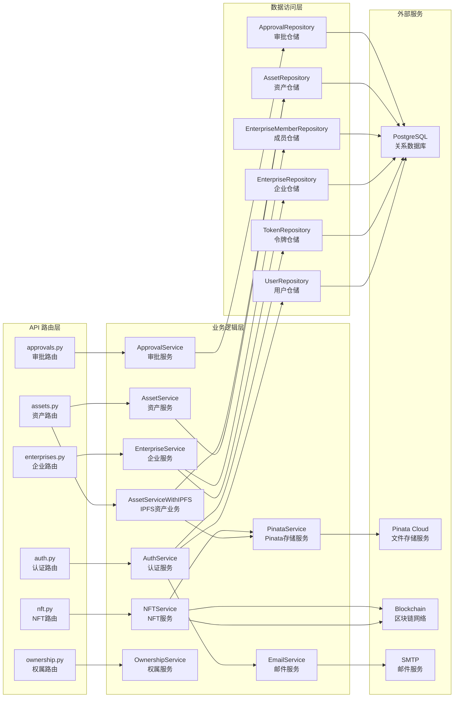
```mermaid
graph LR
    subgraph API["API 路由层"]
        authAPI["auth.py<br/>认证路由"]
        entAPI["enterprises.py<br/>企业路由"]
        assetAPI["assets.py<br/>资产路由"]
        nftAPI["nft.py<br/>NFT路由"]
        approvalAPI["approvals.py<br/>审批路由"]
        ownAPI["ownership.py<br/>权属路由"]
    end

    subgraph Services["业务逻辑层"]
        AuthService["AuthService<br/>认证服务"]
        EnterpriseService["EnterpriseService<br/>企业服务"]
        AssetService["AssetService<br/>资产服务"]
        AssetIPFS["AssetServiceWithIPFS<br/>IPFS资产业务"]
        NFTService["NFTService<br/>NFT服务"]
        ApprovalService["ApprovalService<br/>审批服务"]
        OwnershipService["OwnershipService<br/>权属服务"]
        EmailService["EmailService<br/>邮件服务"]
        PinataService["PinataService<br/>Pinata存储服务"]
    end

    subgraph Repos["数据访问层"]
        UserRepo["UserRepository<br/>用户仓储"]
        TokenRepo["TokenRepository<br/>令牌仓储"]
        EnterpriseRepo["EnterpriseRepository<br/>企业仓储"]
        EnterpriseMemberRepo["EnterpriseMemberRepository<br/>成员仓储"]
        AssetRepo["AssetRepository<br/>资产仓储"]
        ApprovalRepo["ApprovalRepository<br/>审批仓储"]
    end

    subgraph External["外部服务"]
        PostgreSQL["PostgreSQL<br/>关系数据库"]
        Pinata["Pinata Cloud<br/>文件存储服务"]
        Blockchain["Blockchain<br/>区块链网络"]
        SMTP["SMTP<br/>邮件服务"]
    end

    %% API to Service
    authAPI --> AuthService
    entAPI --> EnterpriseService
    assetAPI --> AssetService
    assetAPI --> AssetIPFS
    nftAPI --> NFTService
    approvalAPI --> ApprovalService
    ownAPI --> OwnershipService

    %% Service to Service
    AuthService --> EmailService
    AssetIPFS --> PinataService
    NFTService --> PinataService
    NFTService --> Blockchain

    %% Service to Repo
    AuthService --> UserRepo
    AuthService --> TokenRepo
    EnterpriseService --> EnterpriseRepo
    EnterpriseService --> EnterpriseMemberRepo
    AssetService --> AssetRepo
    AssetIPFS --> AssetRepo
    ApprovalService --> ApprovalRepo

    %% Repo to DB
    UserRepo --> PostgreSQL
    TokenRepo --> PostgreSQL
    EnterpriseRepo --> PostgreSQL
    EnterpriseMemberRepo --> PostgreSQL
    AssetRepo --> PostgreSQL
    ApprovalRepo --> PostgreSQL

    %% Services to External
    PinataService --> Pinata
    NFTService --> Blockchain
    EmailService --> SMTP
```

---

## 4. 智能合约架构

### 4.1 合约架构图


```mermaid
graph TB
    subgraph IPNFT_Contract ["IPNFT 智能合约"]
        subgraph Standards ["继承的标准"]
            ERC721["ERC721 NFT标准"]
            ERC721_URI["ERC721URIStorage 元数据存储"]
            ERC721_Enum["ERC721Enumerable 代币枚举"]
            ERC2981["ERC2981 版税标准"]
            Ownable["Ownable 管理员权限"]
        end
        
        subgraph Security ["安全机制"]
            ReentrancyGuard["ReentrancyGuard 重入攻击防护"]
            Pausable["Pausable 紧急暂停功能"]
            InputValidation["输入验证 参数校验"]
        end
        
        subgraph Core_Features ["核心功能"]
            Mint["mint() 铸造 NFT"]
            MintRoyalty["mintWithRoyalty() 带版税铸造"]
            BatchMint["batchMint() 批量铸造"]
            Transfer["transferNFT() 转移 NFT"]
            Metadata["元数据管理 tokenURI/updateTokenURI"]
            Royalty["版税管理 setTokenRoyalty/lockRoyalty"]
        end
        
        subgraph Mappings ["数据映射"]
            MintTimestamps["mintTimestamps 铸造时间戳"]
            OriginalCreators["originalCreators 原始创建者"]
            MetadataLocked["metadataLocked 元数据锁定"]
            RoyaltyLocked["royaltyLocked 版税锁定"]
            TransferWhitelist["transferWhitelist 转移白名单"]
        end
        
        subgraph Events ["事件"]
            NFTMinted["NFTMinted 铸造事件"]
            NFTBurned["NFTBurned 销毁事件"]
            NFTTransferred["NFTTransferred 转移事件"]
            MetadataUpdated["MetadataUpdated 元数据更新"]
            RoyaltySet["RoyaltySet 版税设置"]
        end
    end
    
    subgraph Blockchain_Networks ["支持的区块链网络"]
        Polygon["Polygon Mumbai"]
        Sepolia["Sepolia Testnet"]
        BSC["BSC Testnet"]
        LocalNode["本地节点 (Hardhat Node)"]
    end
    
    subgraph Storage ["去中心化存储"]
        IPFS["IPFS 元数据存储"]
        Pinata["Pinata Cloud 元数据上传服务"]
    end
    
    %% Contract internal
    ERC721 --> ERC721_URI
    ERC721 --> ERC721_Enum
    ERC2981 --> Standards
    Ownable --> Standards
    ReentrancyGuard --> Security
    Pausable --> Security
    
    Mint --> MintTimestamps
    Mint --> OriginalCreators
    MintRoyalty --> Mint
    BatchMint --> Mint
    Transfer --> TransferWhitelist
    Metadata --> MetadataLocked
    Royalty --> RoyaltyLocked
    
    %% External connections
    IPNFT_Contract -->|部署| Polygon
    IPNFT_Contract -->|部署| Sepolia
    IPNFT_Contract -->|部署| BSC
    IPNFT_Contract -->|部署| LocalNode
    
    Mint -->|元数据URI| IPFS
    MintRoyalty -->|元数据URI| IPFS
    BatchMint -->|元数据URI| IPFS
    
    Pinata -->|上传| IPFS
```

### 4.2 合约特性

#### 标准继承

- **ERC-721**: 标准NFT接口
- **ERC-721URIStorage**: 元数据管理
- **ERC-721Enumerable**: 代币枚举查询
- **ERC-2981**: NFT版税标准

#### 安全特性

- **ReentrancyGuard**: 防止重入攻击
- **Ownable**: 管理员权限控制
- **Pausable**: 紧急暂停功能
- **转移锁定时间**: 铸造后需等待才能转移
- **转移白名单**: 可选的接收方白名单

#### 核心功能

| 函数 | 功能 |
|------|------|
| `mint()` | 铸造新IP-NFT |
| `mintWithRoyalty()` | 带版税信息铸造 |
| `batchMint()` | 批量铸造 (最多50个) |
| `transferNFT()` | 带原因的NFT转移 |
| `burn()` | 销毁NFT |
| `setTokenRoyalty()` | 设置代币版税 |
| `lockRoyalty()` | 永久锁定版税 |
| `updateTokenURI()` | 更新元数据URI |
| `lockMetadata()` | 永久锁定元数据 |

---

## 5. 数据流架构

### 5.1 数据流时序图

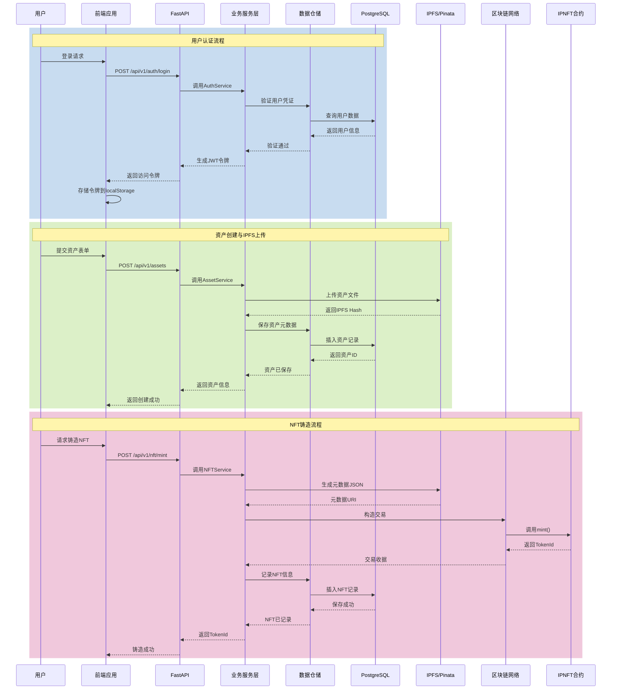
```mermaid
sequenceDiagram
    participant User as 用户
    participant Frontend as 前端应用
    participant API as FastAPI
    participant Service as 业务服务层
    participant Repo as 数据仓储
    participant DB as PostgreSQL
    participant IPFS as IPFS/Pinata
    participant BC as 区块链网络
    participant Contract as IPNFT合约
    
    %% Authentication Flow
    rect rgb(200, 220, 240)
        Note over User,DB: 用户认证流程
        User->>Frontend: 登录请求
        Frontend->>API: POST /api/v1/auth/login
        API->>Service: 调用AuthService
        Service->>Repo: 验证用户凭证
        Repo->>DB: 查询用户数据
        DB-->>Repo: 返回用户信息
        Repo-->>Service: 验证通过
        Service-->>API: 生成JWT令牌
        API-->>Frontend: 返回访问令牌
        Frontend->>Frontend: 存储令牌到localStorage
    end
    
    %% Asset Creation Flow
    rect rgb(220, 240, 200)
        Note over User,IPFS: 资产创建与IPFS上传
        User->>Frontend: 提交资产表单
        Frontend->>API: POST /api/v1/assets
        API->>Service: 调用AssetService
        Service->>IPFS: 上传资产文件
        IPFS-->>Service: 返回IPFS Hash
        Service->>Repo: 保存资产元数据
        Repo->>DB: 插入资产记录
        DB-->>Repo: 返回资产ID
        Repo-->>Service: 资产已保存
        Service-->>API: 返回资产信息
        API-->>Frontend: 返回创建成功
    end
    
    %% NFT Minting Flow
    rect rgb(240, 200, 220)
        Note over User,Contract: NFT铸造流程
        User->>Frontend: 请求铸造NFT
        Frontend->>API: POST /api/v1/nft/mint
        API->>Service: 调用NFTService
        Service->>IPFS: 生成元数据JSON
        IPFS-->>Service: 元数据URI
        Service->>BC: 构造交易
        BC->>Contract: 调用mint()
        Contract-->>BC: 返回TokenId
        BC-->>Service: 交易收据
        Service->>Repo: 记录NFT信息
        Repo->>DB: 插入NFT记录
        DB-->>Repo: 保存成功
        Repo-->>Service: NFT已记录
        Service-->>API: 返回TokenId
        API-->>Frontend: 铸造成功
    end
```

### 5.2 用户认证数据流

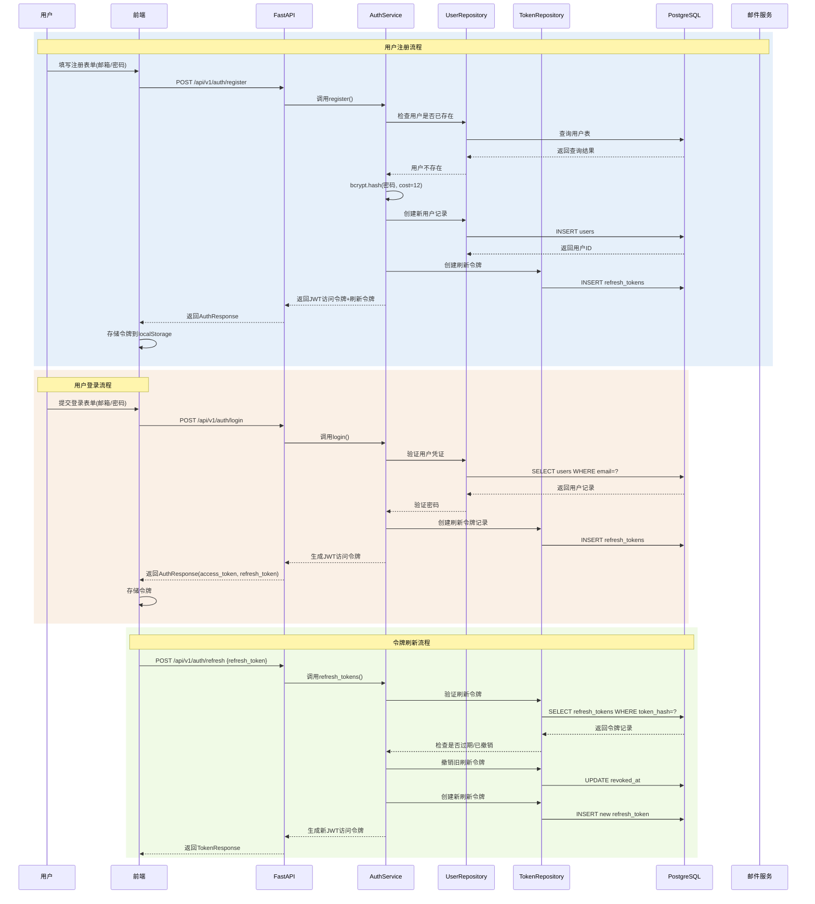
```mermaid
sequenceDiagram
    participant U as 用户
    participant F as 前端
    participant API as FastAPI
    participant AS as AuthService
    participant UR as UserRepository
    participant TR as TokenRepository
    participant DB as PostgreSQL
    participant SMTP as 邮件服务
    
    %% Registration Flow
    rect rgb(230, 240, 250)
        Note over U,SMTP: 用户注册流程
        U->>F: 填写注册表单(邮箱/密码)
        F->>API: POST /api/v1/auth/register
        API->>AS: 调用register()
        AS->>UR: 检查用户是否已存在
        UR->>DB: 查询用户表
        DB-->>UR: 返回查询结果
        UR-->>AS: 用户不存在
        AS->>AS: bcrypt.hash(密码, cost=12)
        AS->>UR: 创建新用户记录
        UR->>DB: INSERT users
        DB-->>UR: 返回用户ID
        AS->>TR: 创建刷新令牌
        TR->>DB: INSERT refresh_tokens
        AS-->>API: 返回JWT访问令牌+刷新令牌
        API-->>F: 返回AuthResponse
        F->>F: 存储令牌到localStorage
    end
    
    %% Login Flow
    rect rgb(250, 240, 230)
        Note over U,F: 用户登录流程
        U->>F: 提交登录表单(邮箱/密码)
        F->>API: POST /api/v1/auth/login
        API->>AS: 调用login()
        AS->>UR: 验证用户凭证
        UR->>DB: SELECT users WHERE email=?
        DB-->>UR: 返回用户记录
        UR-->>AS: 验证密码
        AS->>TR: 创建刷新令牌记录
        TR->>DB: INSERT refresh_tokens
        AS-->>API: 生成JWT访问令牌
        API-->>F: 返回AuthResponse(access_token, refresh_token)
        F->>F: 存储令牌
    end
    
    %% Token Refresh Flow
    rect rgb(240, 250, 230)
        Note over F,DB: 令牌刷新流程
        F->>API: POST /api/v1/auth/refresh {refresh_token}
        API->>AS: 调用refresh_tokens()
        AS->>TR: 验证刷新令牌
        TR->>DB: SELECT refresh_tokens WHERE token_hash=?
        DB-->>TR: 返回令牌记录
        TR-->>AS: 检查是否过期/已撤销
        AS->>TR: 撤销旧刷新令牌
        TR->>DB: UPDATE revoked_at
        AS->>TR: 创建新刷新令牌
        TR->>DB: INSERT new refresh_token
        AS-->>API: 生成新JWT访问令牌
        API-->>F: 返回TokenResponse
    end
```

### 5.3 企业管理数据流

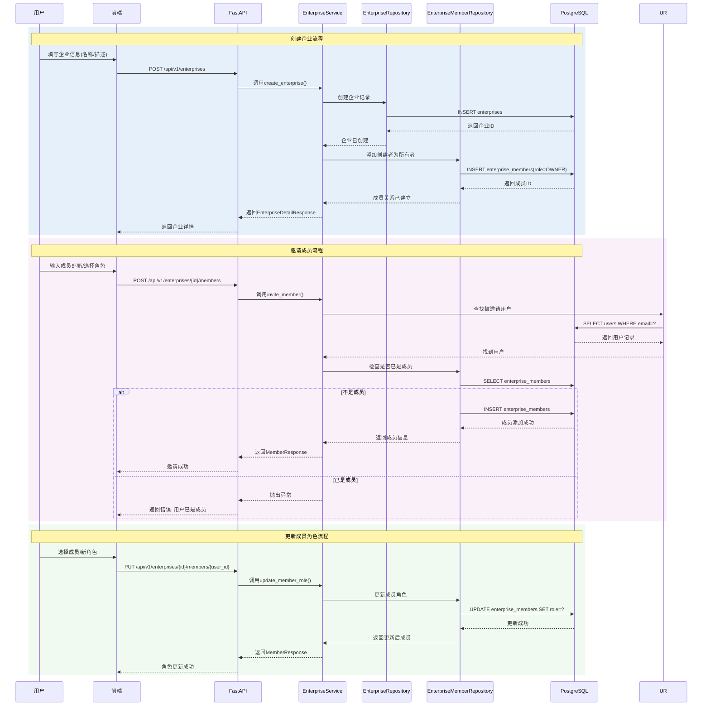
```mermaid
sequenceDiagram
    participant U as 用户
    participant F as 前端
    participant API as FastAPI
    participant ES as EnterpriseService
    participant ER as EnterpriseRepository
    participant EMR as EnterpriseMemberRepository
    participant DB as PostgreSQL
    
    %% Create Enterprise Flow
    rect rgb(230, 240, 250)
        Note over U,DB: 创建企业流程
        U->>F: 填写企业信息(名称/描述)
        F->>API: POST /api/v1/enterprises
        API->>ES: 调用create_enterprise()
        ES->>ER: 创建企业记录
        ER->>DB: INSERT enterprises
        DB-->>ER: 返回企业ID
        ER-->>ES: 企业已创建
        ES->>EMR: 添加创建者为所有者
        EMR->>DB: INSERT enterprise_members(role=OWNER)
        DB-->>EMR: 返回成员ID
        EMR-->>ES: 成员关系已建立
        ES-->>API: 返回EnterpriseDetailResponse
        API-->>F: 返回企业详情
    end
    
    %% Invite Member Flow
    rect rgb(250, 240, 250)
        Note over U,DB: 邀请成员流程
        U->>F: 输入成员邮箱/选择角色
        F->>API: POST /api/v1/enterprises/{id}/members
        API->>ES: 调用invite_member()
        ES->>UR: 查找被邀请用户
        UR->>DB: SELECT users WHERE email=?
        DB-->>UR: 返回用户记录
        UR-->>ES: 找到用户
        ES->>EMR: 检查是否已是成员
        EMR->>DB: SELECT enterprise_members
        alt 不是成员
            EMR->>DB: INSERT enterprise_members
            DB-->>EMR: 成员添加成功
            EMR-->>ES: 返回成员信息
            ES-->>API: 返回MemberResponse
            API-->>F: 邀请成功
        else 已是成员
            ES-->>API: 抛出异常
            API-->>F: 返回错误: 用户已是成员
        end
    end
    
    %% Update Member Role Flow
    rect rgb(240, 250, 240)
        Note over U,DB: 更新成员角色流程
        U->>F: 选择成员/新角色
        F->>API: PUT /api/v1/enterprises/{id}/members/{user_id}
        API->>ES: 调用update_member_role()
        ES->>EMR: 更新成员角色
        EMR->>DB: UPDATE enterprise_members SET role=?
        DB-->>EMR: 更新成功
        EMR-->>ES: 返回更新后成员
        ES-->>API: 返回MemberResponse
        API-->>F: 角色更新成功
    end
```

### 5.4 资产管理数据流

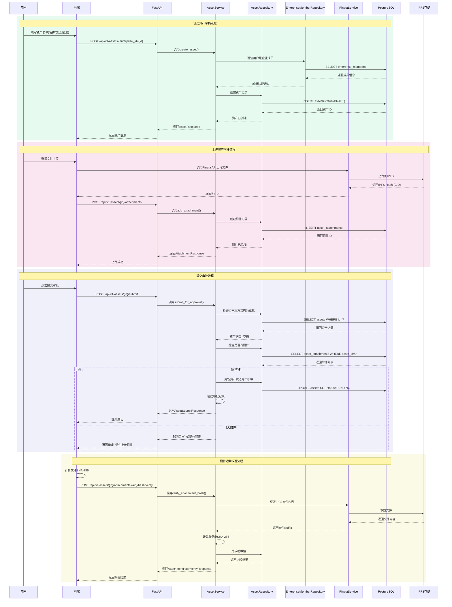
```mermaid
sequenceDiagram
    participant U as 用户
    participant F as 前端
    participant API as FastAPI
    participant AS as AssetService
    participant AR as AssetRepository
    participant EMR as EnterpriseMemberRepository
    participant PS as PinataService
    participant DB as PostgreSQL
    participant IPFS as IPFS存储
    
    %% Create Asset Draft Flow
    rect rgb(230, 250, 240)
        Note over U,DB: 创建资产草稿流程
        U->>F: 填写资产表单(名称/类型/描述)
        F->>API: POST /api/v1/assets?enterprise_id={id}
        API->>AS: 调用create_asset()
        AS->>EMR: 验证用户是企业成员
        EMR->>DB: SELECT enterprise_members
        DB-->>EMR: 返回成员信息
        EMR-->>AS: 成员验证通过
        AS->>AR: 创建资产记录
        AR->>DB: INSERT assets(status=DRAFT)
        DB-->>AR: 返回资产ID
        AR-->>AS: 资产已创建
        AS-->>API: 返回AssetResponse
        API-->>F: 返回资产信息
    end
    
    %% Upload Attachment Flow
    rect rgb(250, 230, 240)
        Note over U,IPFS: 上传资产附件流程
        U->>F: 选择文件上传
        F->>PS: 调用Pinata API上传文件
        PS->>IPFS: 上传到IPFS
        IPFS-->>PS: 返回IPFS Hash (CID)
        PS-->>F: 返回file_url
        F->>API: POST /api/v1/assets/{id}/attachments
        API->>AS: 调用add_attachment()
        AS->>AR: 创建附件记录
        AR->>DB: INSERT asset_attachments
        DB-->>AR: 返回附件ID
        AR-->>AS: 附件已添加
        AS-->>API: 返回AttachmentResponse
        API-->>F: 上传成功
    end
    
    %% Submit for Approval Flow
    rect rgb(240, 240, 250)
        Note over U,DB: 提交审批流程
        U->>F: 点击提交审批
        F->>API: POST /api/v1/assets/{id}/submit
        API->>AS: 调用submit_for_approval()
        AS->>AR: 检查资产状态是否为草稿
        AR->>DB: SELECT assets WHERE id=?
        DB-->>AR: 返回资产记录
        AR-->>AS: 资产状态=草稿
        AS->>AR: 检查是否有附件
        AR->>DB: SELECT asset_attachments WHERE asset_id=?
        DB-->>AR: 返回附件列表
        alt 有附件
            AS->>AR: 更新资产状态为审核中
            AR->>DB: UPDATE assets SET status=PENDING
            AS->>AS: 创建审批记录
            AS-->>API: 返回AssetSubmitResponse
            API-->>F: 提交成功
        else 无附件
            AS-->>API: 抛出异常: 必须有附件
            API-->>F: 返回错误: 请先上传附件
        end
    end
    
    %% Verify Attachment Hash Flow
    rect rgb(250, 250, 230)
        Note over F,DB: 附件哈希校验流程
        F->>F: 计算文件SHA-256
        F->>API: POST /api/v1/assets/{id}/attachments/{aid}/hash/verify
        API->>AS: 调用verify_attachment_hash()
        AS->>PS: 获取IPFS文件内容
        PS->>IPFS: 下载文件
        IPFS-->>PS: 返回文件内容
        PS-->>AS: 返回文件Buffer
        AS->>AS: 计算服务端SHA-256
        AS->>AR: 比较哈希值
        AR-->>AS: 返回比较结果
        AS-->>API: 返回AttachmentHashVerifyResponse
        API-->>F: 返回校验结果
    end
```

### 5.5 NFT铸造数据流

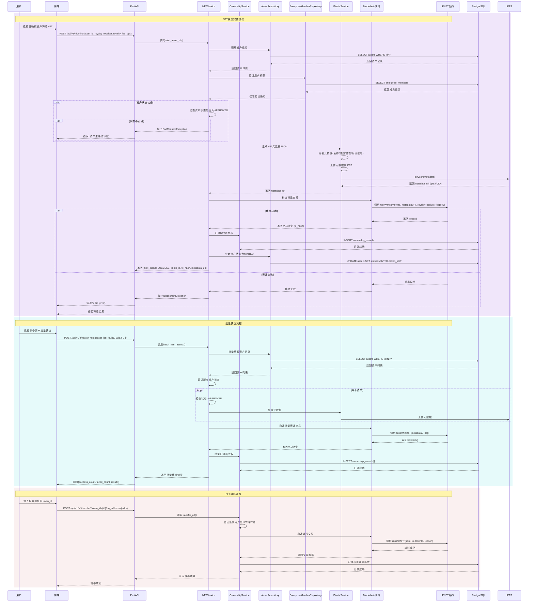
```mermaid
sequenceDiagram
    participant U as 用户
    participant F as 前端
    participant API as FastAPI
    participant NS as NFTService
    participant OS as OwnershipService
    participant AR as AssetRepository
    participant EMR as EnterpriseMemberRepository
    participant PS as PinataService
    participant BC as Blockchain网络
    participant Contract as IPNFT合约
    participant DB as PostgreSQL
    
    %% NFT Minting Flow
    rect rgb(240, 230, 250)
        Note over U,Contract: NFT铸造完整流程
        U->>F: 选择已确权资产铸造NFT
        F->>API: POST /api/v1/nft/mint {asset_id, royalty_receiver, royalty_fee_bps}
        API->>NS: 调用mint_asset_nft()
        
        NS->>AR: 获取资产信息
        AR->>DB: SELECT assets WHERE id=?
        DB-->>AR: 返回资产记录
        AR-->>NS: 返回资产详情
        
        NS->>EMR: 验证用户权限
        EMR->>DB: SELECT enterprise_members
        DB-->>EMR: 返回成员信息
        EMR-->>NS: 权限验证通过
        
        alt 资产状态检查
            NS->>NS: 检查资产状态是否为APPROVED
            alt 状态不正确
                NS-->>API: 抛出BadRequestException
                API-->>F: 错误: 资产未通过审批
            end
        end
        
        NS->>PS: 生成NFT元数据JSON
        PS->>PS: 组装元数据(名称/描述/属性/版权信息)
        PS->>PS: 上传元数据到IPFS
        PS->>IPFS: pinJson(metadata)
        IPFS-->>PS: 返回metadata_uri (ipfs://CID)
        PS-->>NS: 返回metadata_uri
        
        NS->>BC: 构造铸造交易
        BC->>Contract: 调用mintWithRoyalty(to, metadataURI, royaltyReceiver, feeBPS)
        
        alt 铸造成功
            Contract-->>BC: 返回tokenId
            BC-->>NS: 返回交易收据(tx_hash)
            NS->>OS: 记录NFT所有权
            OS->>DB: INSERT ownership_records
            DB-->>OS: 记录成功
            NS->>AR: 更新资产状态为MINTED
            AR->>DB: UPDATE assets SET status=MINTED, token_id=?
            NS-->>API: 返回{mint_status: SUCCESS, token_id, tx_hash, metadata_uri}
        else 铸造失败
            Contract-->>BC: 抛出异常
            BC-->>NS: 铸造失败
            NS-->>API: 抛出BlockchainException
            API-->>F: 铸造失败: {error}
        end
        
        API-->>F: 返回铸造结果
    end
    
    %% Batch Mint Flow
    rect rgb(230, 250, 250)
        Note over U,Contract: 批量铸造流程
        U->>F: 选择多个资产批量铸造
        F->>API: POST /api/v1/nft/batch-mint {asset_ids: [uuid1, uuid2, ...]}
        API->>NS: 调用batch_mint_assets()
        
        NS->>AR: 批量获取资产信息
        AR->>DB: SELECT assets WHERE id IN (?)
        DB-->>AR: 返回资产列表
        AR-->>NS: 返回资产列表
        
        NS->>NS: 验证所有资产状态
        loop 每个资产
            NS->>NS: 检查状态=APPROVED
            NS->>PS: 生成元数据
            PS->>IPFS: 上传元数据
        end
        
        NS->>BC: 构造批量铸造交易
        BC->>Contract: 调用batchMint(to, [metadataURIs])
        Contract-->>BC: 返回tokenIds[]
        BC-->>NS: 返回交易收据
        
        NS->>OS: 批量记录所有权
        OS->>DB: INSERT ownership_records[]
        DB-->>OS: 记录成功
        
        NS-->>API: 返回批量铸造结果
        API-->>F: 返回{success_count, failed_count, results}
    end
    
    %% NFT Transfer Flow
    rect rgb(250, 240, 240)
        Note over U,Contract: NFT转移流程
        U->>F: 输入接收地址和token_id
        F->>API: POST /api/v1/nft/transfer?token_id={id}&to_address={addr}
        API->>OS: 调用transfer_nft()
        
        OS->>OS: 验证当前用户是NFT持有者
        OS->>BC: 构造转移交易
        BC->>Contract: 调用transferNFT(from, to, tokenId, reason)
        Contract-->>BC: 转移成功
        BC-->>OS: 返回交易收据
        
        OS->>DB: 记录权属变更历史
        DB-->>OS: 记录成功
        
        OS-->>API: 返回转移结果
        API-->>F: 转移成功
    end
```

### 5.6 审批流程数据流

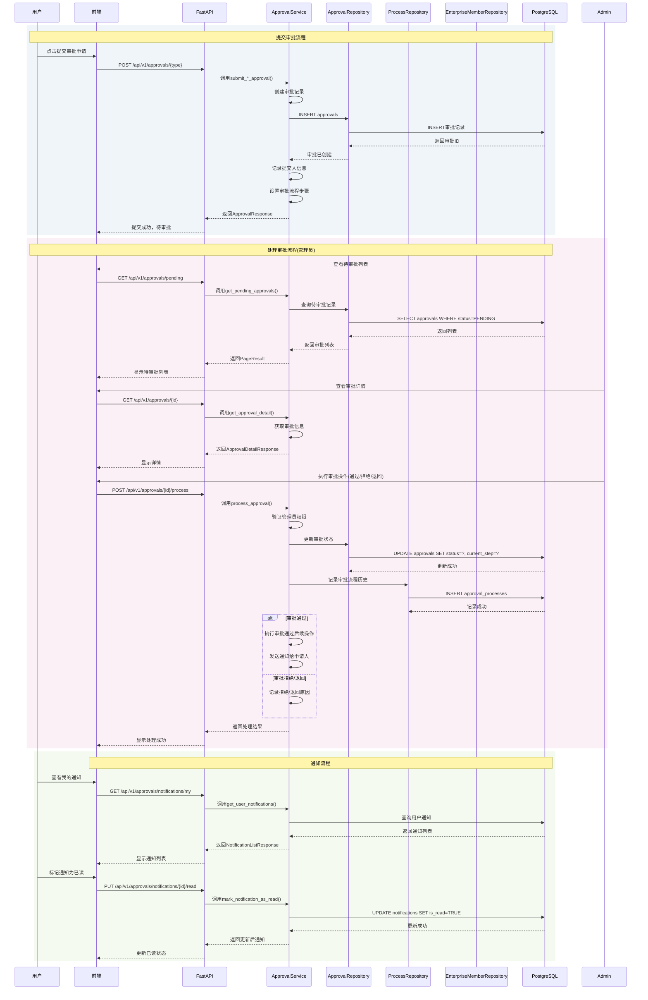
```mermaid
sequenceDiagram
    participant U as 用户
    participant F as 前端
    participant API as FastAPI
    participant APS as ApprovalService
    participant APR as ApprovalRepository
    participant PPR as ProcessRepository
    participant EMR as EnterpriseMemberRepository
    participant DB as PostgreSQL
    
    %% Submit Approval Flow
    rect rgb(240, 245, 250)
        Note over U,DB: 提交审批流程
        U->>F: 点击提交审批申请
        F->>API: POST /api/v1/approvals/{type}
        API->>APS: 调用submit_*_approval()
        
        APS->>APS: 创建审批记录
        APS->>APR: INSERT approvals
        APR->>DB: INSERT审批记录
        DB-->>APR: 返回审批ID
        APR-->>APS: 审批已创建
        
        APS->>APS: 记录提交人信息
        APS->>APS: 设置审批流程步骤
        APS-->>API: 返回ApprovalResponse
        API-->>F: 提交成功，待审批
    end
    
    %% Process Approval Flow
    rect rgb(250, 240, 245)
        Note over U,DB: 处理审批流程(管理员)
        Admin->>F: 查看待审批列表
        F->>API: GET /api/v1/approvals/pending
        API->>APS: 调用get_pending_approvals()
        APS->>APR: 查询待审批记录
        APR->>DB: SELECT approvals WHERE status=PENDING
        DB-->>APR: 返回列表
        APR-->>APS: 返回审批列表
        APS-->>API: 返回PageResult
        API-->>F: 显示待审批列表
        
        Admin->>F: 查看审批详情
        F->>API: GET /api/v1/approvals/{id}
        API->>APS: 调用get_approval_detail()
        APS->>APS: 获取审批信息
        APS-->>API: 返回ApprovalDetailResponse
        API-->>F: 显示详情
        
        Admin->>F: 执行审批操作(通过/拒绝/退回)
        F->>API: POST /api/v1/approvals/{id}/process
        API->>APS: 调用process_approval()
        
        APS->>APS: 验证管理员权限
        APS->>APR: 更新审批状态
        APR->>DB: UPDATE approvals SET status=?, current_step=?
        DB-->>APR: 更新成功
        
        APS->>PPR: 记录审批流程历史
        PPR->>DB: INSERT approval_processes
        DB-->>PPR: 记录成功
        
        alt 审批通过
            APS->>APS: 执行审批通过后续操作
            APS->>APS: 发送通知给申请人
        else 审批拒绝/退回
            APS->>APS: 记录拒绝/退回原因
        end
        
        APS-->>API: 返回处理结果
        API-->>F: 显示处理成功
    end
    
    %% Notification Flow
    rect rgb(245, 250, 240)
        Note over F,DB: 通知流程
        U->>F: 查看我的通知
        F->>API: GET /api/v1/approvals/notifications/my
        API->>APS: 调用get_user_notifications()
        APS->>DB: 查询用户通知
        DB-->>APS: 返回通知列表
        APS-->>API: 返回NotificationListResponse
        API-->>F: 显示通知列表
        
        U->>F: 标记通知为已读
        F->>API: PUT /api/v1/approvals/notifications/{id}/read
        API->>APS: 调用mark_notification_as_read()
        APS->>DB: UPDATE notifications SET is_read=TRUE
        DB-->>APS: 更新成功
        APS-->>API: 返回更新后通知
        API-->>F: 更新已读状态
    end
```

### 5.7 文件上传数据流

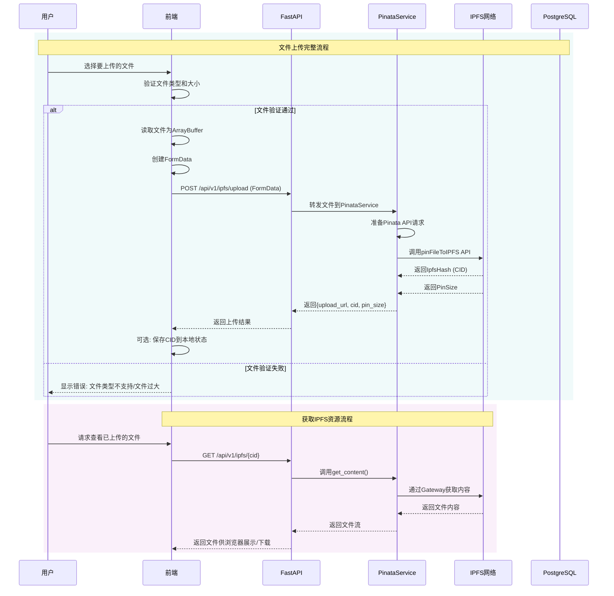
```mermaid
sequenceDiagram
    participant U as 用户
    participant F as 前端
    participant API as FastAPI
    participant PS as PinataService
    participant IPFS as IPFS网络
    participant DB as PostgreSQL
    
    rect rgb(240, 250, 250)
        Note over U,DB: 文件上传完整流程
        U->>F: 选择要上传的文件
        F->>F: 验证文件类型和大小
        alt 文件验证通过
            F->>F: 读取文件为ArrayBuffer
            F->>F: 创建FormData
            F->>API: POST /api/v1/ipfs/upload (FormData)
            API->>PS: 转发文件到PinataService
            PS->>PS: 准备Pinata API请求
            PS->>IPFS: 调用pinFileToIPFS API
            IPFS-->>PS: 返回IpfsHash (CID)
            IPFS-->>PS: 返回PinSize
            PS-->>API: 返回{upload_url, cid, pin_size}
            API-->>F: 返回上传结果
            
            F->>F: 可选: 保存CID到本地状态
        else 文件验证失败
            F-->>U: 显示错误: 文件类型不支持/文件过大
        end
    end
    
    rect rgb(250, 240, 250)
        Note over F,IPFS: 获取IPFS资源流程
        U->>F: 请求查看已上传的文件
        F->>API: GET /api/v1/ipfs/{cid}
        API->>PS: 调用get_content()
        PS->>IPFS: 通过Gateway获取内容
        IPFS-->>PS: 返回文件内容
        PS-->>API: 返回文件流
        API-->>F: 返回文件供浏览器展示/下载
    end
```

### 5.8 项目数据库ER图

#### 5.8.1 完整实体关系图

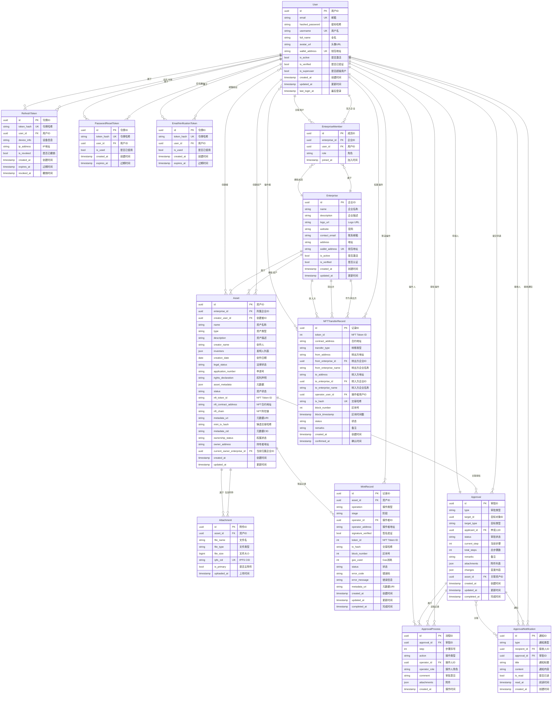
```mermaid
erDiagram
    User {
        uuid id PK "用户ID"
        string email UK "邮箱"
        string hashed_password "密码哈希"
        string username UK "用户名"
        string full_name "全名"
        string avatar_url "头像URL"
        string wallet_address UK "钱包地址"
        bool is_active "是否激活"
        bool is_verified "是否已验证"
        bool is_superuser "是否超级用户"
        timestamp created_at "创建时间"
        timestamp updated_at "更新时间"
        timestamp last_login_at "最后登录"
    }
    
    RefreshToken {
        uuid id PK "令牌ID"
        string token_hash UK "令牌哈希"
        uuid user_id FK "用户ID"
        string device_info "设备信息"
        string ip_address "IP地址"
        bool is_revoked "是否已撤销"
        timestamp created_at "创建时间"
        timestamp expires_at "过期时间"
        timestamp revoked_at "撤销时间"
    }
    
    PasswordResetToken {
        uuid id PK "令牌ID"
        string token_hash UK "令牌哈希"
        uuid user_id FK "用户ID"
        bool is_used "是否已使用"
        timestamp created_at "创建时间"
        timestamp expires_at "过期时间"
    }
    
    EmailVerificationToken {
        uuid id PK "令牌ID"
        string token_hash UK "令牌哈希"
        uuid user_id FK "用户ID"
        bool is_used "是否已使用"
        timestamp created_at "创建时间"
        timestamp expires_at "过期时间"
    }
    
    Enterprise {
        uuid id PK "企业ID"
        string name "企业名称"
        string description "企业描述"
        string logo_url "Logo URL"
        string website "官网"
        string contact_email "联系邮箱"
        string address "地址"
        string wallet_address UK "钱包地址"
        bool is_active "是否激活"
        bool is_verified "是否认证"
        timestamp created_at "创建时间"
        timestamp updated_at "更新时间"
    }
    
    EnterpriseMember {
        uuid id PK "成员ID"
        uuid enterprise_id FK "企业ID"
        uuid user_id FK "用户ID"
        string role "角色"
        timestamp joined_at "加入时间"
    }
    
    Asset {
        uuid id PK "资产ID"
        uuid enterprise_id FK "所属企业ID"
        uuid creator_user_id FK "创建者ID"
        string name "资产名称"
        string type "资产类型"
        string description "资产描述"
        string creator_name "创作人"
        json inventors "发明人列表"
        date creation_date "创作日期"
        string legal_status "法律状态"
        string application_number "申请号"
        string rights_declaration "权利声明"
        json asset_metadata "元数据"
        string status "资产状态"
        string nft_token_id "NFT Token ID"
        string nft_contract_address "NFT合约地址"
        string nft_chain "NFT所在链"
        string metadata_uri "元数据URI"
        string mint_tx_hash "铸造交易哈希"
        string metadata_cid "元数据CID"
        string ownership_status "权属状态"
        string owner_address "持有者地址"
        uuid current_owner_enterprise_id FK "当前归属企业ID"
        timestamp created_at "创建时间"
        timestamp updated_at "更新时间"
    }
    
    Attachment {
        uuid id PK "附件ID"
        uuid asset_id FK "资产ID"
        string file_name "文件名"
        string file_type "文件类型"
        bigint file_size "文件大小"
        string ipfs_cid UK "IPFS CID"
        bool is_primary "是否主附件"
        timestamp uploaded_at "上传时间"
    }
    
    MintRecord {
        uuid id PK "记录ID"
        uuid asset_id FK "资产ID"
        string operation "操作类型"
        string stage "阶段"
        uuid operator_id FK "操作者ID"
        string operator_address "操作者地址"
        bool signature_verified "签名验证"
        int token_id "NFT Token ID"
        string tx_hash "交易哈希"
        int block_number "区块号"
        int gas_used "Gas消耗"
        string status "状态"
        string error_code "错误码"
        string error_message "错误信息"
        string metadata_uri "元数据URI"
        timestamp created_at "创建时间"
        timestamp updated_at "更新时间"
        timestamp completed_at "完成时间"
    }
    
    Approval {
        uuid id PK "审批ID"
        string type "审批类型"
        uuid target_id "目标对象ID"
        string target_type "目标类型"
        uuid applicant_id FK "申请人ID"
        string status "审批状态"
        int current_step "当前步骤"
        int total_steps "总步骤数"
        string remarks "备注"
        json attachments "附件列表"
        json changes "变更内容"
        uuid asset_id FK "关联资产ID"
        timestamp created_at "创建时间"
        timestamp updated_at "更新时间"
        timestamp completed_at "完成时间"
    }
    
    ApprovalProcess {
        uuid id PK "流程ID"
        uuid approval_id FK "审批ID"
        int step "步骤序号"
        string action "操作类型"
        uuid operator_id FK "操作人ID"
        string operator_role "操作人角色"
        string comment "审批意见"
        json attachments "附件"
        timestamp created_at "操作时间"
    }
    
    ApprovalNotification {
        uuid id PK "通知ID"
        string type "通知类型"
        uuid recipient_id FK "接收人ID"
        uuid approval_id FK "审批ID"
        string title "通知标题"
        string content "通知内容"
        bool is_read "是否已读"
        timestamp read_at "阅读时间"
        timestamp created_at "创建时间"
    }
    
    NFTTransferRecord {
        uuid id PK "记录ID"
        int token_id "NFT Token ID"
        string contract_address "合约地址"
        string transfer_type "转移类型"
        string from_address "转出方地址"
        uuid from_enterprise_id FK "转出方企业ID"
        string from_enterprise_name "转出方企业名称"
        string to_address "转入方地址"
        uuid to_enterprise_id FK "转入方企业ID"
        string to_enterprise_name "转入方企业名称"
        uuid operator_user_id FK "操作者用户ID"
        string tx_hash UK "交易哈希"
        int block_number "区块号"
        timestamp block_timestamp "区块时间戳"
        string status "状态"
        string remarks "备注"
        timestamp created_at "创建时间"
        timestamp confirmed_at "确认时间"
    }
    
    User ||--o{ RefreshToken : "持有令牌"
    User ||--o{ PasswordResetToken : "密码重置"
    User ||--o{ EmailVerificationToken : "邮箱验证"
    User ||--o{ EnterpriseMember : "加入企业"
    User ||--o{ Asset : "创建资产"
    User ||--o{ Approval : "提交申请"
    User ||--o{ ApprovalProcess : "审批操作"
    User ||--o{ ApprovalNotification : "接收通知"
    User ||--o{ MintRecord : "铸造操作"
    User ||--o{ NFTTransferRecord : "权属操作"
    
    RefreshToken }o--|| User : "属于"
    PasswordResetToken }o--|| User : "属于"
    EmailVerificationToken }o--|| User : "属于"
    
    Enterprise ||--o{ EnterpriseMember : "拥有成员"
    Enterprise ||--o{ Asset : "拥有资产"
    Enterprise ||--o{ NFTTransferRecord : "作为转出方"
    
    EnterpriseMember }o--|| Enterprise : "属于"
    EnterpriseMember }o--|| User : "关联用户"
    
    Asset }o--|| Enterprise : "属于"
    Asset }o--o{ User : "创建者"
    Asset ||--o{ Attachment : "包含附件"
    Asset ||--o{ MintRecord : "铸造记录"
    Asset ||--o{ Approval : "关联审批"
    
    Attachment }o--|| Asset : "属于"
    
    Approval ||--|| User : "申请人"
    Approval ||--o{ ApprovalProcess : "流程记录"
    Approval ||--o{ ApprovalNotification : "通知"
    
    ApprovalProcess }o--|| Approval : "属于"
    ApprovalProcess }o--|| User : "操作人"
    
    ApprovalNotification }o--|| User : "接收人"
    ApprovalNotification }o--o{ Approval : "关联"
    
    NFTTransferRecord }o--|| Enterprise : "转出方"
    NFTTransferRecord }o--|| Enterprise : "转入方"
    NFTTransferRecord }o--o{ User : "操作者"
```

#### 5.8.2 核心表结构说明

| 表名 | 说明 | 主键 | 外键 |
|------|------|------|------|
| `users` | 用户表 | id | - |
| `refresh_tokens` | 刷新令牌表 | id | user_id |
| `password_reset_tokens` | 密码重置令牌表 | id | user_id |
| `email_verification_tokens` | 邮箱验证令牌表 | id | user_id |
| `enterprises` | 企业表 | id | - |
| `enterprise_members` | 企业成员关联表 | id | enterprise_id, user_id |
| `assets` | IP资产表 | id | enterprise_id, creator_user_id, current_owner_enterprise_id |
| `attachments` | 资产附件表 | id | asset_id |
| `mint_records` | 铸造记录表 | id | asset_id, operator_id |
| `approvals` | 审批记录表 | id | applicant_id, asset_id |
| `approval_processes` | 审批流程记录表 | id | approval_id, operator_id |
| `approval_notifications` | 审批通知表 | id | recipient_id, approval_id |
| `nft_transfer_records` | NFT权属变更记录表 | id | from_enterprise_id, to_enterprise_id, operator_user_id |

#### 5.8.3 枚举类型定义

**MemberRole (企业成员角色)**
| 值 | 说明 |
|------|------|
| OWNER | 所有者 |
| ADMIN | 管理员 |
| MEMBER | 普通成员 |
| VIEWER | 观察者 |

**AssetType (资产类型)**
| 值 | 说明 |
|------|------|
| PATENT | 专利 |
| TRADEMARK | 商标 |
| COPYRIGHT | 版权 | 
| TRADE_SECRET | 商业秘密 |
| DIGITAL_WORK | 数字作品 |

**LegalStatus (法律状态)**
| 值 | 说明 |
|------|------|
| APPLIED | 已申请 |
| PENDING | 申请中 |
| GRANTED | 已授权 |
| EXPIRED | 已过期 |

**AssetStatus (资产状态)**
| 值 | 说明 |
|------|------|
| DRAFT | 草稿 |
| PENDING | 待审批 |
| APPROVED | 已审批 |
| MINTING | 铸造中 |
| MINTED | 已铸造 |
| REJECTED | 已拒绝 |
| TRANSFERRED | 已转移 |
| LICENSED | 已授权 |
| STAKED | 已质押 |
| MINT_FAILED | 铸造失败 |

**ApprovalType (审批类型)**
| 值 | 说明 |
|------|------|
| ENTERPRISE_CREATE | 企业创建 |
| ENTERPRISE_UPDATE | 企业信息变更 |
| MEMBER_JOIN | 成员加入 |
| ASSET_SUBMIT | 资产提交审批 |

**OwnershipStatus (权属状态)**
| 值 | 说明 |
|------|------|
| ACTIVE | 有效持有 |
| LICENSED | 已许可 |
| STAKED | 已质押 |
| TRANSFERRED | 已转移 |

**TransferType (转移类型)**
| 值 | 说明 |
|------|------|
| MINT | 铸造 |
| TRANSFER | 转移 |
| LICENSE | 许可 |
| STAKE | 质押 |
| UNSTAKE | 解除质押 |
| BURN | 销毁 |

### 5.9 状态流转图

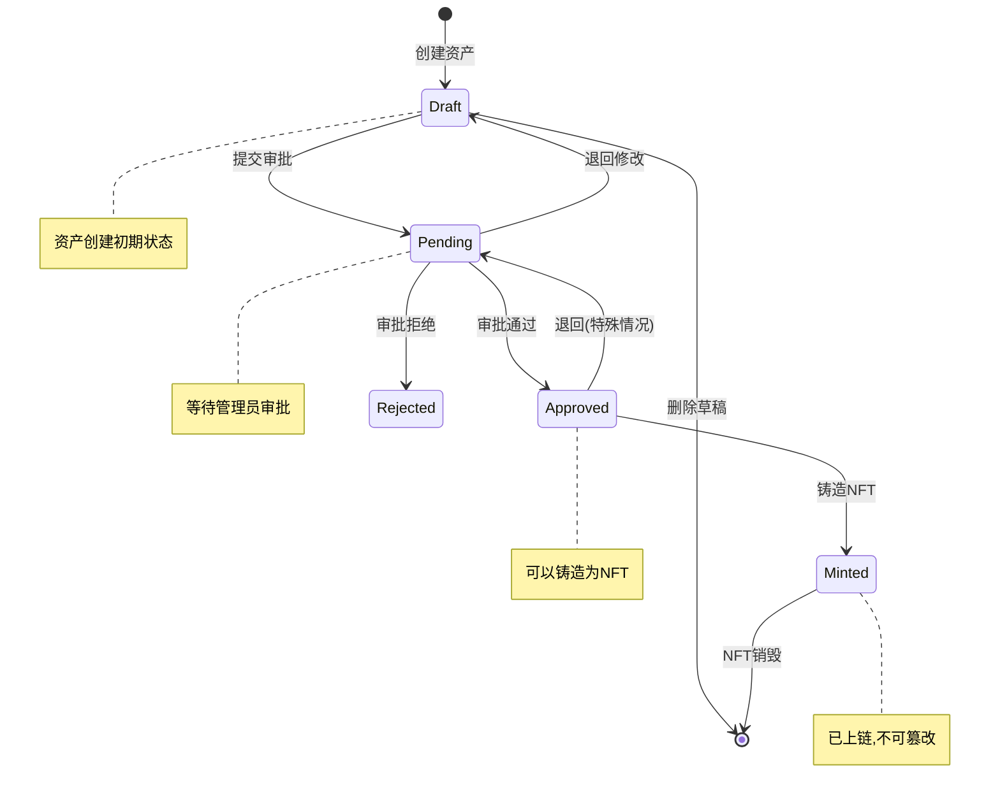
```mermaid
stateDiagram-v2
    [*] --> Draft : 创建资产
    
    Draft --> Pending : 提交审批
    Draft --> [*] : 删除草稿
    
    Pending --> Approved : 审批通过
    Pending --> Rejected : 审批拒绝
    Pending --> Draft : 退回修改
    
    Approved --> Minted : 铸造NFT
    Approved --> Pending : 退回(特殊情况)
    
    Minted --> [*] : NFT销毁
    
    note right of Draft : 资产创建初期状态
    note right of Pending : 等待管理员审批
    note right of Approved : 可以铸造为NFT
    note right of Minted : 已上链,不可篡改
```

### 5.10 权限控制数据流

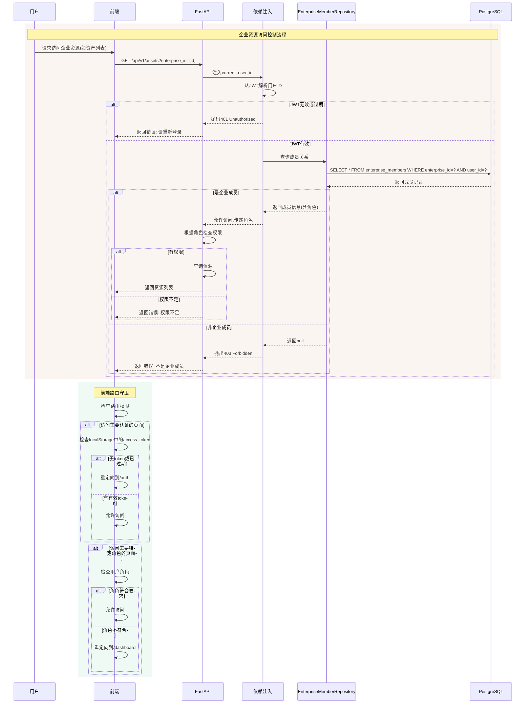
```mermaid
sequenceDiagram
    participant U as 用户
    participant F as 前端
    participant API as FastAPI
    participant Deps as 依赖注入
    participant EMR as EnterpriseMemberRepository
    participant DB as PostgreSQL
    
    rect rgb(250, 245, 240)
        Note over U,DB: 企业资源访问控制流程
        U->>F: 请求访问企业资源(如资产列表)
        F->>API: GET /api/v1/assets?enterprise_id={id}
        API->>Deps: 注入current_user_id
        Deps->>Deps: 从JWT解析用户ID
        
        alt JWT无效或过期
            Deps-->>API: 抛出401 Unauthorized
            API-->>F: 返回错误: 请重新登录
        else JWT有效
            Deps->>EMR: 查询成员关系
            EMR->>DB: SELECT * FROM enterprise_members WHERE enterprise_id=? AND user_id=?
            DB-->>EMR: 返回成员记录
            
            alt 是企业成员
                EMR-->>Deps: 返回成员信息(含角色)
                Deps-->>API: 允许访问,传递角色
                API->>API: 根据角色检查权限
                
                alt 有权限
                    API->>API: 查询资源
                    API-->>F: 返回资源列表
                else 权限不足
                    API-->>F: 返回错误: 权限不足
                end
            else 非企业成员
                EMR-->>Deps: 返回null
                Deps-->>API: 抛出403 Forbidden
                API-->>F: 返回错误: 不是企业成员
            end
        end
    end
    
    rect rgb(240, 250, 245)
        Note over F,F: 前端路由守卫
        F->>F: 检查路由权限
        alt 访问需要认证的页面
            F->>F: 检查localStorage中的access_token
            alt 无token或已过期
                F->>F: 重定向到/auth
            else 有有效token
                F->>F: 允许访问
            end
        end
        
        alt 访问需要特定角色的页面
            F->>F: 检查用户角色
            alt 角色符合要求
                F->>F: 允许访问
            else 角色不符合
                F->>F: 重定向到/dashboard
            end
        end
    end
```

---

## 6. 系统部署架构

### 6.1 部署架构图

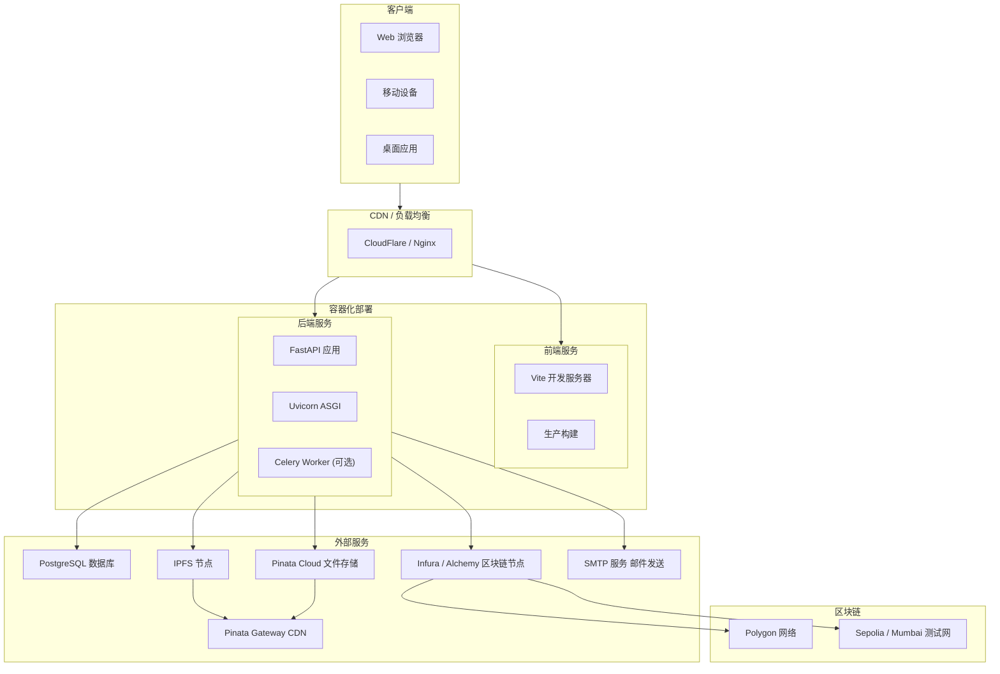
```mermaid
graph TB
    subgraph Clients ["客户端"]
        Browser["Web 浏览器"]
        Mobile["移动设备"]
        Desktop["桌面应用"]
    end
    
    subgraph CDN ["CDN / 负载均衡"]
        CloudFlare["CloudFlare / Nginx"]
    end
    
    subgraph Containers ["容器化部署"]
        subgraph Frontend_Deploy ["前端服务"]
            Vite["Vite 开发服务器"]
            Prod_Build["生产构建"]
        end
        
        subgraph Backend_Deploy ["后端服务"]
            FastAPI["FastAPI 应用"]
            Uvicorn["Uvicorn ASGI"]
            Worker["Celery Worker (可选)"]
        end
    end
    
    subgraph External_Services ["外部服务"]
        PostgreSQL_DB["PostgreSQL 数据库"]
        IPFS_Node["IPFS 节点"]
        Pinata["Pinata Cloud 文件存储"]
        Pinata_Gateway["Pinata Gateway CDN"]
        Infura["Infura / Alchemy 区块链节点"]
        SMTP["SMTP 服务 邮件发送"]
    end
    
    subgraph Blockchain ["区块链"]
        Polygon_Network["Polygon 网络"]
        Testnet["Sepolia / Mumbai 测试网"]
    end
    
    %% Client connections
    Clients --> CDN
    CDN --> Frontend_Deploy
    CDN --> Backend_Deploy
    
    %% Backend connections
    Backend_Deploy --> PostgreSQL_DB
    Backend_Deploy --> IPFS_Node
    Backend_Deploy --> Pinata
    Backend_Deploy --> Infura
    Backend_Deploy --> SMTP
    
    %% Blockchain
    Infura --> Polygon_Network
    Infura --> Testnet
    
    %% IPFS
    IPFS_Node --> Pinata_Gateway
    Pinata --> Pinata_Gateway
```

### 6.2 部署环境要求

| 环境 | 组件 | 版本要求 |
|------|------|----------|
| Node.js | 前端运行时 | >= 18.0.0 |
| Python | 后端运行时 | 3.12+ |
| PostgreSQL | 主数据库 | 14+ |
| IPFS | 去中心化存储 | 可选 (可使用Pinata) |

---

## 7. 安全架构

### 7.1 安全架构图

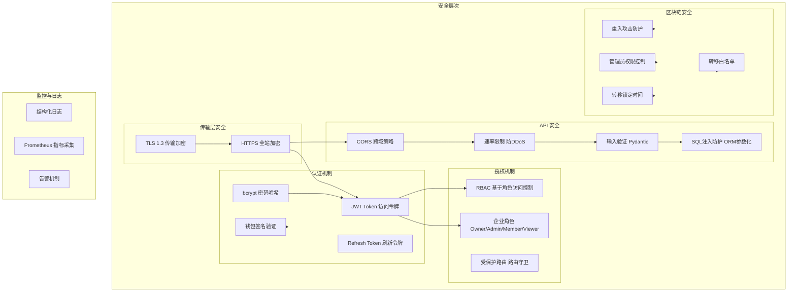
```mermaid
graph TB
    subgraph Security_Layers ["安全层次"]
        subgraph Transport ["传输层安全"]
            TLS["TLS 1.3 传输加密"]
            HTTPS["HTTPS 全站加密"]
        end
        
        subgraph Authentication ["认证机制"]
            JWT["JWT Token 访问令牌"]
            Refresh_Token["Refresh Token 刷新令牌"]
            Password["bcrypt 密码哈希"]
            Wallet_Sig["钱包签名验证"]
        end
        
        subgraph Authorization ["授权机制"]
            RBAC["RBAC 基于角色访问控制"]
            Enterprise_Roles["企业角色 Owner/Admin/Member/Viewer"]
            Protected_Routes["受保护路由 路由守卫"]
        end
        
        subgraph API_Security ["API 安全"]
            CORS["CORS 跨域策略"]
            Rate_Limit["速率限制 防DDoS"]
            Input_Validation["输入验证 Pydantic"]
            SQL_Injection["SQL注入防护 ORM参数化"]
        end
        
        subgraph Blockchain_Security ["区块链安全"]
            ReentrancyGuard["重入攻击防护"]
            Ownable["管理员权限控制"]
            TransferLock["转移锁定时间"]
            Whitelist["转移白名单"]
        end
    end
    
    subgraph Monitoring ["监控与日志"]
        Logging["结构化日志"]
        Metrics["Prometheus 指标采集"]
        Alerting["告警机制"]
    end
    
    %% Security flow
    TLS --> HTTPS
    HTTPS --> CORS
    HTTPS --> JWT
    JWT --> RBAC
    JWT --> Enterprise_Roles
    Password --> JWT
    Wallet_Sig --> Authentication
    
    CORS --> Rate_Limit
    Rate_Limit --> Input_Validation
    Input_Validation --> SQL_Injection
    
    ReentrancyGuard --> Blockchain_Security
    Ownable --> Blockchain_Security
    TransferLock --> Blockchain_Security
    Whitelist --> Blockchain_Security
```

### 7.2 安全措施详情

#### 传输层安全

- **TLS 1.3**: 加密传输
- **HTTPS**: 全站强制重定向

#### 认证机制

| 机制 | 配置 |
|------|------|
| JWT访问令牌 | 30分钟过期 |
| Refresh Token | 7天过期 |
| bcrypt密码哈希 | cost factor 12 |
| 区块链钱包签名 | 验证钱包所有权 |

#### 授权机制

- **基于角色的访问控制 (RBAC)**
- **企业角色**: Owner / Admin / Member / Viewer
- **受保护路由**: 未认证自动重定向

#### API安全

- **CORS**: 跨域策略配置
- **速率限制**: API防DDoS
- **Pydantic**: 输入验证

#### 区块链安全

- **ReentrancyGuard**: 重入攻击防护
- **Ownable**: 管理员权限控制
- **转移锁定时间**: 铸造后需等待
- **转移白名单**: 可选的接收方限制

---

## 附录

### 项目结构

```
web3.0_system/
├── frontend/                 # React 19 前端应用
│   ├── src/
│   │   ├── components/       # React 组件
│   │   ├── pages/           # 页面组件
│   │   ├── hooks/           # 自定义 Hooks
│   │   ├── services/        # API 服务
│   │   ├── store/           # Zustand 状态管理
│   │   ├── types/           # TypeScript 类型
│   │   └── utils/           # 工具函数
│   └── package.json
├── backend/                  # FastAPI 后端服务
│   ├── app/
│   │   ├── api/             # API 路由层
│   │   ├── core/            # 核心基础设施
│   │   ├── models/          # 数据模型
│   │   ├── repositories/    # 数据访问层
│   │   ├── schemas/         # Pydantic 模型
│   │   └── services/        # 业务逻辑层
│   ├── tests/               # 测试代码
│   └── requirements.txt
├── contracts/               # Solidity 智能合约
│   ├── contracts/           # 合约源码
│   ├── scripts/             # 部署脚本
│   ├── test/                # 测试用例
│   └── package.json
└── docs/                    # 文档
```

---

*文档生成时间: 2026-03-28*
*IP-NFT 企业资产管理系统 | System Architecture Documentation*
