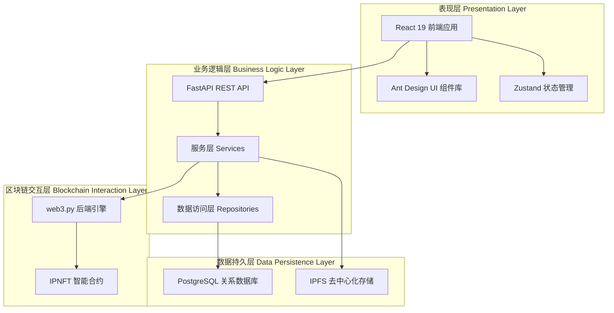
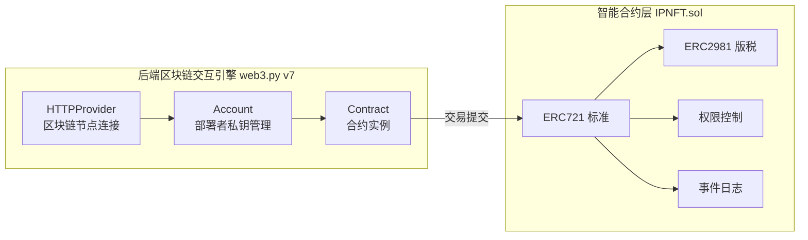
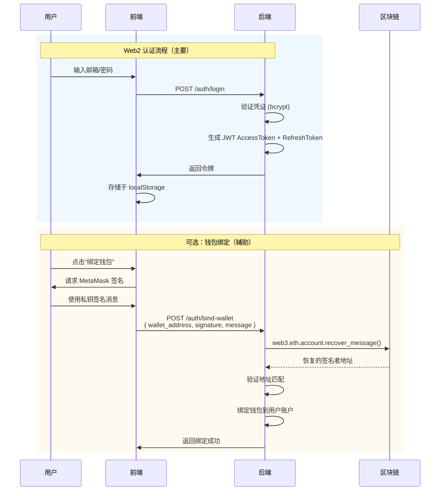
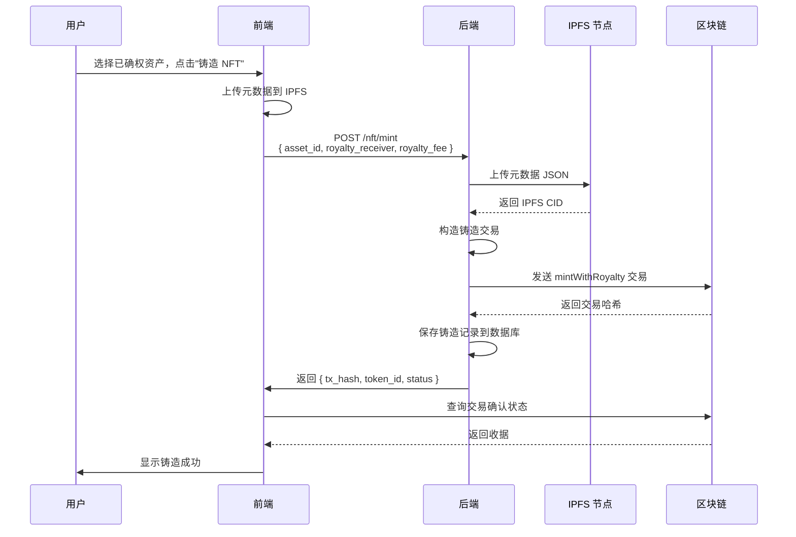
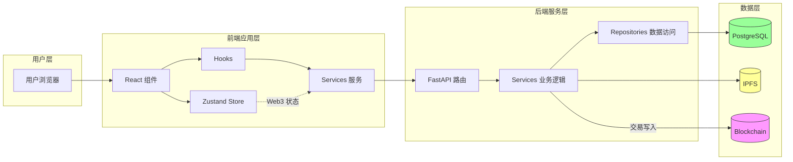
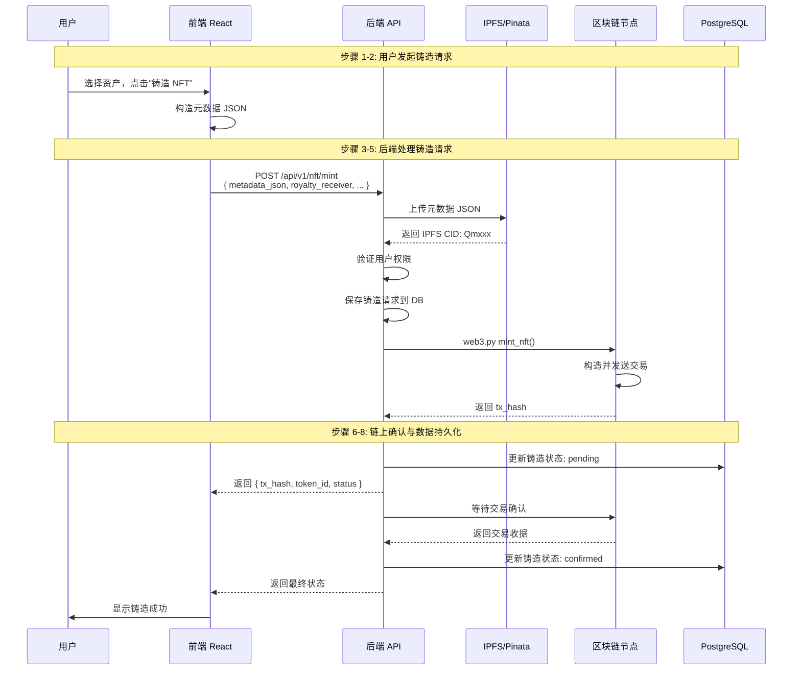
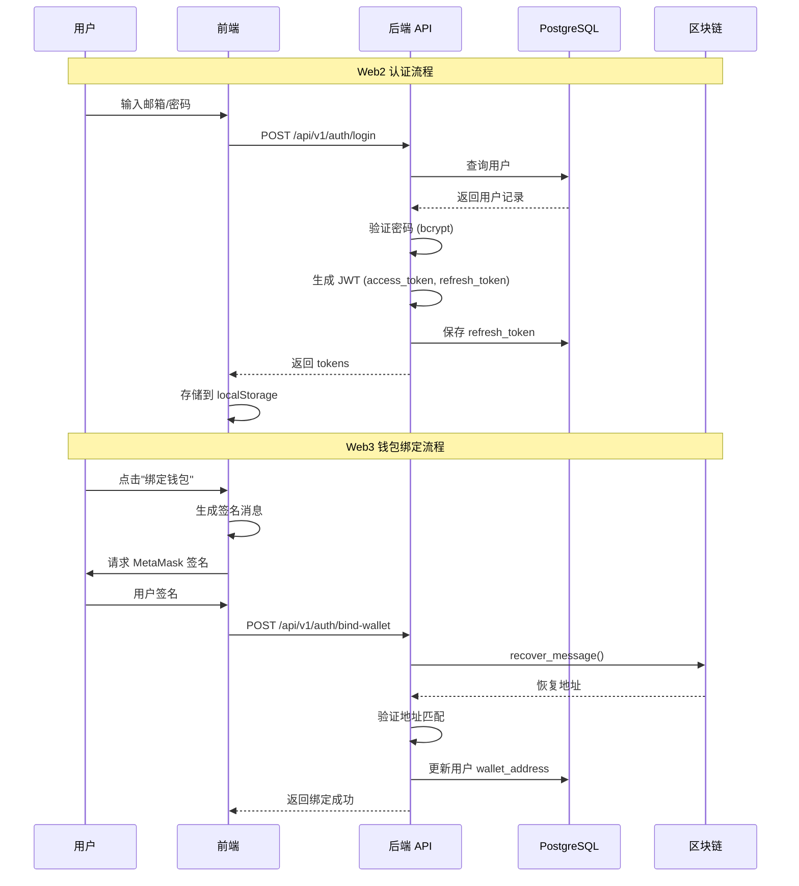
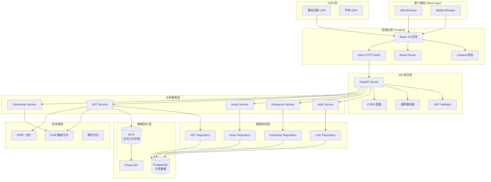
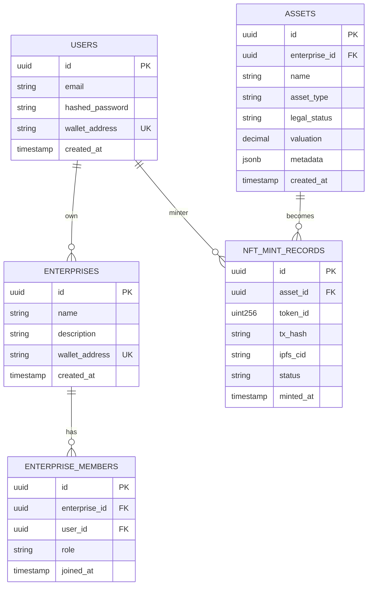

# IP-NFT 企业知识产权资产管理系统 Web2 与 Web3 融合架构设计与实现

## 摘要

本文档系统阐述了 IP-NFT 企业知识产权资产管理系统中传统 Web2 架构与新兴 Web3 区块链技术融合设计与实现方案。该系统采用分层架构设计，前端基于 React 19 框架构建用户交互界面，后端采用 FastAPI 微服务架构提供业务逻辑处理，智能合约层基于 Solidity 语言实现知识产权 NFT 的链上管理。系统采用后端网关模式进行区块链交互，所有链上交易由后端统一处理，通过 web3.py 与区块链账本进行交互。本文详细介绍了系统的技术选型依据、模块划分、数据流转机制以及关键设计决策，为企业级知识产权数字化管理提供了一套完整的 Web2-Web3 融合解决方案。

---

## 1 引言

### 1.1 研究背景

随着数字经济的快速发展，知识产权（Intellectual Property，IP）的数字化管理已成为企业资产管理的核心诉求。传统知识产权管理系统依赖于中心化数据库进行资产记录与流转追踪，存在数据可篡改、权属证明依赖第三方机构、跨机构协作效率低下等问题。区块链技术以其去中心化、不可篡改、可追溯的特性，为知识产权的数字化确权与流转提供了全新的技术路径。

非同质化通证（Non-Fungible Token，NFT）作为区块链技术的应用创新，能够将知识产权资产映射为链上唯一的数字凭证，实现知识产权的数字化表示、确权与流转。然而，纯粹的 Web3 应用在用户体验、业务流程支持、数据存储效率等方面存在局限，难以满足企业级复杂业务场景的需求。因此，设计一套融合 Web2 与 Web3 优势的混合架构系统，具有重要的理论与实践价值。

### 1.2 研究目标

本文旨在详细描述一个企业级 IP-NFT 资产管理系统的技术架构与实现方案，该系统需要达成以下目标：

1. 建立前后端分离的 Web2 应用架构，支持复杂的用户认证、企业管理、资产管理等业务逻辑；
2. 实现与区块链账本的无缝交互，支持知识产权 NFT 的铸造、转移、查询等链上操作；
3. 设计合理的数据存储策略，平衡链上与链下数据的存储成本与安全性；
4. 构建统一的身份认证体系，融合传统 JWT 令牌机制与区块链钱包签名验证。

### 1.3 论文结构

本文第二章介绍相关技术与架构背景；第三章详细阐述系统的整体架构设计；第四章深入分析核心模块的实现方案；第五章展示系统的主要数据流与交互机制；第六章进行安全性分析；第七章总结全文并展望未来工作。

---

## 2 相关技术与架构背景

### 2.1 Web2 与 Web3 技术特征对比

| 维度       | Web2 架构        | Web3 架构               |
| ---------- | ---------------- | ----------------------- |
| 数据存储   | 中心化数据库     | 分布式账本/区块链       |
| 身份标识   | 邮箱/用户名+密码 | 加密钱包地址+私钥签名   |
| 认证机制   | Session/JWT 令牌 | 数字签名验证（EIP-191） |
| 数据所有权 | 平台所有         | 用户自己控制            |
| 业务逻辑   | 服务端代码       | 智能合约                |
| 状态管理   | 数据库事务       | 链上交易                |
| 扩展性     | 高（集中式优化） | 受限于区块链吞吐量      |

### 2.2 核心技术栈概述

#### 2.2.1 前端技术选型

本系统前端采用 React 19 作为 UI 框架，配合 TypeScript 实现类型安全。状态管理选用 Zustand 5 提供轻量级状态管理方案，HTTP 通信采用 Axios 库。Web3 交互层采用 ethers.js 6.x 库，该库提供了对以太坊虚拟机（Ethereum Virtual Machine，EVM）兼容链的完整访问能力，包括钱包连接、交易签名、合约调用等功能。

#### 2.2.2 后端技术选型

后端服务基于 FastAPI 框架构建，利用其异步特性提升系统吞吐量。数据库层采用 PostgreSQL 配合 SQLAlchemy 2.0 的异步驱动（asyncpg），实现高效的数据库访问。区块链交互采用 web3.py 7.x 库，该库是 Python 生态中功能最完备的以太坊交互工具。数据迁移使用 Alembic 进行版本管理，认证机制采用 JWT 标准的 python-jose 实现。

#### 2.2.3 智能合约技术选型

智能合约采用 Solidity 0.8.20 语言开发，继承 OpenZeppelin Contracts 5.0 标准库。合约开发与测试环境选用 Hardhat 框架。NFT 实现遵循 ERC-721 标准，并集成 ERC-2981 版税标准接口，实现知识产权资产的标准化合规表示。

### 2.3 架构模式分析

Web2-Web3 融合架构通常采用以下几种模式：

**模式一：全前端交互模式**

- 前端直接与区块链交互
- 后端仅处理 Web2 业务逻辑
- 优点：去中心化程度高
- 缺点：用户体验差（每笔交易需钱包确认）

**模式二：后端网关模式（本文采用）**

- 后端持有钱包私钥（部署者账户）
- 前端通过 API 触发链上操作
- 所有交易签名由后端完成
- 优点：用户体验好、交易稳定性高、便于审计
- 缺点：中心化程度较高（适合企业内网/私有链场景）

---

## 3 系统架构设计

### 3.1 整体架构概述

本系统采用经典的三层分离架构，包括表现层（Presentation Layer）、业务逻辑层（Business Logic Layer）和数据持久层（Data Persistence Layer）。在此基础上，引入区块链交互层作为特殊的分布式数据处理层，形成四层架构体系。



### 3.2 模块划分与职责

#### 3.2.1 表现层模块

表现层负责用户界面的渲染与交互处理，主要包含以下功能模块：

| 模块名称     | 职责描述                         | 技术实现                |
| ------------ | -------------------------------- | ----------------------- |
| 认证模块     | 用户注册、登录、JWT 令牌管理     | React + Zustand         |
| 企业管理模块 | 企业 CRUD、成员邀请、角色分配    | React + Ant Design      |
| 资产管理模块 | 知识产权资产创建、编辑、状态流转 | React + Ant Design      |
| NFT 铸造模块 | 资产上链铸造、元数据管理         | React + Axios (后端API) |
| 区块链浏览器 | 链上数据查询、交易历史追踪       | React + 后端API代理     |

#### 3.2.2 业务逻辑层模块

业务逻辑层处理核心的业务规则与流程控制：

| 服务模块          | 核心功能                             | 区块链交互          |
| ----------------- | ------------------------------------ | ------------------- |
| AuthService       | 用户认证、JWT 签发、钱包绑定验证     | EIP-191 签名验证    |
| EnterpriseService | 企业管理、成员管理、权限控制         | -                   |
| AssetService      | 资产创建、状态管理、附件上传         | -                   |
| NFTService        | NFT 铸造交易构造、Gas 预估、状态追踪 | mint_nft() 调用     |
| OwnershipService  | NFT 权属记录、转移历史               | transfer_nft() 调用 |
| BlockchainService | 区块链连接管理、合约交互             | web3.py             |

#### 3.2.3 区块链交互层架构



**架构说明**：本系统采用后端网关模式，前端不直接与区块链交互。所有链上操作（NFT铸造、转移等）通过后端API触发，由部署者账户签名发送交易。

### 3.3 技术架构决策

#### 3.3.1 后端网关策略

本系统采用后端网关模式进行区块链交互，所有链上交易由后端统一处理：

**后端采用 web3.py 的考量**：

- 完善的异步支持，与 FastAPI 的 asyncio 生态无缝集成
- 私钥安全管理能力，适合作为交易构造的信任锚点
- 成熟的 HTTPProvider 机制，支持连接各类区块链节点
- 统一管理 Gas 费用，便于成本核算

**架构优势**：

- **交易稳定性**：由后端统一管理交易发送，避免前端网络波动导致失败
- **用户体验**：用户无需在每次操作时确认钱包签名
- **便于审计**：所有链上操作经由统一入口，便于日志记录与审计
- **成本可控**：Gas 费用由部署者账户统一支付，便于成本管理

**职责划分**：

| 操作类型     | 执行方式            | 说明                               |
| ------------ | ------------------- | ---------------------------------- |
| 钱包绑定验证 | 前端签名 + 后端验证 | EIP-191 标准，一次性消息验证所有权 |
| NFT 铸造交易 | web3.py (后端)      | 部署者账户签名，统一发送           |
| NFT 转移交易 | web3.py (后端)      | 同上                               |
| 链上数据查询 | 后端 API            | 通过后端代理查询，减少前端复杂度   |

#### 3.3.2 数据分层存储策略

```mermaid
graph TD
    subgraph "链上存储 On-Chain"
        O1[NFT 代币 ID]
        O2[所有者地址]
        O3[元数据 URI<br/>指向 IPFS]
        O4[版税信息]
        O5[创建者记录]
        O6[转移记录<br/>事件日志]
    end

    subgraph "链下存储 Off-Chain
        F1[PostgreSQL<br/>用户账户]
        F2[PostgreSQL<br/>企业组织]
        F3[PostgreSQL<br/>知识产权资产]
        F4[PostgreSQL<br/>权属关系映射]
        F5[IPFS<br/>元数据 JSON]
        F6[IPFS<br/>附件文件]
    end

    O1 --> O2
    O3 --> F5
    F3 --> F4
    F4 --> O1
```

**存储策略说明**：

1. **链上存储内容**：
   - NFT 代币的唯一标识符（tokenId）
   - 当前所有者地址
   - IPFS 上元数据的 URI 指针
   - 版税接收者与费率（ERC-2981）
   - 原始创建者地址（用于权限控制）
   - 铸造时间戳（不可篡改的存证）

2. **链下存储内容**：
   - 用户账户信息、企业组织结构（PostgreSQL）
   - 知识产权资产的详细描述、类型、法律状态（PostgreSQL）
   - 资产与 NFT 的映射关系（PostgreSQL）
   - NFT 元数据 JSON 文件（IPFS）
   - 资产相关的附件文件（IPFS）

3. **存储成本优化**：
   - 仅将必要的存证数据上链，大文件存储于 IPFS
   - 利用 IPFS 的去中心化特性确保元数据不可篡改
   - PostgreSQL 提供高效的业务查询能力

---

## 4 核心模块实现

### 4.1 身份认证与钱包绑定机制

#### 4.1.1 身份认证体系

本系统采用传统 Web2 认证体系为主、区块链钱包绑定为辅的认证机制：



**说明**：钱包绑定为可选功能，用于将用户账户与区块链身份关联。核心交易操作通过后端网关统一处理。

#### 4.1.2 签名消息格式设计

为防止签名被恶意重放攻击，系统设计了带有时间戳的一次性签名消息：

```
IP-NFT 平台钱包绑定验证

钱包地址: {wallet_address}
时间戳: {timestamp}
随机数: {nonce}

请签名以验证您对此钱包的所有权。
此签名将绑定到您的账户。
```

**安全性设计**：

- 时间戳限制签名有效期（15 分钟窗口）
- 随机数防止彩虹表攻击
- 消息内容包含操作意图描述

#### 4.1.3 签名验证实现

**前端签名实现**（ethers.js）：

```typescript
// C:\Users\hyperchain\Desktop\web3.0_system\frontend\src\services\blockchain.ts
async signMessage(message: string): Promise<string> {
  if (!this.signer) {
    throw new Error('钱包未连接');
  }
  // 使用 Signer API 签名消息
  return await this.signer.signMessage(message);
}
```

**后端验证实现**（web3.py）：

```python
# C:\Users\hyperchain\Desktop\web3.0_system\backend\app\core\blockchain.py
def verify_signature(
    self,
    message: str,
    signature: str,
    expected_address: str
) -> bool:
    """使用 EIP-191 标准验证签名"""
    # 根据 EIP-191 编码消息格式
    message_encoded = encode_defunct(text=message)

    # 从签名恢复签名者地址
    recovered_address = self.w3.eth.account.recover_message(
        message_encoded,
        signature=signature
    )

    # 比较地址（不区分大小写）
    return recovered_address.lower() == expected_address.lower()
```

### 4.2 区块链交互引擎实现

#### 4.2.1 前端 ethers.js 封装（开发/调试用）

前端区块链交互工具采用单例模式的封装设计，主要用于开发环境和调试：

```typescript
// C:\Users\hyperchain\Desktop\web3.0_system\frontend\src\utils\web3.ts
import { ethers } from "ethers";
import { IPNFT_ABI } from "./abis/IPNFT";

// Provider 单例管理
let provider: ethers.JsonRpcProvider | null = null;

export const initProvider = async (): Promise<ethers.JsonRpcProvider> => {
  if (!provider) {
    provider = new ethers.JsonRpcProvider(RPC_URL);
    const network = await provider.getNetwork();
    console.log("Connected to:", network.name, "Chain ID:", network.chainId);
  }
  return provider;
};

export const getContract = async (
  signerOrProvider?: ethers.Signer | ethers.Provider,
): Promise<ethers.Contract> => {
  return new ethers.Contract(CONTRACT_ADDRESS, IPNFT_ABI, signerOrProvider);
};
```

**说明**：生产环境中，前端通过后端API进行区块链交互，该封装主要用于本地开发节点连接。

#### 4.2.2 后端 web3.py 封装

后端区块链客户端采用类封装设计，支持连接管理与错误处理：

```python
# C:\Users\hyperchain\Desktop\web3.0_system\backend\app\core\blockchain.py
class BlockchainClient:
    """带有错误处理和重试逻辑的区块链交互客户端"""

    def __init__(self, provider_url: Optional[str] = None, timeout: int = 30):
        self.provider_url = provider_url or settings.WEB3_PROVIDER_URL
        self.w3 = Web3(Web3.HTTPProvider(
            self.provider_url,
            request_kwargs={"timeout": timeout}
        ))
        self.contract_address = settings.CONTRACT_ADDRESS
        self._deployer_account: Optional[Account] = None
        self._contract_abi: Optional[list] = None
        self._contract_bytecode: Optional[str] = None
        self._connect()
        self._load_contract_info()

    async def mint_nft(
        self,
        to_address: str,
        metadata_uri: str,
        royalty_receiver: Optional[str] = None,
        royalty_fee_bps: Optional[int] = None,
    ) -> tuple:
        """铸造 NFT 到指定地址"""
        contract = self._get_contract()

        if royalty_receiver and royalty_fee_bps:
            tx_hash = contract.functions.mintWithRoyalty(
                to_address,
                metadata_uri,
                royalty_receiver,
                royalty_fee_bps,
            ).transact({'from': self.deployer_address})
        else:
            tx_hash = contract.functions.mint(to_address, metadata_uri).transact({
                'from': self.deployer_address
            })

        receipt = self.w3.eth.wait_for_transaction_receipt(tx_hash)
        # 从事件日志中提取 tokenId
        token_id = self._extract_token_id_from_receipt(receipt)

        return token_id, tx_hash.hex()
```

### 4.3 NFT 铸造服务实现

#### 4.3.1 铸造流程设计

NFT 铸造是系统的核心链上操作，采用后端触发模式：



#### 4.3.2 元数据设计

NFT 元数据采用符合 ERC-721 Metadata JSON Schema 标准的设计：

```json
{
  "name": "发明专利 - 一种人工智能图像识别方法",
  "description": "本专利描述了一种基于深度卷积神经网络的图像识别方法...",
  "image": "ipfs://QmXxx.../preview.png",
  "external_url": "https://ipnft.example.com/asset/12345",
  "attributes": [
    {
      "trait_type": "asset_type",
      "value": "patent"
    },
    {
      "trait_type": "legal_status",
      "value": "approved"
    },
    {
      "trait_type": "jurisdiction",
      "value": "CN"
    },
    {
      "display_type": "date",
      "trait_type": "filing_date",
      "value": 1704067200
    }
  ]
}
```

### 4.4 智能合约实现

#### 4.4.1 合约继承架构

IPNFT 智能合约采用多重继承设计，模块化实现各类功能：

```solidity
// C:\Users\hyperchain\Desktop\web3.0_system\contracts\contracts\IPNFT.sol
contract IPNFT is
    ERC721,                 // 标准 NFT 接口
    ERC721URIStorage,       // 元数据存储扩展
    ERC721Enumerable,       // 代币枚举扩展
    ERC2981,                // 版税标准接口
    Ownable,                // 管理员权限控制
    ReentrancyGuard,        // 重入攻击防护
    Pausable                 // 紧急暂停功能
{
    // 代币 ID 计数器
    uint256 private _nextTokenId;

    // 核心映射结构
    mapping(uint256 => uint256) public mintTimestamps;      // 铸造时间戳
    mapping(uint256 => address) public originalCreators;    // 原创作者
    mapping(uint256 => bool) public metadataLocked;         // 元数据锁定
    mapping(uint256 => bool) public royaltyLocked;          // 版税锁定

    // 转移限制配置
    bool public transferWhitelistEnabled;
    uint256 public transferLockTime;
    mapping(address => bool) public transferWhitelist;

    constructor() ERC721("IP-NFT", "IPNFT") Ownable(msg.sender) {
        _nextTokenId = 1;
        transferLockTime = 0;
        transferWhitelistEnabled = false;
    }
}
```

#### 4.4.2 铸造功能实现

```solidity
function mint(address to, string memory metadataURI)
    external
    onlyOwner
    whenNotPaused
    nonReentrant
    returns (uint256)
{
    require(to != address(0), "IPNFT: mint to zero address");
    require(bytes(metadataURI).length > 0, "IPNFT: empty metadata URI");

    uint256 tokenId = _nextTokenId++;

    _safeMint(to, tokenId);
    _setTokenURI(tokenId, metadataURI);

    mintTimestamps[tokenId] = block.timestamp;
    originalCreators[tokenId] = msg.sender;

    emit NFTMinted(tokenId, msg.sender, to, metadataURI, block.timestamp);

    return tokenId;
}
```

#### 4.4.3 安全机制设计

**多重重入防护**：

```solidity
function _update(address to, uint256 tokenId, address auth)
    internal
    override(ERC721, ERC721Enumerable)
    returns (address)
{
    address from = _ownerOf(tokenId);

    // 转移限制检查
    if (from != address(0) && to != address(0)) {
        // 时间锁检查
        require(
            block.timestamp >= mintTimestamps[tokenId] + transferLockTime,
            "IPNFT: transfer lock time not expired"
        );
        // 白名单检查
        if (transferWhitelistEnabled) {
            require(transferWhitelist[to], "IPNFT: recipient not whitelisted");
        }
    }

    address result = super._update(to, tokenId, auth);

    if (from != address(0) && to != address(0) && from != to) {
        emit NFTTransferred(tokenId, from, to);
    }

    return result;
}
```

### 4.5 状态管理实现

#### 4.5.1 Web3 状态管理

采用 Zustand 进行前端状态管理，分离 Web3 状态与业务状态：

```typescript
// C:\Users\hyperchain\Desktop\web3.0_system\frontend\src\store\index.ts
interface Web3State {
  account: string | null;
  isConnected: boolean;
  chainId: number | null;
  setConnection: (account: string, chainId: number) => void;
  clearConnection: () => void;
}

export const useWeb3Store = create<Web3State>()((set) => ({
  account: null,
  isConnected: false,
  chainId: null,
  setConnection: (account, chainId) =>
    set({
      account,
      isConnected: true,
      chainId,
    }),
  clearConnection: () =>
    set({
      account: null,
      isConnected: false,
      chainId: null,
    }),
}));
```

#### 4.5.2 钱包事件监听（预留）

```typescript
// C:\Users\hyperchain\Desktop\web3.0_system\frontend\src\hooks\useWeb3.ts
// 预留的钱包事件监听机制
useEffect(() => {
  const ethereum = window.ethereum;
  if (typeof ethereum !== "undefined") {
    const handleAccountsChanged = (...args: unknown[]) => {
      const accounts = args[0] as string[];
      if (accounts.length === 0) {
        clearConnection();
      } else if (accounts[0] !== account) {
        setConnection(accounts[0], chainId || 1);
      }
    };

    const handleChainChanged = (...args: unknown[]) => {
      const newChainId = args[0] as string;
      const chainIdNum = parseInt(newChainId, 16);
      if (account) {
        setConnection(account, chainIdNum);
      }
    };

    ethereum.on("accountsChanged", handleAccountsChanged);
    ethereum.on("chainChanged", handleChainChanged);

    return () => {
      ethereum.removeListener("accountsChanged", handleAccountsChanged);
      ethereum.removeListener("chainChanged", handleChainChanged);
    };
  }
}, [account, chainId, setConnection, clearConnection]);
```

**说明**：钱包连接功能已实现但当前版本中主要作为调试功能使用，核心业务操作通过后端网关统一处理。

---

## 5 数据流转与系统交互

### 5.1 核心数据流图



### 5.2 NFT 铸造完整数据流



### 5.3 身份认证数据流



---

## 6 安全性分析

### 6.1 智能合约安全措施

| 安全机制 | 实现方式               | 防护目标               |
| -------- | ---------------------- | ---------------------- |
| 重入防护 | ReentrancyGuard 修饰器 | NFT 转移重入攻击       |
| 权限控制 | Ownable + onlyOwner    | 未授权铸造/暂停        |
| 输入验证 | require 语句           | 零地址、空数据、边界值 |
| 紧急暂停 | Pausable 机制          | 合约级紧急制动         |
| 事件审计 | 完整事件日志           | 操作可追溯性           |

### 6.2 身份认证安全

| 风险             | 缓解措施                                     |
| ---------------- | -------------------------------------------- |
| JWT 令牌泄露     | 短期有效期（15min）+ Refresh Token 轮换      |
| 钱包绑定签名重放 | 时间戳 + 随机数 + 操作绑定（仅用于绑定验证） |
| 中间人攻击       | HTTPS 传输加密                               |
| CSRF             | 后端验证 Referer/CORS                        |
| 私钥泄露         | 后端私钥隔离存储，环境变量管理               |

### 6.3 数据存储安全

| 数据类型   | 存储位置     | 安全措施         |
| ---------- | ------------ | ---------------- |
| 用户密码   | PostgreSQL   | bcrypt 哈希      |
| JWT 密钥   | 环境变量     | 隔离配置         |
| 私钥       | 后端环境变量 | 从不暴露到前端   |
| NFT 元数据 | IPFS         | 内容寻址不可篡改 |

---

## 7 系统支持的网络

### 7.1 多链部署支持

本系统智能合约支持在多条 EVM 兼容链上部署：

| 网络             | Chain ID | 用途   | RPC 节点       |
| ---------------- | -------- | ------ | -------------- |
| Ethereum Sepolia | 11155111 | 测试网 | Alchemy/Infura |
| Polygon Amoy     | 80002    | 测试网 | Polygon RPC    |
| BSC Testnet      | 97       | 测试网 | BSC RPC        |
| Hardhat Local    | 31337    | 开发   | localhost:8545 |

### 7.2 网络切换机制

前端通过 chainId 判断当前连接的网络，并动态调整合约地址与 RPC 配置：

```typescript
const CHAIN_CONFIG = {
  11155111: { name: "Sepolia", explorer: "https://sepolia.etherscan.io" },
  80002: { name: "Amoy", explorer: "https://www.oklink.com/amoy" },
  97: { name: "BSC Testnet", explorer: "https://testnet.bscscan.com" },
  31337: { name: "Hardhat", explorer: null },
};
```

---

## 8 结论

### 8.1 工作总结

本文详细阐述了一个企业级 IP-NFT 资产管理系统中 Web2 与 Web3 融合架构的设计与实现方案。该系统的主要工作与特点包括：

1. **分层融合架构**：设计了前后端分离的 Web2 应用架构与基于智能合约的 Web3 链上架构的融合方案，采用后端网关模式实现统一的区块链交互管理。

2. **统一身份认证体系**：实现了传统 JWT 令牌认证与区块链钱包签名验证相结合的身份认证机制，支持可选的钱包绑定功能。

3. **数据分层存储策略**：设计了链上与链下相结合的数据存储策略，将必要的存证数据上链以利用区块链的不可篡改性，大文件与业务数据存储于传统数据库以优化成本与效率。

4. **企业级功能支持**：实现了完整的知识产权资产管理功能，包括企业组织管理、成员角色控制、资产状态流转以及 NFT 铸造的完整生命周期管理。

### 8.2 局限性分析

当前系统存在以下局限性：

1. **可升级性缺失**：智能合约采用直接部署模式，未实现代理升级机制，合约升级需要重新部署。
2. **跨链互操作受限**：系统仅支持单链部署，NFT 资产无法在不同链之间转移。
3. **预言机集成空白**：系统尚未集成 Chainlink 等预言机服务，无法获取链外数据（如动态估值）。

### 8.3 未来工作展望

1. **合约升级机制**：引入 UUPS 或 Transparent 代理模式，支持合约逻辑升级同时保留链上状态。
2. **跨链互操作**：集成 LayerZero 或 Wormhole 等跨链消息传递协议，实现 NFT 资产的跨链流转。
3. **动态数据集成**：引入 Chainlink 预言机，支持知识产权的动态估值、版权到期自动续费等高级功能。
4. **去中心化身份**：集成 DID（去中心化身份）协议，实现真正的用户数据主权。

---

## 参考文献

[1] Buterin V. Ethereum: A next-generation smart contract and decentralized application platform[J]. Ethereum White Paper, 2014.

[2] Di Angelo M, Durd G. On the security and usability of ERC721 tokens[C]//International Conference on Business Information Systems. Springer, 2019.

[3] OpenZeppelin. OpenZeppelin Contracts Documentation[EB/OL]. https://docs.openzeppelin.com/contracts.

[4] Wood G. Ethereum: A secure decentralised generalised transaction ledger[J]. Ethereum Project Yellow Paper, 2014.

[5] Ethereum Foundation. EIP-721: Non-Fungible Token Standard[EB/OL]. https://eips.ethereum.org/EIPS/eip-721.

[6] Entriken W, Shirley D, Evans J, et al. EIP-2981: NFT Royalty Standard[EB/OL]. https://eips.ethereum.org/EIPS/eip-2981.

[7] Szabo N. Smart contracts: building blocks for digital markets[J]. Extropy, 1996.

[8] Nakamoto S. Bitcoin: A peer-to-peer electronic cash system[J]. Bitcoin.org, 2008.

---

## 附录 A：核心代码文件索引

| 文件路径                              | 说明                           |
| ------------------------------------- | ------------------------------ |
| `frontend/src/utils/web3.ts`          | ethers.js 封装与 Provider 管理 |
| `frontend/src/services/blockchain.ts` | 钱包签名服务（开发/调试用） |
| `frontend/src/hooks/useWeb3.ts`       | Web3 状态管理 Hook             |
| `frontend/src/store/index.ts`         | Zustand 状态管理配置           |
| `frontend/src/utils/abis/IPNFT.ts`    | IPNFT 合约 ABI 定义            |
| `frontend/src/services/nft.ts`        | NFT 业务 API 服务              |
| `backend/app/core/blockchain.py`      | web3.py 区块链客户端           |
| `backend/app/core/ipfs.py`            | IPFS 交互客户端                |
| `backend/app/services/nft_service.py` | NFT 铸造业务逻辑               |
| `contracts/contracts/IPNFT.sol`       | IPNFT 智能合约源码             |

---

## 附录 B：系统架构图

### B.1 完整技术架构图



**说明**：前端通过 Axios 调用后端 API，后端统一处理与区块链的交互，不存在前端直接连接区块链的路径。

### B.2 数据模型关系图



---

_文档版本：1.0_
_撰写日期：2026-04-02_
_项目名称：IP-NFT Enterprise Asset Management System_
