# IP-NFT 系统业务流程图

**文档版本：** v1.0  
**生成日期：** 2026-04-11  
**依据文档：** 需求规格说明书.md, chapter-3-requirements.md  

---

## 目录

1. [总体业务架构](#1-总体业务架构)
2. [用户注册登录流程](#2-用户注册登录流程)
3. [企业创建与管理流程](#3-企业创建与管理流程)
4. [IP资产创建流程](#4-ip资产创建流程)
5. [审批工作流](#5-审批工作流)
6. [NFT铸造流程](#6-nft铸造流程)
7. [NFT所有权转移流程](#7-nft所有权转移流程)
8. [钱包绑定流程](#8-钱包绑定流程)

---

## 1. 总体业务架构

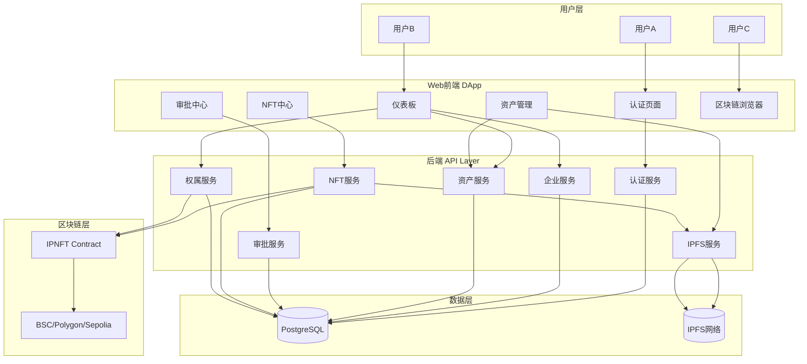

---

## 2. 用户注册登录流程

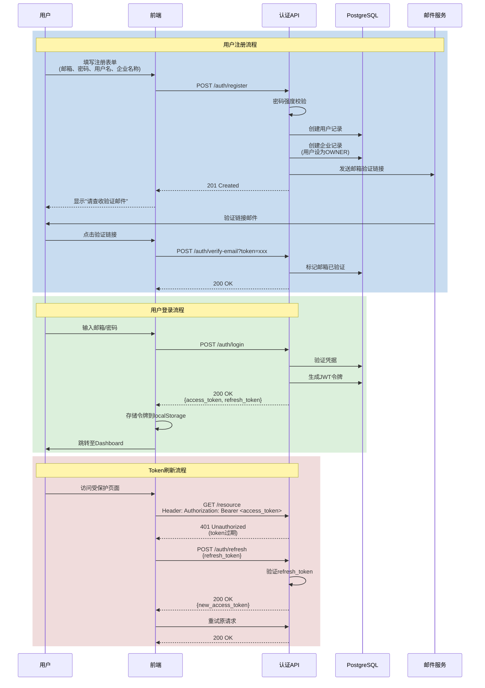

---

## 3. 企业创建与管理流程

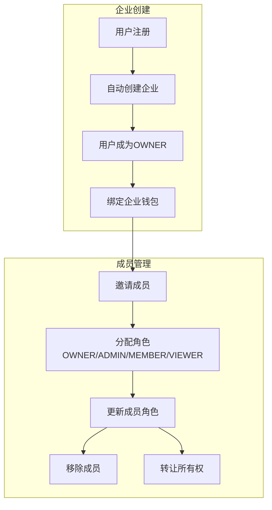

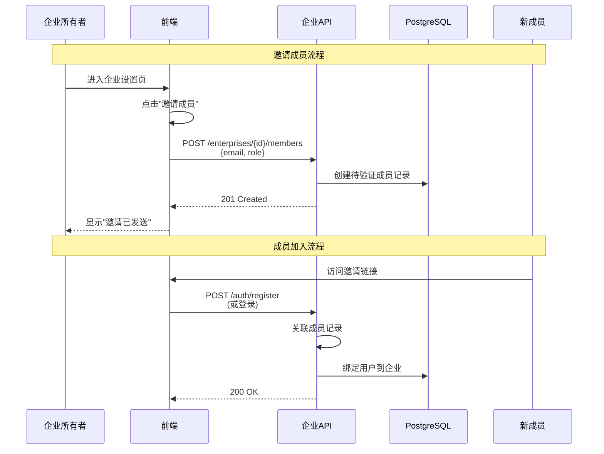

---

## 4. IP资产创建流程

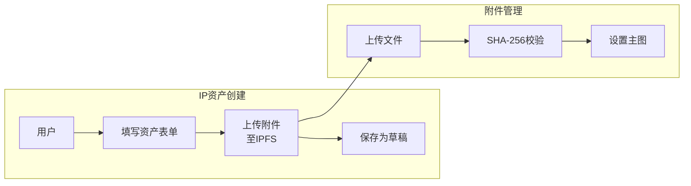

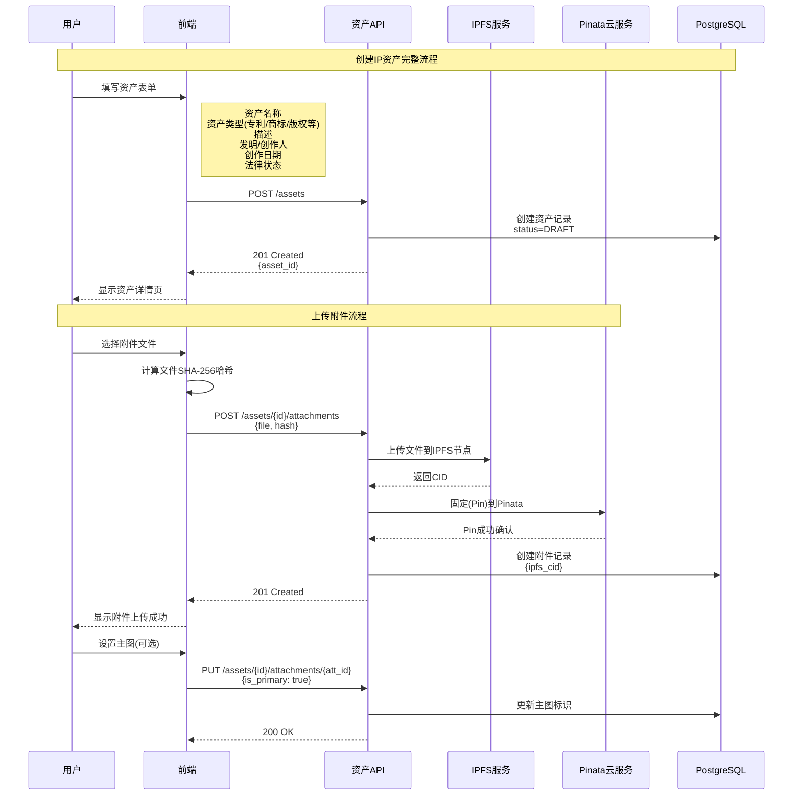

---

## 5. 审批工作流

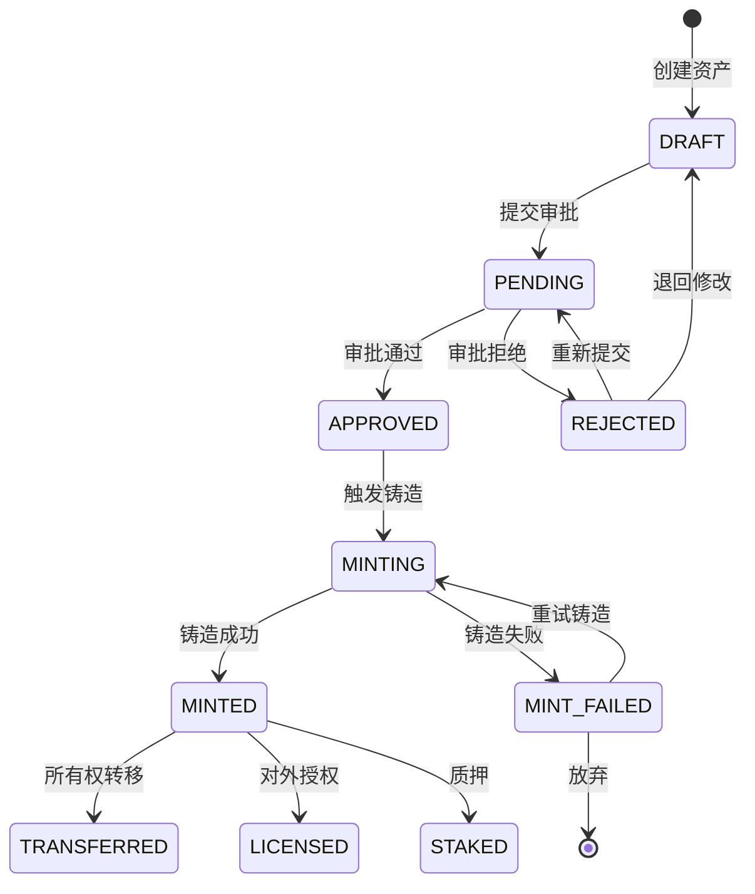

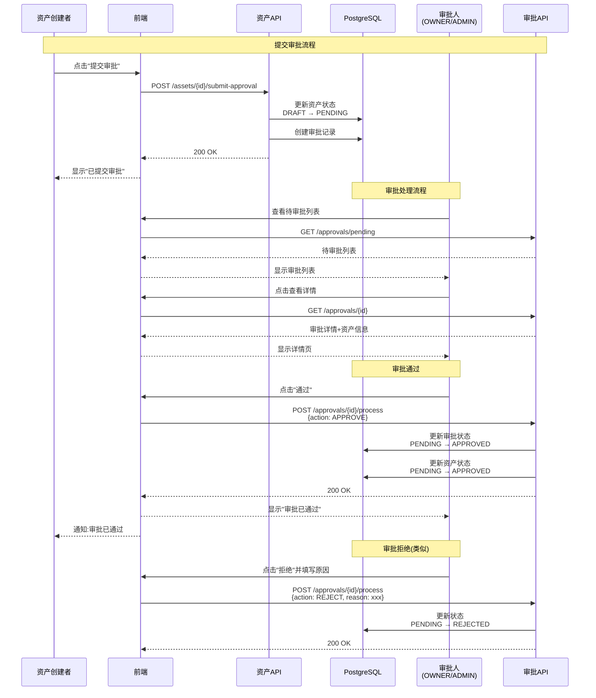

---

## 6. NFT铸造流程

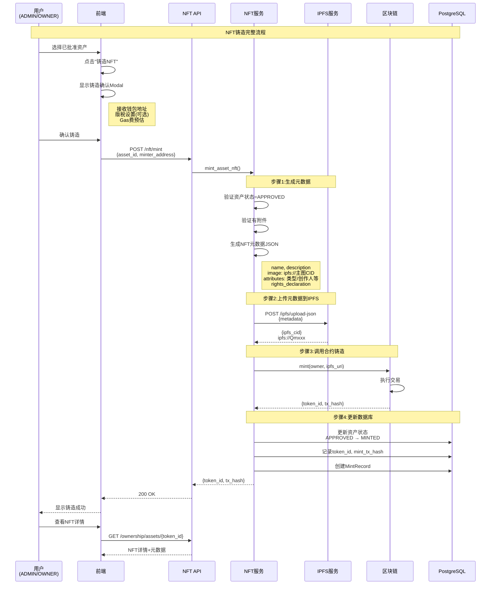

```mermaid
graph TB
    subgraph 铸造前检查["铸造前置条件检查"]
        C1[资产状态=APPROVED]
        C2[资产有附件]
        C3[用户角色=ADMIN或OWNER]
        C4[资产未铸造过]
    end

    subgraph 元数据生成["NFT元数据生成"]
        M1[构建JSON对象]
        M2[设置name/description]
        M3[设置image为IPFS URI]
        M4[添加attributes数组]
        M5[添加rights_declaration]
    end

    subgraph 链上操作["链上铸造"]
        B1[上传元数据JSON到IPFS]
        B2[获取metadata CID]
        B3[调用IPNFT.mint()]
        B4[等待交易确认]
        B5[获取token_id]
    end

    subgraph 数据库更新["数据库更新"]
        D1[更新status=MINTED]
        D2[记录token_id]
        D3[记录mint_tx_hash]
        D4[创建MintRecord]
    end

    C1 --> C2 --> C3 --> C4
    C4 --> M1 --> M2 --> M3 --> M4 --> M5
    M5 --> B1 --> B2 --> B3 --> B4 --> B5
    B5 --> D1 --> D2 --> D3 --> D4
```

---

## 7. NFT所有权转移流程

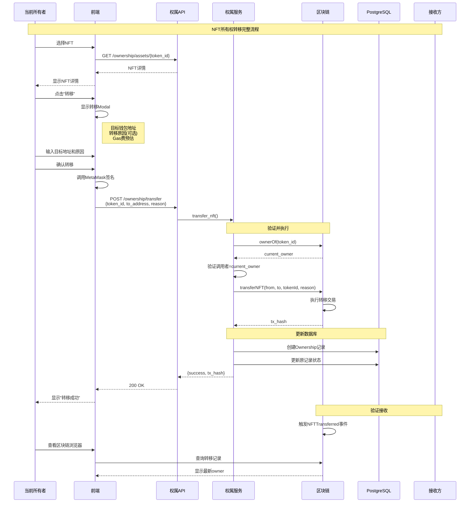

```mermaid
graph TB
    subgraph 转移限制["所有权转移限制"]
        R1[只有OWNER或ADMIN可以转移]
        R2[目标地址不能为零地址]
        R3[转移锁定时间内不可转移<br/>(可选)]
        R4[白名单模式下<br/>目标需在白名单中]
    end

    subgraph 事件记录["链上事件记录"]
        E1[NFTTransferred事件<br/>tokenId, from, to]
        E2[NFTTransferredWithReason事件<br/>包含reason字符串]
    end

    subgraph 溯源数据["溯源数据结构"]
        S1[token_id]
        S2[originalCreator<br/>(永久保留)]
        S3[mintTimestamp]
        S4[ownership_history<br/>时间线]
    end

    R1 --> R2 --> R3 --> R4
    E1 --> E2
    S1 --> S2 --> S3 --> S4
```

---

## 8. 钱包绑定流程

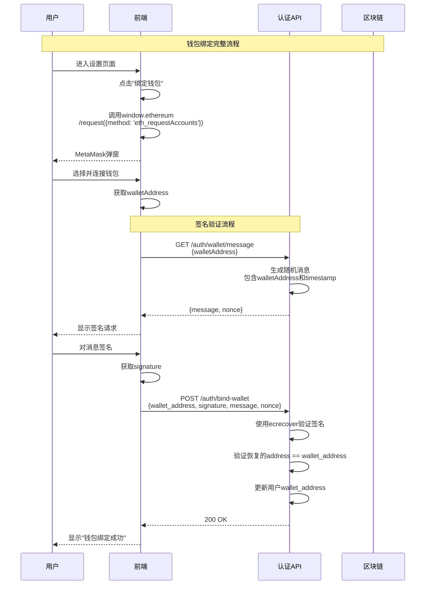

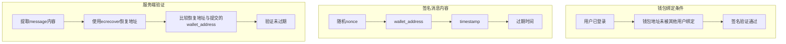

---

## 附录: 批量操作流程

### 批量铸造流程

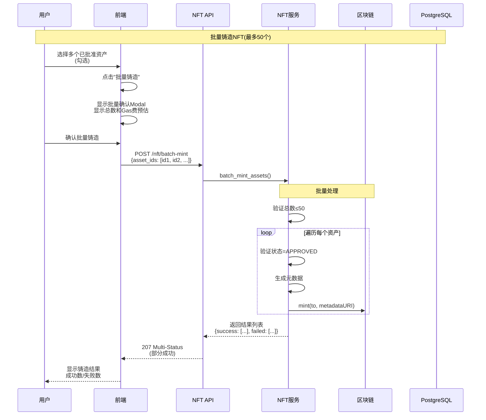

### 批量审批流程

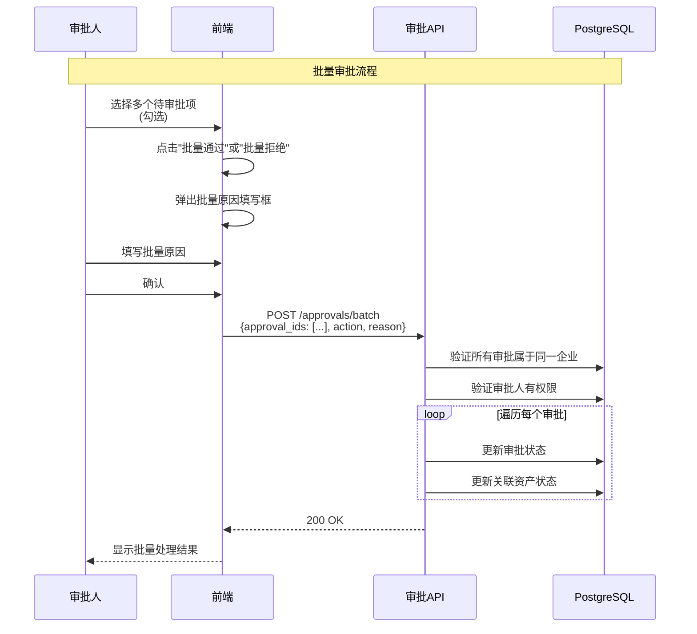

---

## 附录: 数据流向总图

```mermaid
graph LR
    subgraph 前端["前端 (React)"]
        F1[表单输入]
        F2[Web3交互]
        F3[状态管理<br/>Zustand]
        F4[API调用<br/>Axios]
    end

    subgraph 后端服务["后端服务"]
        B1[API路由层]
        B2[业务逻辑层<br/>Services]
        B3[数据访问层<br/>Repositories]
        B4[数据库<br/>PostgreSQL]
    end

    subgraph 外部服务["外部服务"]
        E1[IPFS<br/>(Kubo+Pinata)]
        E2[区块链<br/>(web3.py)]
        E3[邮件服务<br/>(SMTP)]
    end

    subgraph 智能合约["智能合约"]
        C1[IPNFT.sol<br/>ERC-721]
        C2[元数据存储<br/>IPFS]
    end

    F1 --> F3 --> F4 --> B1
    F2 --> C1
    B1 --> B2 --> B3 --> B4
    B2 --> E1
    B2 --> E2 --> C1
    B2 --> E3
    C1 -.-> E2
    E1 -.-> C2
```

---

*文档基于需求规格说明书.md 和 chapter-3-requirements.md 生成*
*流程图使用 Mermaid 语法编写，可在支持 Mermaid 的 Markdown 渲染器中查看*
