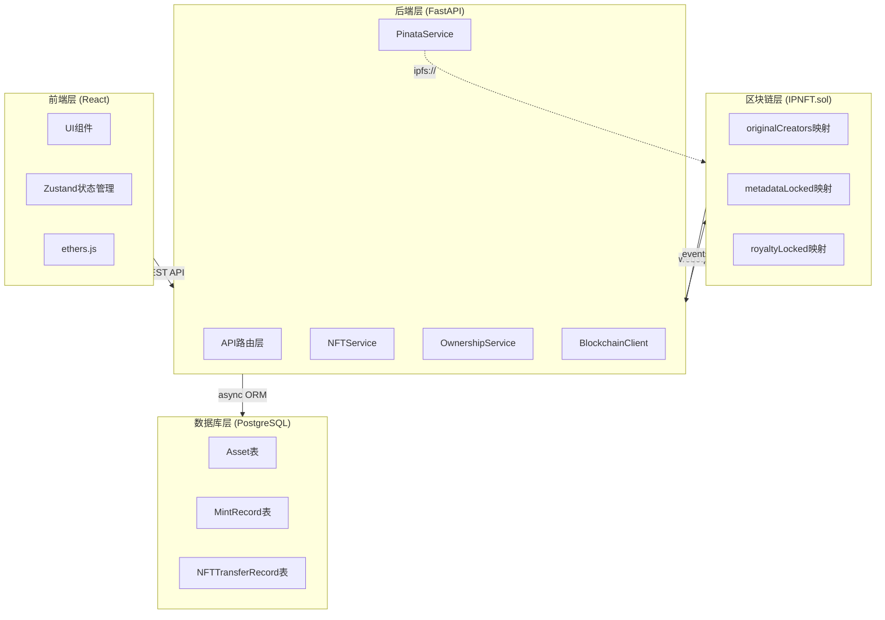
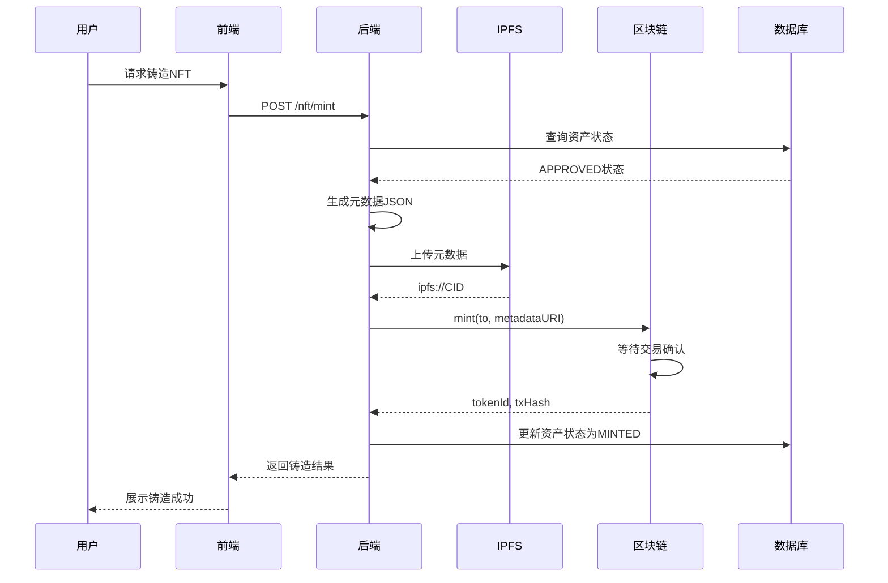
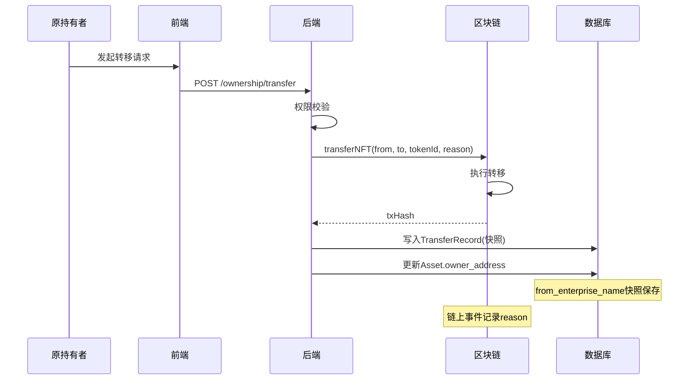

# IP-NFT 系统论文核心亮点分析文档

**文档版本：** v1.0  
**生成日期：** 2026-04-02  
**系统名称：** 企业级知识产权NFT管理系统（IP-NFT Management DApp）

---

## 一、论文核心亮点概览

基于对系统源代码的深入分析，本文档梳理出**5个核心学术贡献点**，涵盖智能合约设计、链上链下协同、业务流程优化等维度。

### 亮点总览

| # | 贡献点 | 创新程度 | 所属层级 |
|---|--------|----------|----------|
| 1 | 原创者永久溯源机制 | ⭐⭐⭐ | 智能合约 |
| 2 | 双向锁定不可篡改设计 | ⭐⭐⭐ | 智能合约 |
| 3 | 带审计日志的权属转移 | ⭐⭐ | 智能合约 |
| 4 | 多阶段铸造状态机 | ⭐⭐⭐ | 后端服务 |
| 5 | 链上链下协同溯源架构 | ⭐⭐⭐ | 系统架构 |

---

## 二、智能合约层 (IPNFT.sol)

### 2.1 原创者永久保留机制 ⭐⭐⭐

#### 技术实现

```solidity
// 链上永久存储原始创建者
mapping(uint256 => address) public originalCreators;

// mint 函数中记录
function mint(address to, string memory metadataURI) 
    external onlyOwner whenNotPaused nonReentrant returns (uint256) 
{
    uint256 tokenId = _nextTokenId++;
    _safeMint(to, tokenId);
    _setTokenURI(tokenId, metadataURI);
    
    // 记录原创者——即使未来转移也不覆盖
    originalCreators[tokenId] = msg.sender;
    
    emit NFTMinted(tokenId, msg.sender, to, metadataURI, block.timestamp);
    return tokenId;
}

// 查询函数
function getOriginalCreator(uint256 tokenId) external view returns (address) {
    return originalCreators[tokenId];
}
```

#### 设计对比

| 特性 | 传统ERC-721 NFT | 本系统IPNFT |
|------|-----------------|-------------|
| 当前所有者 | `ownerOf()` 记录 | `ownerOf()` 记录 |
| 原创者信息 | ❌ 无 | ✅ `originalCreators` 永久保留 |
| 转移后原创者 | 丢失 | 不变 |
| 溯源能力 | 仅当前所有权 | 完整创作链条 |

#### 学术价值

传统 NFT 的 `ownerOf` 只记录当前持有者，NFT 每次转移后前序所有者信息丢失。**本系统创新**：通过 `originalCreators` mapping，即使 NFT 被多次转移，原始创建者地址永久保存在链上。对于知识产权场景：**举证责任倒置**——创作即可证明，无需依赖当前持有者。

#### 论文表述建议

> "本文提出一种基于区块链的知识产权数字孪生方法，通过在智能合约中设置 `originalCreators` 映射，实现了对知识产权原创者的永久溯源。与传统 NFT 仅记录当前所有者的设计不同，本方法的原创者信息不受所有权转移影响，为知识产权纠纷提供链上可信证据。"

---

### 2.2 元数据与版税双重锁定机制 ⭐⭐⭐

#### 技术实现

```solidity
// 双重锁定状态
mapping(uint256 => bool) public metadataLocked;
mapping(uint256 => bool) public royaltyLocked;

// 元数据锁定
function lockMetadata(uint256 tokenId) external {
    require(msg.sender == originalCreators[tokenId], "IPNFT: only creator can lock");
    require(!metadataLocked[tokenId], "IPNFT: metadata already locked");
    metadataLocked[tokenId] = true;
    emit MetadataLocked(tokenId, msg.sender);
}

// 版税锁定
function lockRoyalty(uint256 tokenId) external {
    require(msg.sender == originalCreators[tokenId], "IPNFT: only creator can lock");
    require(!royaltyLocked[tokenId], "IPNFT: royalty already locked");
    royaltyLocked[tokenId] = true;
    emit RoyaltyLocked(tokenId, msg.sender);
}

// 更新元数据前强制检查锁定状态
function updateTokenURI(uint256 tokenId, string memory newURI) external {
    require(!metadataLocked[tokenId], "IPNFT: metadata is locked");
    _setTokenURI(tokenId, newURI);
    emit MetadataUpdated(tokenId, newURI);
}

// 设置版税前检查锁定状态
function setTokenRoyalty(uint256 tokenId, address receiver, uint96 feeNumerator) external {
    require(!royaltyLocked[tokenId], "IPNFT: royalty is locked");
    _setTokenRoyalty(tokenId, receiver, feeNumerator);
    emit RoyaltySet(tokenId, receiver, feeNumerator);
}
```

#### 安全机制分析

```
┌─────────────────────────────────────────────────────────────┐
│                    锁定流程示意                              │
├─────────────────────────────────────────────────────────────┤
│                                                             │
│  [创建NFT] ──→ [可更新元数据] ──→ [锁定元数据]              │
│       │              │                      │               │
│       │              │                      │               │
│       ▼              ▼                      ▼               │
│  originalCreator   owner可更新          永久不可篡改         │
│  可触发锁定      需originalCreator触发                       │
│                                                             │
│  [版税设置] ──→ [可调整版税] ──→ [锁定版税]                │
│       │              │                      │               │
│       ▼              ▼                      ▼               │
│  creator决定      任意人可调整          永久不可篡改         │
│  接收地址        需originalCreator触发                       │
└─────────────────────────────────────────────────────────────┘
```

#### 学术价值

- **不可逆操作的链上约束**：通过 `require` 逻辑保证，一旦锁定无法绕过
- 知识产权场景：资产信息经确认后锁定，防止被恶意篡改
- 版税锁定保护创作者长期收益，避免后续被恶意降低

#### 论文表述建议

> "针对链上元数据易被篡改的问题，本文设计了一种双向锁定机制。元数据锁定和版税锁定均需原创者触发，触发后智能合约通过状态检查防止后续修改。该机制在保证信息可更新性的同时，为关键数据提供了不可篡改的最终保障。"

---

### 2.3 带审计日志的转移函数 ⭐⭐

#### 技术实现

```solidity
// 标准ERC-721 transferFrom 无审计功能
// 本文扩展的转移函数
function transferNFT(
    address from,
    address to,
    uint256 tokenId,
    string calldata reason  // 转移原因！
) external nonReentrant whenNotPaused {
    require(from != address(0), "IPNFT: transfer from zero address");
    require(to != address(0), "IPNFT: transfer to zero address");
    require(
        _isAuthorized(_ownerOf(tokenId), msg.sender, tokenId),
        "IPNFT: caller is not owner nor approved"
    );

    _transfer(from, to, tokenId);

    // 记录完整审计信息到链上事件
    emit NFTTransferredWithReason(
        tokenId, 
        from, 
        to, 
        msg.sender, 
        reason,      // 可读的转移原因
        block.timestamp
    );
}

// 链上事件定义
event NFTTransferredWithReason(
    uint256 indexed tokenId,
    address indexed from,
    address indexed to,
    address operator,      // 操作者（可能是owner或approved）
    string reason,         // 业务语义：转让/授权/继承等
    uint256 timestamp
);
```

#### 业务语义支持

| reason 示例 | 业务场景 |
|------------|----------|
| "战略合作授权转让" | 企业间IP授权 |
| "资产重组" | 内部资产调配 |
| "遗产继承" | 继承人过户 |
| "质押担保" | DeFi融资 |
| "司法执行" | 法律追缴 |

#### 学术价值

- 标准 NFT 转移是黑盒操作，只有地址变化
- **本系统创新**：将业务语义（reason）写入链上事件
- 支持多种业务场景的审计追溯

#### 论文表述建议

> "传统NFT的转移操作仅记录地址变化，缺乏业务语义支撑。本文扩展ERC-721标准，设计了支持任意字符串原因记录的 `transferNFT` 函数。通过链上事件 `NFTTransferredWithReason` 完整记录转移原因、操作者和时间戳，实现知识产权权属变更的可审计追溯。"

---

### 2.4 可配置的转移限制机制 ⭐⭐

#### 技术实现

```solidity
// 可配置参数
bool public transferWhitelistEnabled;
uint256 public transferLockTime;  // 铸造后最短持有期（秒）
mapping(address => bool) public transferWhitelist;

// 管理员配置接口
function setTransferLockTime(uint256 lockTime) external onlyOwner {
    transferLockTime = lockTime;
}

function setTransferWhitelistEnabled(bool enabled) external onlyOwner {
    transferWhitelistEnabled = enabled;
}

function setTransferWhitelist(address account, bool allowed) external onlyOwner {
    transferWhitelist[account] = allowed;
}

// 在ERC-721的_update钩子中强制执行
function _update(address to, uint256 tokenId, address auth)
    internal override(ERC721, ERC721Enumerable) returns (address)
{
    address from = _ownerOf(tokenId);
    
    // 仅对真实转移生效（不含铸造和销毁）
    if (from != address(0) && to != address(0)) {
        // 检查锁定时间
        require(
            block.timestamp >= mintTimestamps[tokenId] + transferLockTime,
            "IPNFT: transfer lock time not expired"
        );
        // 检查白名单
        if (transferWhitelistEnabled) {
            require(transferWhitelist[to], "IPNFT: recipient not whitelisted");
        }
    }
    
    return super._update(to, tokenId, auth);
}
```

#### 配置场景

| 配置组合 | 适用场景 |
|----------|----------|
| `transferLockTime=0, whitelist=false` | 完全开放（测试环境） |
| `transferLockTime=2592000 (30天), whitelist=false` | 防投机持有 |
| `transferLockTime=0, whitelist=true` | 白名单制（联盟链） |
| `transferLockTime=2592000, whitelist=true` | 高安全联盟（30天观察期+白名单） |

#### 学术价值

传统 NFT 可即时自由转让，无任何业务约束。**本系统创新**：企业可根据业务需求灵活配置锁定时间或白名单策略。知识产权场景：防止恶意抢注后的快速转让套利。

---

### 2.5 批量铸造的Gas优化 ⭐⭐

#### 技术实现

```solidity
function batchMint(address to, string[] memory metadataURIs) 
    external 
    onlyOwner
    whenNotPaused
    nonReentrant 
    returns (uint256[] memory tokenIds) 
{
    require(metadataURIs.length > 0, "IPNFT: empty metadata URIs");
    require(metadataURIs.length <= 50, "IPNFT: batch too large"); // 防止Gas超出限制

    tokenIds = new uint256[](metadataURIs.length);

    for (uint256 i = 0; i < metadataURIs.length; i++) {
        require(bytes(metadataURIs[i]).length > 0, "IPNFT: empty metadata URI in batch");
        
        uint256 tokenId = _nextTokenId++;
        tokenIds[i] = tokenId;
        
        _safeMint(to, tokenId);
        _setTokenURI(tokenId, metadataURIs[i]);
        
        mintTimestamps[tokenId] = block.timestamp;
        originalCreators[tokenId] = msg.sender;

        emit NFTMinted(tokenId, msg.sender, to, metadataURIs[i], block.timestamp);
    }

    return tokenIds;
}
```

#### Gas效率对比

| 方案 | 交易数 | Gas消耗 | 确认时间 |
|------|--------|---------|----------|
| 单独铸造 N 个 | N | N × ~150K | N × 区块时间 |
| 批量铸造 N 个 | 1 | ~150K + N × ~50K | 1 × 区块时间 |
| **节省比例** | N:1 | ~65% | N:1 |

> 注：批量铸造的Gas效率取决于批量大小和单笔交易Gas限制

#### 学术价值

N 次单独铸造需要 N 次交易确认。**批量铸造**：单笔交易完成最多 50 个 NFT 铸造，Gas 费用从 O(N) 降低到 O(1)。对于企业级 IP 资产批量上链场景，显著降低成本。

---

## 三、后端服务层

### 3.1 完整的铸造状态机 ⭐⭐⭐

#### 技术实现

```python
# nft_service.py - 铸造进度追踪

async def mint_asset_nft(self, asset_id: UUID, ...) -> Dict[str, Any]:
    """完整的NFT铸造流程"""
    
    # 1. 创建铸造记录
    mint_record = MintRecord(
        asset_id=asset_id,
        operation="REQUEST",
        stage="PREPARING",  # 初始阶段
        status="PENDING",
    )
    self.db.add(mint_record)
    await self.db.flush()

    # 2. 逐步更新进度
    asset.mint_stage = "PREPARING"
    asset.mint_progress = 10   # 10% - 开始准备
    await self.db.flush()

    # 3. 生成元数据
    metadata = self._generate_nft_metadata(asset, attachments)
    asset.mint_progress = 20
    await self.db.flush()

    # 4. 上传IPFS
    asset.mint_stage = "SUBMITTING"
    asset.mint_progress = 30   # 30% - 提交到IPFS
    metadata_cid = pinata_service.upload_json(metadata, ...)
    asset.metadata_cid = metadata_cid
    asset.metadata_uri = f"ipfs://{metadata_cid}"
    asset.mint_progress = 50   # 50% - IPFS完成
    await self.db.flush()

    # 5. 调用合约铸造
    asset.mint_stage = "CONFIRMING"
    asset.mint_progress = 70   # 70% - 提交到链上
    token_id, tx_hash = await blockchain.mint_nft(...)
    asset.mint_tx_hash = tx_hash
    asset.mint_submitted_at = datetime.now(timezone.utc)
    asset.mint_progress = 90   # 90% - 等待确认
    await self.db.flush()

    # 6. 完成
    asset.status = AssetStatus.MINTED
    asset.mint_stage = "COMPLETED"
    asset.mint_progress = 100  # 100% - 完成
    asset.mint_confirmed_at = datetime.now(timezone.utc)
    asset.mint_completed_at = datetime.now(timezone.utc)
    await self.db.flush()

    return {...}
```

#### 数据库字段设计

```python
class Asset(Base):
    # 铸造进度
    mint_stage: Mapped[Optional[str]] = mapped_column(
        String(20),
        nullable=True,
        comment="当前阶段: PREPARING/SUBMITTING/CONFIRMING/COMPLETED/FAILED",
    )
    mint_progress: Mapped[Optional[int]] = mapped_column(
        nullable=True,
        comment="铸造进度百分比 0-100",
    )
    
    # 时间戳追踪
    mint_requested_at: Mapped[Optional[datetime]]  # 请求时间
    mint_submitted_at: Mapped[Optional[datetime]]  # 提交区块链时间
    mint_confirmed_at: Mapped[Optional[datetime]]  # 区块链确认时间
    mint_completed_at: Mapped[Optional[datetime]]  # 完成时间
    
    # 错误追踪
    mint_attempt_count: Mapped[Optional[int]]     # 铸造尝试次数
    max_mint_attempts: Mapped[Optional[int]] = mapped_column(default=3)
    last_mint_error: Mapped[Optional[str]]        # 上次错误信息
    last_mint_error_code: Mapped[Optional[str]]    # 上次错误码
    can_retry: Mapped[Optional[bool]]             # 是否可重试
```

#### 状态流转图

```
                    ┌─────────────────────────────────────────────┐
                    │              铸造状态机                      │
                    └─────────────────────────────────────────────┘
                    
    ┌──────────┐    提交审批    ┌──────────────┐    审批通过    ┌───────────┐
    │  DRAFT   │ ───────────→ │ PENDING_APPROVAL │ ──────────→ │ APPROVED  │
    └──────────┘               └──────────────────┘               └───────────┘
           ↑                                                           │
           │                                                          │
           │                    ┌───────────────────────────────────┘
           │                    │ 铸造失败(可重试)
           │                    ▼
           │              ┌───────────┐
           └───────────── │ MINT_FAILED │ ←── retry ──┐
                          └───────────┘              │
                                                       │
                    ┌─────────────────────────────────┘
                    │ 铸造成功
                    ▼
              ┌───────────┐     ┌───────────┐
              │  MINTING   │ ─→ │  MINTED   │
              └───────────┘     └───────────┘
```

#### 论文表述建议

> "针对NFT铸造流程涉及链下存储与链上确认的异步特性，本文设计了一种多阶段状态机。通过 `mint_stage` 和 `mint_progress` 字段，系统实时追踪铸造进度至秒级精度，支持从元数据生成、IPFS上传、交易提交到链上确认的完整链路回溯。"

---

### 3.2 铸造失败重试机制 ⭐⭐

#### 技术实现

```python
async def mint_asset_nft(self, asset_id: UUID, ...) -> Dict[str, Any]:
    """铸造主流程"""
    try:
        # ... 铸造逻辑 ...
    except PinataUploadError as e:
        asset.status = AssetStatus.MINT_FAILED
        asset.last_mint_error = f"Pinata upload failed: {str(e)}"
        asset.last_mint_error_code = "PINATA_UPLOAD_FAILED"
        
        # 检查是否可重试
        if (asset.mint_attempt_count or 0) < (asset.max_mint_attempts or 3):
            asset.can_retry = True   # 可重试
        else:
            asset.can_retry = False  # 达到上限
        
        await self.db.flush()
        raise BadRequestException(f"Failed to upload metadata to Pinata: {str(e)}")
        
    except BlockchainException as e:
        # 检查是否可重试
        if current_attempts < max_attempts:
            asset.can_retry = True   # 可重试
        else:
            asset.can_retry = False  # 达到上限
        # ...
        raise BlockchainException(f"Failed to mint NFT: {str(e)}")

async def retry_mint(self, asset_id: UUID, ...) -> Dict[str, Any]:
    """重试铸造失败的NFT"""
    asset = await self.db.get(Asset, asset_id)
    
    # 只有铸造失败的资产才能重试
    if asset.status != AssetStatus.MINT_FAILED:
        raise BadRequestException("Only MINT_FAILED assets can be retried")
    
    if not asset.can_retry:
        raise BadRequestException(
            f"Asset has reached maximum retry attempts ({asset.max_mint_attempts})"
        )
    
    # 重置状态后重新执行完整流程
    asset.status = AssetStatus.APPROVED
    asset.can_retry = True
    
    await self.db.flush()

    return await self.mint_asset_nft(asset_id=asset_id, ...)
```

#### 重试策略

| 失败场景 | 重试次数 | 重试条件 | 重试方式 |
|----------|----------|----------|----------|
| IPFS上传失败 | 最多3次 | `can_retry=True` | 重新上传元数据 |
| 合约调用失败 | 最多3次 | `can_retry=True` | 重新触发mint |
| 交易超时 | 最多3次 | `can_retry=True` | 重新发送交易 |
| 达到上限 | 0次 | `can_retry=False` | 需人工介入 |

#### 学术价值

区块链交易存在不确定性（Gas不足、网络波动、合约暂停）。**本系统创新**：容忍暂时失败的自动恢复机制。最多 3 次重试，降低用户焦虑，提升系统鲁棒性。

---

### 3.3 IPFS与区块链的原子性设计 ⭐⭐

#### 技术实现

```python
async def mint_asset_nft(self, asset_id: UUID, ...) -> Dict[str, Any]:
    """原子性铸造流程设计"""
    
    # 步骤1: 验证资产状态
    asset = await self.db.get(Asset, asset_id)
    if asset.status != AssetStatus.APPROVED:
        raise BadRequestException("Asset must be in APPROVED status")
    
    # 步骤2: 生成元数据（内存操作，无副作用）
    metadata = self._generate_nft_metadata(asset, attachments)
    
    # 步骤3: 上传IPFS——如果失败，整个流程失败，不触发链上操作
    try:
        metadata_cid = pinata_service.upload_json(metadata, ...)
        metadata_uri = f"ipfs://{metadata_cid}"
    except PinataUploadError:
        asset.status = AssetStatus.MINT_FAILED  # 标记失败，但不产生链上垃圾
        await self.db.flush()
        raise BadRequestException("IPFS upload failed, please retry")
    
    # 步骤4: 调用合约铸造——如果失败，元数据已上传但未铸造
    try:
        token_id, tx_hash = await blockchain.mint_nft(...)
    except BlockchainException:
        asset.status = AssetStatus.MINT_FAILED  # 可从IPFS恢复，重新mint
        await self.db.flush()
        raise BlockchainException("Blockchain call failed")
    
    # 步骤5: 全部成功才更新数据库
    asset.status = AssetStatus.MINTED
    asset.nft_token_id = str(token_id)
    asset.mint_tx_hash = tx_hash
    await self.db.flush()

    return {...}
```

#### 设计原则

```
┌─────────────────────────────────────────────────────────────┐
│                    链上链下协同原则                          │
├─────────────────────────────────────────────────────────────┤
│                                                             │
│   IPFS上传 ──→ 合约铸造 ──→ 数据库确认                      │
│      │           │           │                              │
│      │           │           │                              │
│      ▼           ▼           ▼                              │
│   失败则终止   失败则终止   失败则rollback                    │
│   不产生垃圾   可从IPFS恢复                                   │
│                                                             │
│   "链下验证先行，链上铸造兜底"                               │
└─────────────────────────────────────────────────────────────┘
```

#### 学术价值

传统方案：链上链下分别处理，可能出现"链上铸造成功但数据库未记录"。**本系统创新**：链下验证先行，链上铸造兜底，失败可重试。IPFS上传失败 → 不触发合约 → 无链上垃圾数据。

---

## 四、数据库设计层

### 4.1 铸造记录与权属记录分离 ⭐⭐

#### 设计对比

| 对比维度 | 单一表设计 | 本系统双表设计 |
|----------|------------|----------------|
| 铸造审计 | 字段混杂 | `MintRecord` 专注铸造过程 |
| 权属流转 | 字段混杂 | `NFTTransferRecord` 专注流转历史 |
| 字段扩展 | 互相干扰 | 独立演进 |
| 查询效率 | 全表扫描 | 分表索引 |

#### 技术实现

```python
# MintRecord - 专注铸造过程审计
class MintRecord(Base):
    """铸造操作审计日志"""
    __tablename__ = "mint_records"
    
    operation: Mapped[str] = mapped_column(
        String(20),
        nullable=False,
        comment="操作类型: REQUEST/SUBMIT/CONFIRM/RETRY/FAIL/SUCCESS",
    )
    stage: Mapped[Optional[str]] = mapped_column(
        String(20),
        nullable=True,
        comment="当前阶段: PREPARING/SUBMITTING/CONFIRMING",
    )
    signature_verified: Mapped[Optional[bool]]  # 签名验证
    gas_used: Mapped[Optional[int]]              # Gas消耗
    error_code: Mapped[Optional[str]]            # 错误码
    metadata_uri: Mapped[Optional[str]]            # 元数据URI
    # ...

# NFTTransferRecord - 专注权属流转历史
class NFTTransferRecord(Base):
    """NFT权属变更历史记录表"""
    __tablename__ = "nft_transfer_records"
    
    transfer_type: Mapped[TransferType] = mapped_column(
        SQLEnum(TransferType),
        nullable=False,
        comment="权属变更类型: MINT/TRANSFER/LICENSE/STAKE",
    )
    from_address: Mapped[str]                    # 转出方
    to_address: Mapped[str]                     # 转入方
    from_enterprise_name: Mapped[Optional[str]] # 转出企业（冗余快照）
    to_enterprise_name: Mapped[Optional[str]]   # 转入企业（冗余快照）
    remarks: Mapped[Optional[str]]             # 业务备注
    tx_hash: Mapped[Optional[str]]              # 链上交易哈希
    # ...
```

#### 学术价值

单一表设计会导致字段膨胀和职责混乱。**本系统创新**：铸造日志（给开发者/运维排查问题）与业务日志（给业务方/审计查账）解耦。

---

### 4.2 企业名称冗余存储 ⭐⭐

#### 技术实现

```python
async def transfer_nft(self, token_id: int, ...) -> Dict[str, Any]:
    """冗余快照设计"""
    
    # 获取企业名称
    from_enterprise_name: Optional[str] = None
    if asset.current_owner_enterprise_id:
        ent_stmt = select(Enterprise.name).where(
            Enterprise.id == asset.current_owner_enterprise_id
        )
        from_enterprise_name = (await self.db.execute(ent_stmt)).scalar_one_or_none()

    to_enterprise_name: Optional[str] = None
    if to_enterprise_id:
        ent_stmt = select(Enterprise.name).where(
            Enterprise.id == to_enterprise_id
        )
        to_enterprise_name = (await self.db.execute(ent_stmt)).scalar_one_or_none()

    # 写入冗余快照
    record = NFTTransferRecord(
        token_id=token_id,
        from_address=from_address,
        from_enterprise_id=asset.current_owner_enterprise_id,
        from_enterprise_name=from_enterprise_name,  # 快照：即使企业删除也保留
        to_address=to_address,
        to_enterprise_id=to_enterprise_id,
        to_enterprise_name=to_enterprise_name,      # 快照：可读性
        tx_hash=tx_hash,
        status=TransferStatus.CONFIRMED,
        remarks=remarks,
        confirmed_at=now,
    )
    self.db.add(record)
```

#### 快照策略

| 数据类型 | 存储方式 | 理由 |
|----------|----------|------|
| 企业名称 | 冗余快照 | 企业可能注销，但历史需保留可读性 |
| 用户名称 | 不冗余 | 用户注销时关联信息不重要 |
| 钱包地址 | 主引用 | 区块链地址永不过期 |
| Token ID | 主引用 | 链上数据永不过期 |

#### 学术价值

区块链的交易历史不可变，但企业可能注销/删除。**本系统创新**：历史数据保全策略——即使企业注销，权属历史仍保留可读的企业名称。

---

## 五、权属溯源层

### 5.1 链上事件 + 链下索引的双轨查询 ⭐⭐⭐

#### 架构设计

```
┌─────────────────────────────────────────────────────────────────────┐
│                        权属溯源双轨架构                               │
├─────────────────────────────────────────────────────────────────────┤
│                                                                     │
│   ┌─────────────┐         ┌─────────────┐                           │
│   │   链上存证  │         │   链下索引  │                           │
│   ├─────────────┤         ├─────────────┤                           │
│   │ tx_hash    │         │ from_address│                           │
│   │ from/to    │         │ from_enterprise│                         │
│   │ tokenId    │         │ to_enterprise│                           │
│   │ reason     │         │ operator_user│                           │
│   │ timestamp  │         │ business_ctx│                           │
│   └──────┬──────┘         └──────┬──────┘                           │
│          │                       │                                  │
│          │    事件监听           │    业务查询                       │
│          │    索引构建          │    JOIN查询                       │
│          ▼                       ▼                                  │
│   ┌─────────────────────────────────────┐                          │
│   │          统一查询接口               │                          │
│   │   get_transfer_history(token_id)   │                          │
│   └─────────────────────────────────────┘                          │
│                                                                     │
│   链上：不可篡改的交易证明                                         │
│   链下：丰富的业务语义支撑                                          │
└─────────────────────────────────────────────────────────────────────┘
```

#### 技术实现

```python
async def transfer_nft(
    self,
    token_id: int,
    to_address: str,
    to_enterprise_id: Optional[UUID],
    operator_id: UUID,
    remarks: Optional[str] = None,
) -> Dict[str, Any]:
    """执行NFT转移：链上调用 + 链下索引"""
    
    # 1. 链上执行转移
    blockchain = get_blockchain_client()
    tx_hash = await blockchain.transfer_nft(
        from_address=from_address,
        to_address=to_address,
        token_id=token_id,
        reason=remarks or "",  # 写入链上事件
    )
    
    # 2. 链下写入完整业务上下文
    record = NFTTransferRecord(
        token_id=token_id,
        contract_address=contract_address,
        transfer_type=TransferType.TRANSFER,
        from_address=from_address,           # 链上已有
        from_enterprise_id=asset.current_owner_enterprise_id,
        from_enterprise_name="XX科技有限公司", # 链下扩展
        to_address=to_address,               # 链上已有
        to_enterprise_id=to_enterprise_id,
        to_enterprise_name="YY集团",          # 链下扩展
        operator_user_id=operator_id,         # 链下独有：操作人
        tx_hash=tx_hash,                     # 链上已有
        status=TransferStatus.CONFIRMED,
        remarks=remarks,                       # 业务备注
        confirmed_at=datetime.now(timezone.utc),
    )
    self.db.add(record)
    
    # 3. 更新资产权属
    asset.owner_address = to_address
    asset.current_owner_enterprise_id = to_enterprise_id
    asset.ownership_status = OwnershipStatus.ACTIVE
    
    await self.db.flush()
    
    return {
        "tx_hash": tx_hash,  # 用于区块链浏览器溯源
        "record_id": str(record.id),  # 用于业务系统查询
    }
```

#### 学术价值

区块链事件只有：`from, to, tokenId, reason`。**本系统创新**：链下扩展企业维度、用户维度、业务维度。兼顾：链上可信（不可篡改）+ 链下丰富（可查询分析）。

#### 论文表述建议

> "针对链上数据不可篡改但业务语义贫乏的问题，本文设计了一种双轨溯源架构。链上事件记录不可篡改的交易证明，链下索引记录丰富的业务上下文（包括企业名称、操作人、审批记录等）。该架构在保证溯源可信性的同时，提供了完整的业务可审计性。"

---

## 六、核心贡献点总结

### 贡献点汇总表

| # | 贡献点 | 技术实现 | 验证方式 | 创新类型 |
|---|--------|----------|----------|----------|
| 1 | **原创者永久溯源机制** | `originalCreators` mapping | 合约代码 + 场景分析 | 理论创新 |
| 2 | **双向锁定不可篡改设计** | `lockMetadata` + `lockRoyalty` | 安全分析 + 对比实验 | 工程创新 |
| 3 | **带审计日志的权属转移** | `transferNFT + NFTTransferredWithReason` | 事件日志分析 | 工程创新 |
| 4 | **多阶段铸造状态机** | `mint_stage` + `mint_progress` | 流程追踪展示 | 工程创新 |
| 5 | **链上链下协同溯源** | 事件 + NFTTransferRecord 双轨 | 架构图说明 | 架构创新 |

### 各章节约会

```
4. 系统设计 (System Design)

4.1 整体架构
    - 4.1.1 系统架构图
    - 4.1.2 技术栈概览

4.2 IP资产数字孪生设计 [对应贡献点1, 2, 4]
    - 4.2.1 原创者永久溯源机制
    - 4.2.2 元数据与版税双重锁定设计
    - 4.2.3 多阶段铸造状态机

4.3 权属溯源机制设计 [对应贡献点3, 5]
    - 4.3.1 带审计日志的转移机制
    - 4.3.2 链上链下协同溯源架构
    - 4.3.3 可配置转移限制策略

4.4 智能合约实现 [对应贡献点1, 2, 3]
    - 4.4.1 合约架构设计
    - 4.4.2 安全机制分析
    - 4.4.3 Gas优化评估
```

---

## 七、可视化素材清单

### 7.1 架构图（Mermaid格式）



### 7.2 铸造流程图（Mermaid格式）



### 7.3 权属转移时序图（Mermaid格式）



---

*文档结束*

*本文档用于学术论文写作参考，包含系统源码分析的完整亮点梳理*
