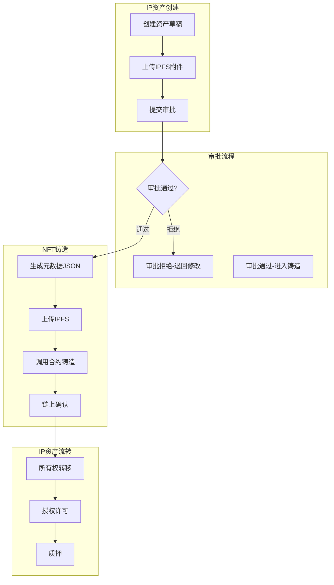
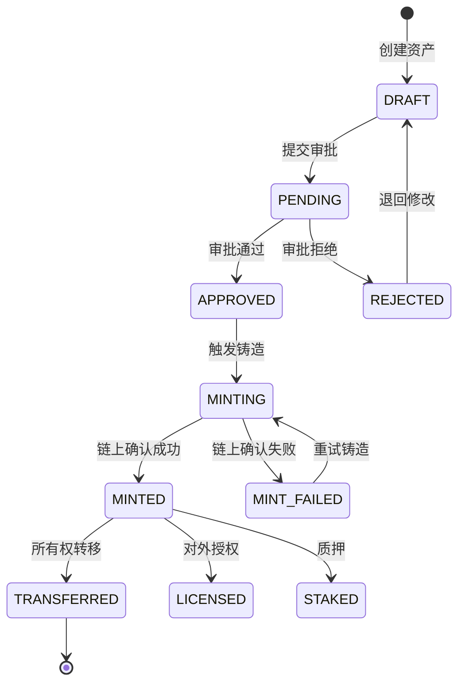
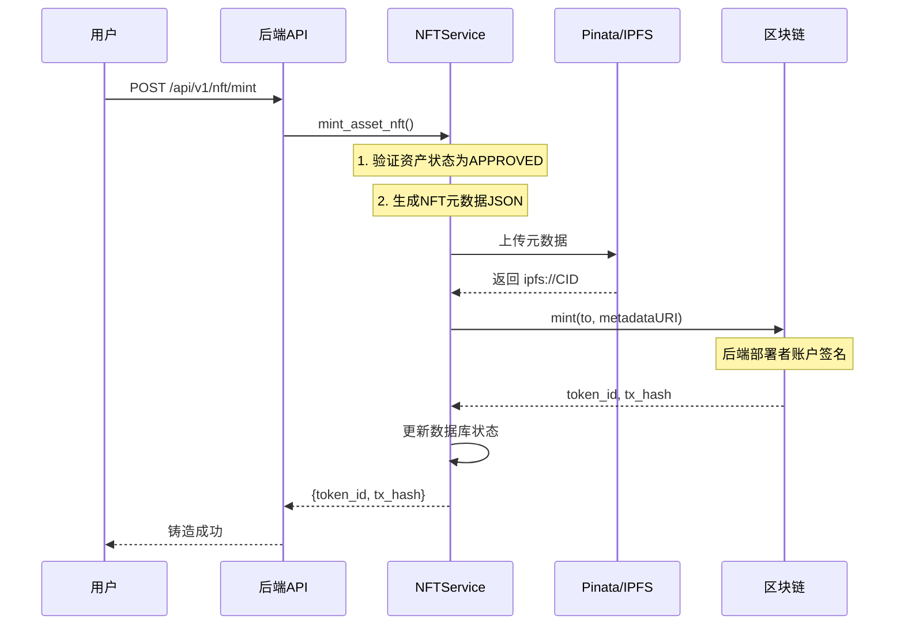
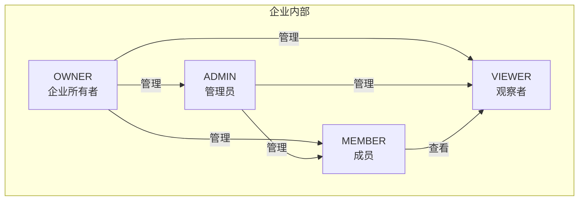

# 第3章 IP-NFT系统需求分析 - 素材笔记

## 元信息

| 字段 | 内容 |
|------|------|
| 章节 | 第3章 需求分析 |
| 小节 | 3.1业务场景、3.2非功能需求、3.3角色权限模型 |
| 完成日期 | 2026-04-03 |
| 代码依据 | asset.py, enterprise.py, ownership.py, approval.py, nft_service.py |

---

## 3.1 业务场景与功能需求

### 3.1.1 系统业务总览

**业务架构图（Mermaid）：**



### 3.1.2 资产类型定义

| 资产类型 | 代码枚举 | 描述 |
|----------|----------|------|
| 专利 | `PATENT` | 发明专利、实用新型专利、外观设计专利 |
| 商标 | `TRADEMARK` | 商品商标、服务商标、集体商标 |
| 著作权 | `COPYRIGHT` | 软件著作权、文学艺术作品著作权 |
| 商业秘密 | `TRADE_SECRET` | 技术秘密、经营秘密 |
| 数字作品 | `DIGITAL_WORK` | NFT数字艺术、数字藏品 |

### 3.1.3 资产状态流转

**状态机定义（asset.py AssetStatus）：**

```python
class AssetStatus(str, Enum):
    DRAFT = "DRAFT"           # 草稿
    PENDING = "PENDING"       # 待审批
    APPROVED = "APPROVED"     # 审批通过
    MINTING = "MINTING"       # 铸造中
    MINTED = "MINTED"         # 已铸造
    REJECTED = "REJECTED"     # 已拒绝
    TRANSFERRED = "TRANSFERRED"  # 已转移
    LICENSED = "LICENSED"     # 已授权
    STAKED = "STAKED"         # 已质押
    MINT_FAILED = "MINT_FAILED"  # 铸造失败
```

**状态流转图（Mermaid）：**



### 3.1.4 IP铸造场景

**铸造前置条件：**
1. 资产处于 `APPROVED` 状态
2. 资产至少有一个附件（上传至IPFS）
3. 操作者具有 `OWNER` 或 `ADMIN` 角色

**铸造流程时序（Mermaid）：**



### 3.1.5 IP流转场景

**流转类型（ownership.py TransferType）：**

| 流转类型 | 枚举值 | 说明 |
|----------|--------|------|
| 铸造 | `MINT` | 资产首次铸造为NFT |
| 转移 | `TRANSFER` | 所有权转移至其他企业/地址 |
| 授权 | `LICENSE` | 对外授予使用权（不转移所有权） |
| 质押 | `STAKE` | 质押获取收益 |
| 解押 | `UNSTAKE` | 解除质押状态 |
| 销毁 | `BURN` | 永久销毁NFT |

**权属状态（ownership.py OwnershipStatus）：**

| 状态 | 说明 |
|------|------|
| ACTIVE | 有效持有中 |
| LICENSED | 已对外许可使用 |
| STAKED | 已质押 |
| TRANSFERRED | 已转移给他方 |

**转移前置条件：**
1. NFT状态为 `MINTED`
2. 操作者具有 `OWNER` 或 `ADMIN` 角色
3. 目标地址有效

### 3.1.6 审批流程

**审批类型（approval.py ApprovalType）：**

| 类型 | 说明 |
|------|------|
| `enterprise_create` | 企业创建 |
| `enterprise_update` | 企业信息变更 |
| `member_join` | 成员加入 |
| `asset_submit` | 资产提交审批 |

**审批状态（approval.py ApprovalStatus）：**

| 状态 | 说明 |
|------|------|
| PENDING | 待审批 |
| APPROVED | 已通过 |
| REJECTED | 已拒绝 |
| RETURNED | 已退回 |

**审批操作（approval.py ApprovalAction）：**

| 操作 | 说明 |
|------|------|
| SUBMIT | 提交申请 |
| APPROVE | 通过 |
| REJECT | 拒绝 |
| RETURN | 退回 |
| TRANSFER | 转交 |

### 3.1.7 功能需求汇总表

| 功能模块 | 功能点 | 描述 | 优先级 | 代码来源 |
|----------|--------|------|--------|----------|
| 资产管理 | 创建资产 | 创建IP资产草稿 | P0 | assets.py |
| 资产管理 | 编辑资产 | 修改草稿状态资产 | P0 | assets.py |
| 资产管理 | 删除资产 | 删除草稿状态资产 | P0 | assets.py |
| 资产管理 | 资产列表 | 分页筛选查看资产 | P0 | assets.py |
| 附件管理 | 上传附件 | 上传文件至IPFS | P0 | assets.py |
| 附件管理 | 附件校验 | SHA-256完整性校验 | P1 | assets.py |
| 审批流程 | 提交审批 | 提交资产进行审批 | P0 | assets.py |
| 审批流程 | 审批处理 | 通过/拒绝/退回审批 | P0 | approvals.py |
| 审批通知 | 通知提醒 | 审批状态变更通知 | P1 | approvals.py |
| NFT铸造 | 铸造NFT | 将审批通过资产铸造为NFT | P0 | nft.py |
| NFT铸造 | 批量铸造 | 最多50个/批次 | P1 | nft.py |
| NFT铸造 | 重试铸造 | 铸造失败自动重试(最多3次) | P1 | nft_service.py |
| 权属管理 | 转移NFT | 所有权转移 | P0 | ownership_service.py |
| 权属管理 | 授权许可 | NFT使用权授权 | P2 | ownership_service.py |
| 权属管理 | 权属历史 | 完整的链上链下双轨溯源 | P0 | ownership.py |

---

## 3.2 非功能性需求分析

### 3.2.1 安全性需求

**身份认证与访问控制：**

| 安全需求 | 实现方式 | 防护目标 |
|----------|----------|----------|
| JWT身份认证 | Token + Redis黑名单 | 令牌泄露防护 |
| RBAC权限模型 | 四级角色控制 | 越权访问防护 |
| 区块链签名验证 | EIP-191标准(可选) | 钱包所有权验证 |
| 合约权控 | `onlyOwner`修饰符 | 智能合约操作权限 |

**数据安全：**

| 安全需求 | 实现方式 |
|----------|----------|
| IPFS内容完整性 | 上传后自动CID校验 |
| 链上数据不可篡改 | 原创者mapping + 元数据锁定 |
| 传输加密 | HTTPS + TLS 1.3 |
| 敏感数据保护 | JWT不存储敏感信息 |

### 3.2.2 鲁棒性需求

**铸造失败重试机制（nft_service.py）：**

```python
# 最大重试次数配置
max_mint_attempts: Mapped[Optional[int]] = mapped_column(
    default=3,
    comment="最大铸造尝试次数",
)

# 重试判定逻辑
if current_attempts < max_attempts:
    asset.can_retry = True
else:
    asset.can_retry = False  # 超过最大次数不可重试
```

**错误码体系：**

| 错误码 | 描述 | 处理方式 |
|--------|------|----------|
| `PINATA_UPLOAD_FAILED` | IPFS上传失败 | 可重试 |
| `CONTRACT_CALL_FAILED` | 合约调用失败 | 可重试 |
| `SIGNATURE_VERIFICATION_FAILED` | 签名验证失败 | 不可重试 |
| `INSUFFICIENT_ATTACHMENTS` | 附件不足 | 补充附件后重试 |

**文件大小限制（pinata_service.py）：**

```python
MAX_FILE_SIZE = 50 * 1024 * 1024  # 50MB
ALLOWED_EXTENSIONS = {".jpg", ".png", ".pdf", ".txt", ".json", ...}
```

### 3.2.3 可扩展性需求

**批量铸造支持（nft_service.py）：**

```python
if len(asset_ids) > 50:
    raise BadRequestException("Batch size cannot exceed 50 assets")
```

**多链部署支持：**

| 配置项 | 说明 |
|--------|------|
| `WEB3_PROVIDER_URL` | RPC节点地址 |
| `CONTRACT_ADDRESS` | 合约部署地址 |
| `CHAIN_ID` | 链ID（Polygon/Sepolia/BSC） |

**NFT元数据可扩展性：**

```python
metadata = {
    "name": asset.name,
    "description": asset.description,
    "image": f"ipfs://{image_cid}",
    "attributes": [
        {"trait_type": "Asset Type", "value": asset.type.value},
        {"trait_type": "Creator", "value": asset.creator_name},
    ],
    "properties": {
        "asset_id": str(asset.id),
        "application_number": asset.application_number,
    }
}
```

---

## 3.3 角色与权限模型

### 3.3.1 系统角色定义

**角色层级结构（enterprise.py MemberRole）：**

```python
class MemberRole(str, Enum):
    OWNER = "owner"    # 企业所有者
    ADMIN = "admin"    # 管理员
    MEMBER = "member"  # 普通成员
    VIEWER = "viewer"  # 观察者
```

**角色关系图（Mermaid）：**



### 3.3.2 权限矩阵

**企业业务层权限：**

| 操作 | Owner | Admin | Member | Viewer |
|------|:-----:|:-----:|:------:|:------:|
| 创建企业 | ✅ | - | - | - |
| 删除企业 | ✅ | - | - | - |
| 邀请成员 | ✅ | ✅ | - | - |
| 移除成员 | ✅ | ✅ | - | - |
| 创建资产 | ✅ | ✅ | ✅ | - |
| 编辑资产 | ✅ | ✅ | ✅ | - |
| 删除资产 | ✅ | ✅ | - | - |
| 提交审批 | ✅ | ✅ | ✅ | - |
| 审批处理 | ✅ | ✅ | - | - |
| 铸造NFT | ✅ | ✅ | - | - |
| 转移NFT | ✅ | ✅ | - | - |
| 授权许可 | ✅ | ✅ | - | - |
| 查看资产 | ✅ | ✅ | ✅ | ✅ |

**智能合约层权限：**

| 合约操作 | 权限要求 |
|----------|----------|
| `mint()` | 仅 `onlyOwner`（合约部署者） |
| `mintWithRoyalty()` | 仅 `onlyOwner` |
| `batchMint()` | 仅 `onlyOwner` |
| `transferNFT()` | 持有者或已批准地址 |
| `lockMetadata()` | 仅原创者(`originalCreators[tokenId]`) |
| `lockRoyalty()` | 仅原创者 |
| `pause()/unpause()` | 仅 `onlyOwner` |

### 3.3.3 权限验证实现

**API层权限校验（ownership_service.py）：**

```python
async def verify_transfer_permission(self, asset_dict: Dict, user_id: UUID) -> bool:
    """校验用户是否有权限转移该资产（需要 OWNER 或 ADMIN 角色）。"""
    stmt = select(EnterpriseMember).where(
        and_(
            EnterpriseMember.enterprise_id == UUID(owner_enterprise_id),
            EnterpriseMember.user_id == user_id,
            EnterpriseMember.role.in_([MemberRole.OWNER, MemberRole.ADMIN]),
        )
    )
    return (await self.db.execute(stmt)).scalar_one_or_none() is not None
```

**审批处理权限（ApprovalService）：**

```python
async def process_approval(self, approval_id, operator_id, action, ...):
    # 只有OWNER或ADMIN可以处理审批
    member = await self.member_repo.get_member(enterprise_id, operator_id)
    if member.role not in [MemberRole.OWNER, MemberRole.ADMIN]:
        raise ForbiddenException("只有企业所有者或管理员可以处理审批")
```

### 3.3.4 角色与权限模型总览

```mermaid
graph TB
    subgraph 用户层["用户 (User)"]
        U1[用户账号]
        U2[钱包地址]
    end
    
    subgraph 认证层["身份认证"]
        JWT[JWT Token]
        SIG[钱包签名验证<br/>(可选)]
    end
    
    subgraph 授权层["RBAC授权"]
        E1[ENTERPRISE_MEMBER]
        R1[OWNER]
        R2[ADMIN]
        R3[MEMBER]
        R4[VIEWER]
    end
    
    subgraph 业务层["业务操作"]
        B1[创建资产]
        B2[铸造NFT]
        B3[转移NFT]
        B4[审批处理]
    end
    
    subgraph 合约层["智能合约"]
        C1[onlyOwner]
        C2[isAuthorized]
        C3[originalCreator]
    end
    
    U1 --> JWT --> E1 --> R1 & R2 & R3 & R4
    U2 --> SIG --> C2
    R1 --> B1 & B2 & B3 & B4
    R2 --> B1 & B2 & B3 & B4
    R3 --> B1
    C1 --> C2
    C3 --> B3
```

---

## 代码来源索引

| 文件 | 内容 |
|------|------|
| `backend/app/models/asset.py` | AssetStatus, Asset模型, MintRecord |
| `backend/app/models/enterprise.py` | MemberRole, Enterprise, EnterpriseMember |
| `backend/app/models/ownership.py` | OwnershipStatus, TransferType, NFTTransferRecord |
| `backend/app/models/approval.py` | ApprovalType, ApprovalStatus, Approval模型 |
| `backend/app/services/nft_service.py` | mint_asset_nft, 重试逻辑 |
| `backend/app/services/ownership_service.py` | verify_transfer_permission, transfer_nft |
| `backend/app/services/approval_service.py` | 审批处理逻辑 |
| `backend/app/api/v1/assets.py` | 资产管理API |
| `backend/app/api/v1/nft.py` | NFT铸造API |
| `backend/app/api/v1/approvals.py` | 审批API |

---

*最后更新：2026-04-03*
