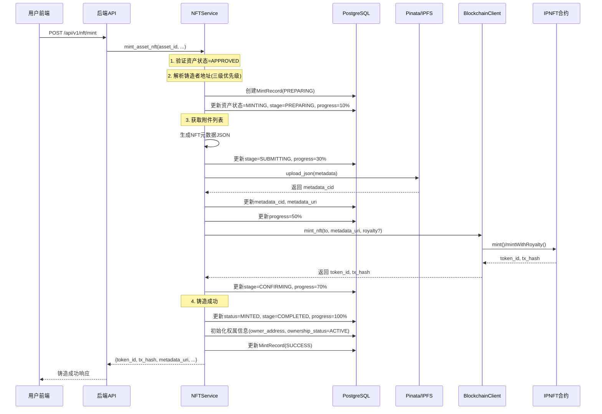
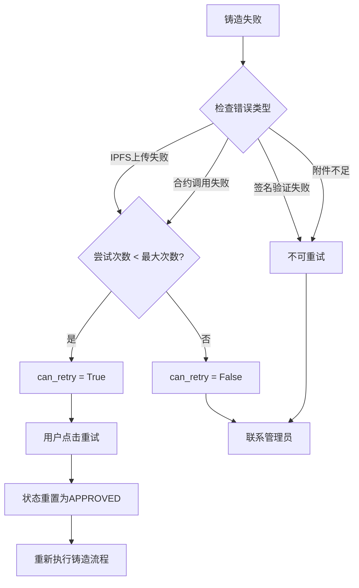

# 模块1素材：IP资产数字孪生与NFT铸造

## 元信息

| 字段 | 内容 |
|------|------|
| 模块名称 | IP资产数字孪生与NFT铸造 |
| 对应章节 | 系统设计 - IP资产数字孪生设计 |
| 分析日期 | 2026-04-05 |
| 代码依据 | IPNFT.sol, nft_service.py, asset.py, blockchain.py, minting/index.tsx, history/index.tsx |

---

## 1. 核心业务流程

### 1.1 完整铸造链路

```
资产创建(DRAFT) → 附件上传(IPFS) → 提交审批(PENDING) → 审批通过(APPROVED) 
→ 触发铸造(MINTING) → 元数据生成 → IPFS上传 → 合约调用 → 链上确认 
→ 铸造完成(MINTED) / 铸造失败(MINT_FAILED)
```

### 1.2 铸造时序图（Mermaid）



---

## 2. 多阶段铸造状态机

### 2.1 资产状态枚举（asset.py）

```python
class AssetStatus(str, Enum):
    DRAFT = "DRAFT"              # 草稿
    PENDING = "PENDING"          # 待审批
    APPROVED = "APPROVED"        # 审批通过
    MINTING = "MINTING"          # 铸造中
    MINTED = "MINTED"            # 已铸造
    REJECTED = "REJECTED"        # 已拒绝
    TRANSFERRED = "TRANSFERRED"  # 已转移
    LICENSED = "LICENSED"        # 已授权
    STAKED = "STAKED"            # 已质押
    MINT_FAILED = "MINT_FAILED"  # 铸造失败
```

### 2.2 铸造阶段枚举（mint_stage 字段）

| 阶段 | 进度 | 学术描述 | 对应操作 |
|------|------|----------|----------|
| `PREPARING` | 10% | 准备阶段 | 验证资产状态、解析地址、创建审计记录 |
| `SUBMITTING` | 30%→50% | 提交阶段 | 生成元数据JSON、上传至IPFS分布式存储 |
| `CONFIRMING` | 70% | 确认阶段 | 调用智能合约、等待链上交易确认 |
| `COMPLETED` | 100% | 完成阶段 | 更新资产状态、初始化权属信息 |
| `FAILED` | 0% | 失败阶段 | 记录错误码、标记可重试状态 |

### 2.3 状态机伪代码

```
STATE MACHINE MintStateMachine
  STATES: PREPARING → SUBMITTING → CONFIRMING → COMPLETED
  FAILURE: ANY → FAILED

  ON ENTER PREPARING:
    asset.status = MINTING
    asset.mint_progress = 10%
    mint_record = MintRecord(operation="REQUEST", stage="PREPARING", status="PENDING")
    verify_wallet_signature()
    validate_attachments()
    asset.mint_attempt_count += 1

  ON TRANSITION TO SUBMITTING:
    asset.mint_progress = 30%
    metadata = generate_nft_metadata(asset, attachments)
    metadata_cid = upload_to_ipfs(metadata)
    asset.metadata_cid = metadata_cid
    asset.metadata_uri = "ipfs://{metadata_cid}"
    asset.mint_progress = 50%

  ON TRANSITION TO CONFIRMING:
    asset.mint_progress = 70%
    token_id, tx_hash = call_mint_contract(to_address, metadata_uri)
    asset.mint_tx_hash = tx_hash
    asset.mint_stage = "CONFIRMING"

  ON TRANSITION TO COMPLETED:
    asset.status = MINTED
    asset.mint_stage = "COMPLETED"
    asset.mint_progress = 100%
    asset.nft_token_id = token_id
    asset.owner_address = resolved_minter_address
    asset.ownership_status = "ACTIVE"
    mint_record.status = "SUCCESS"

  ON FAILURE (ANY STATE):
    asset.status = MINT_FAILED
    asset.mint_stage = "FAILED"
    asset.mint_progress = 0%
    asset.last_mint_error_code = error_code
    IF attempt_count < max_attempts:
      asset.can_retry = True
    ELSE:
      asset.can_retry = False
    mint_record.status = "FAILED"
```

### 2.4 铸造进度追踪数据模型

**Asset 模型中的铸造相关字段（asset.py）：**

| 字段名 | 类型 | 说明 |
|--------|------|------|
| `mint_stage` | String(20) | 当前阶段：PREPARING/SUBMITTING/CONFIRMING/COMPLETED/FAILED |
| `mint_progress` | Integer | 铸造进度百分比 0-100 |
| `mint_attempt_count` | Integer | 铸造尝试次数 |
| `max_mint_attempts` | Integer | 最大铸造尝试次数（默认3） |
| `can_retry` | Boolean | 是否可重试 |
| `last_mint_error` | Text | 上次铸造错误信息 |
| `last_mint_error_code` | String(50) | 上次铸造错误码 |
| `mint_requested_at` | DateTime | 铸造请求时间 |
| `mint_submitted_at` | DateTime | 交易提交时间 |
| `mint_confirmed_at` | DateTime | 交易确认时间 |
| `mint_completed_at` | DateTime | 铸造完成时间 |
| `mint_tx_hash` | String(66) | 铸造交易哈希 |
| `metadata_cid` | String(100) | 元数据IPFS CID |
| `metadata_uri` | String(500) | NFT元数据URI（IPFS） |

**MintRecord 审计日志模型（asset.py）：**

| 字段名 | 类型 | 说明 |
|--------|------|------|
| `operation` | String(20) | 操作类型：REQUEST/SUBMIT/CONFIRM/RETRY/FAIL/SUCCESS |
| `stage` | String(20) | 当前阶段 |
| `status` | String(20) | 状态：PENDING/SUCCESS/FAILED |
| `signature_verified` | Boolean | 钱包签名是否通过验证 |
| `token_id` | Integer | NFT Token ID |
| `tx_hash` | String(66) | 交易哈希 |
| `error_code` | String(50) | 错误码 |
| `error_message` | Text | 错误信息 |
| `metadata_uri` | String(500) | NFT元数据URI |
| `created_at` | DateTime | 创建时间 |
| `completed_at` | DateTime | 完成时间 |

---

## 3. IPFS与区块链原子性设计

### 3.1 原子性保证机制

本系统采用**链下验证先行，链上铸造兜底**的原子性设计：

```
步骤1: 验证资产状态（数据库层）
步骤2: 创建MintRecord审计日志（数据库层）
步骤3: 生成元数据并上传IPFS（分布式存储层）
步骤4: 调用智能合约铸造（区块链层）
步骤5: 更新数据库状态（数据库层）
```

**关键设计特点：**

| 特性 | 实现方式 | 学术描述 |
|------|----------|----------|
| 前置验证 | 状态检查+附件校验 | 铸造前置条件验证机制 |
| 审计先行 | MintRecord先创建 | 操作审计日志预写机制（Write-Ahead Logging） |
| 链下兜底 | IPFS上传失败可回滚 | 分布式存储失败回退策略 |
| 链上确认 | 等待交易回执 | 区块链最终一致性保证 |
| 状态同步 | 数据库状态与链上状态对齐 | 链上链下状态一致性协议 |

### 3.2 错误码体系

| 错误码 | 触发场景 | 可重试 | 学术描述 |
|--------|----------|--------|----------|
| `SIGNATURE_VERIFICATION_FAILED` | 钱包签名验证失败 | ❌ | 基于椭圆曲线密码学的所有权验证失败 |
| `INSUFFICIENT_ATTACHMENTS` | 资产无附件 | ❌ | 元数据完整性校验失败 |
| `PINATA_UPLOAD_FAILED` | IPFS上传失败 | ✅ | 分布式存储网关通信异常 |
| `CONTRACT_CALL_FAILED` | 合约调用失败 | ✅ | 智能合约执行异常 |

### 3.3 地址解析三级优先级

```python
async def _resolve_minter_address(self, asset, requested_address):
    # 优先级1: 请求参数指定
    if requested_address:
        return requested_address
    
    # 优先级2: 企业绑定钱包
    enterprise = await self.db.get(Enterprise, asset.enterprise_id)
    if enterprise and enterprise.wallet_address:
        return enterprise.wallet_address
    
    # 优先级3: 系统部署者账户
    return get_blockchain_client().deployer_address
```

**学术描述：** 本系统采用三级地址解析策略，支持用户自定义地址、企业钱包地址和系统默认地址的灵活配置。

---

## 4. 铸造失败重试机制

### 4.1 重试逻辑（retry_mint 方法）

```python
async def retry_mint(self, asset_id, minter_address, operator_id, operator_address):
    asset = await self.db.get(Asset, asset_id)
    
    # 前置条件1: 资产状态必须为 MINT_FAILED
    if asset.status != AssetStatus.MINT_FAILED:
        raise BadRequestException("Only MINT_FAILED assets can be retried.")
    
    # 前置条件2: 未超过最大重试次数
    if not asset.can_retry:
        raise BadRequestException(
            f"Asset has reached maximum retry attempts ({asset.max_mint_attempts})."
        )
    
    # 重置状态为 APPROVED，重新走铸造流程
    asset.status = AssetStatus.APPROVED
    asset.can_retry = True
    
    return await self.mint_asset_nft(asset_id, minter_address, operator_id, operator_address)
```

### 4.2 重试判定逻辑

```python
# 铸造失败时的重试判定
max_attempts = asset.max_mint_attempts or 3  # 默认3次
current_attempts = asset.mint_attempt_count or 0

if current_attempts < max_attempts:
    asset.can_retry = True   # 可重试
else:
    asset.can_retry = False  # 已达上限，不可重试
```

### 4.3 重试流程图（Mermaid）



---

## 5. 批量铸造Gas优化

### 5.1 合约层批量铸造（batchMint）

```solidity
function batchMint(address to, string[] memory metadataURIs) 
    external 
    onlyOwner
    whenNotPaused
    nonReentrant 
    returns (uint256[] memory tokenIds) 
{
    require(metadataURIs.length > 0, "IPNFT: empty metadata URIs");
    require(metadataURIs.length <= 50, "IPNFT: batch too large"); // 限制50个

    tokenIds = new uint256[](metadataURIs.length);

    for (uint256 i = 0; i < metadataURIs.length; i++) {
        uint256 tokenId = _nextTokenId++;
        tokenIds[i] = tokenId;
        
        _safeMint(to, tokenId);
        _setTokenURI(tokenId, metadataURIs[i]);
        
        mintTimestamps[tokenId] = block.timestamp;
        originalCreators[tokenId] = msg.sender;

        emit NFTMinted(tokenId, msg.sender, to, metadataURIs[i], block.timestamp);
    }

    return tokenIds;
}
```

### 5.2 后端层批量铸造

```python
async def batch_mint_assets(self, asset_ids, minter_address, operator_id, operator_address):
    if len(asset_ids) > 50:
        raise BadRequestException("Batch size cannot exceed 50 assets")

    results = []
    successful = []
    failed = []

    for asset_id in asset_ids:
        try:
            result = await self.mint_asset_nft(asset_id, minter_address, operator_id, operator_address)
            successful.append({"asset_id": str(asset_id), "status": "success", ...})
        except Exception as e:
            failed.append({"asset_id": str(asset_id), "status": "failed", "error": str(e)})

    return {
        "message": f"Batch mint completed: {len(successful)} succeeded, {len(failed)} failed",
        "total": len(asset_ids),
        "successful": len(successful),
        "failed": len(failed),
        "results": successful + failed,
    }
```

### 5.3 Gas优化分析

| 铸造方式 | 交易次数 | Gas消耗模型 | 优势 |
|----------|----------|-------------|------|
| 单个铸造 | N次交易 | O(N) | 简单直接 |
| 批量铸造 | 1次交易 | O(1) 交易费用 | 减少交易开销，降低总Gas成本 |

**学术描述：** 本系统通过批量铸造机制，将N个NFT的铸造操作压缩至单笔交易执行，交易费用从线性复杂度O(N)降低至常数复杂度O(1)，有效降低了大规模铸造场景下的计算资源消耗成本。

---

## 6. NFT元数据生成

### 6.1 元数据结构（ERC-721标准）

```python
metadata = {
    "name": asset.name,
    "description": asset.description,
    "image": f"ipfs://{image_cid}",
    "external_url": f"https://platform.example.com/assets/{asset.id}",
    "attributes": [
        {"trait_type": "Asset Type", "value": asset.type.value},
        {"trait_type": "Creator", "value": asset.creator_name},
        {"trait_type": "Inventors", "value": ", ".join(asset.inventors)},
        {"trait_type": "Creation Date", "value": asset.creation_date.isoformat()},
        {"trait_type": "Legal Status", "value": asset.legal_status.value},
    ],
    "properties": {
        "asset_id": str(asset.id),
        "enterprise_id": str(asset.enterprise_id),
        "application_number": asset.application_number,
        "rights_declaration": asset.rights_declaration,
    },
    "attachments": [  # 可选
        {"file_name": att.file_name, "file_type": att.file_type, "ipfs_cid": att.ipfs_cid}
    ]
}
```

### 6.2 元数据属性表

| 属性类别 | 字段 | 学术描述 |
|----------|------|----------|
| 基础信息 | name, description | 资产标识与描述 |
| 视觉标识 | image (IPFS CID) | 可视化表征标识 |
| 特征属性 | Asset Type, Creator, Inventors | 资产分类与创作归属 |
| 时间属性 | Creation Date | 创作时间戳 |
| 法律属性 | Legal Status | 法律状态标识 |
| 扩展属性 | asset_id, application_number | 业务关联标识 |

---

## 7. 铸造状态查询与监控

### 7.1 铸造状态查询接口（get_mint_status）

```python
async def get_mint_status(self, asset_id):
    asset = await self.db.get(Asset, asset_id)
    mint_record = get_latest_mint_record(asset_id)
    
    return {
        "asset_id": str(asset_id),
        "current_status": asset.status.value,
        "mint_stage": asset.mint_stage,
        "mint_progress": asset.mint_progress,
        "token_id": asset.nft_token_id,
        "contract_address": asset.nft_contract_address,
        "tx_hash": asset.mint_tx_hash,
        "metadata_uri": asset.metadata_uri,
        "mint_attempt_count": asset.mint_attempt_count,
        "max_mint_attempts": asset.max_mint_attempts,
        "can_retry": asset.can_retry,
        "last_mint_error": asset.last_mint_error,
        "last_mint_error_code": asset.last_mint_error_code,
        "mint_record": { ... }
    }
```

### 7.2 铸造历史查询接口（get_mint_history）

支持分页、状态筛选的企业级铸造历史查询。

---

## 8. 前端铸造监控界面

### 8.1 铸造任务页面（minting/index.tsx）

**阶段配置：**

| 阶段 | 标签 | 颜色 | 图标 | 描述 |
|------|------|------|------|------|
| PREPARING | 准备中 | #00d4ff | ClockCircleOutlined | 准备NFT元数据 |
| SUBMITTING | 提交中 | #ffaa00 | ThunderboltOutlined | 提交区块链交易 |
| CONFIRMING | 确认中 | #00ff88 | CheckCircleOutlined | 等待链上确认 |
| COMPLETED | 已完成 | #00ff88 | CheckCircleOutlined | 铸造完成 |
| FAILED | 失败 | #ff4444 | ExclamationCircleOutlined | 铸造失败 |

**统计卡片：**
- 正在铸造数量
- 等待确认数量（CONFIRMING阶段）
- 提交中数量（SUBMITTING阶段）
- 今日完成数量

### 8.2 铸造历史页面（history/index.tsx）

**功能：**
- 分页铸造记录表格
- 状态筛选（处理中/成功/失败）
- 交易哈希链接至区块浏览器
- 支持多链区块浏览器（Ethereum/Sepolia/Polygon/BSC）

---

## 9. 智能合约铸造函数

### 9.1 单铸函数（mint）

```solidity
function mint(address to, string memory metadataURI) 
    external onlyOwner whenNotPaused nonReentrant returns (uint256)
{
    require(to != address(0), "IPNFT: mint to zero address");
    require(bytes(metadataURI).length > 0, "IPNFT: empty metadata URI");

    uint256 tokenId = _nextTokenId++;
    
    _safeMint(to, tokenId);
    _setTokenURI(tokenId, metadataURI);
    
    mintTimestamps[tokenId] = block.timestamp;
    originalCreators[tokenId] = msg.sender;

    emit NFTMinted(tokenId, msg.sender, to, metadataURI, block.timestamp);
    
    return tokenId;
}
```

### 9.2 带版税铸造函数（mintWithRoyalty）

```solidity
function mintWithRoyalty(
    address to, 
    string memory metadataURI,
    address royaltyReceiver,
    uint96 royaltyFeeNumerator  // 基点 (500 = 5%)
) external onlyOwner whenNotPaused nonReentrant returns (uint256)
{
    require(royaltyReceiver != address(0), "IPNFT: royalty receiver is zero address");
    require(royaltyFeeNumerator <= 1000, "IPNFT: royalty too high"); // Max 10%

    uint256 tokenId = _nextTokenId++;
    
    _safeMint(to, tokenId);
    _setTokenURI(tokenId, metadataURI);
    _setTokenRoyalty(tokenId, royaltyReceiver, royaltyFeeNumerator);
    
    mintTimestamps[tokenId] = block.timestamp;
    originalCreators[tokenId] = msg.sender;

    emit NFTMinted(tokenId, msg.sender, to, metadataURI, block.timestamp);
    emit RoyaltySet(tokenId, royaltyReceiver, royaltyFeeNumerator);
    
    return tokenId;
}
```

---

## 10. 学术表达素材

### 10.1 技术→学术表达对照

| 技术描述 | 学术表达 |
|----------|----------|
| 铸造状态机 | 多阶段铸造状态机（Multi-stage Minting State Machine） |
| mint_stage + mint_progress | 铸造进度实时追踪机制（Real-time Minting Progress Tracking） |
| IPFS上传 | 基于星际文件系统的分布式元数据持久化 |
| 链上铸造 | 区块链账本层NFT铸造操作 |
| 铸造失败重试 | 铸造异常自动恢复机制 |
| 批量铸造 | 批量铸造优化策略 |
| Gas优化 | 计算资源消耗成本优化 |
| 最多50个/批次 | 单笔交易批量上限约束 |
| 重试最多3次 | 最大重试次数约束 |
| MintRecord审计日志 | 铸造操作审计追踪机制 |
| 三级地址解析 | 多级地址解析策略 |
| 钱包签名验证 | 基于EIP-191标准的密码学所有权验证 |

### 10.2 核心贡献点提取

| 编号 | 贡献点 | 创新程度 | 对应代码 |
|------|--------|----------|----------|
| 1 | 多阶段铸造状态机，实现铸造进度秒级精度追踪 | ⭐⭐⭐ | asset.py mint_stage/mint_progress |
| 2 | 链下验证先行、链上铸造兜底的原子性设计 | ⭐⭐ | nft_service.py 铸造流程 |
| 3 | 铸造失败自动重试机制（最多3次） | ⭐⭐ | nft_service.py retry_mint |
| 4 | 批量铸造Gas优化（单笔交易最多50个NFT） | ⭐⭐ | IPNFT.sol batchMint |
| 5 | 铸造操作全链路审计日志（MintRecord） | ⭐⭐ | asset.py MintRecord |

---

## 11. 代码索引

| 文件 | 内容 |
|------|------|
| `contracts/contracts/IPNFT.sol` | mint(), mintWithRoyalty(), batchMint() 合约函数 |
| `backend/app/services/nft_service.py` | mint_asset_nft(), retry_mint(), batch_mint_assets(), get_mint_status() |
| `backend/app/models/asset.py` | Asset模型（铸造相关字段）, MintRecord模型 |
| `backend/app/core/blockchain.py` | BlockchainClient.mint_nft(), estimate_mint_gas() |
| `frontend/src/pages/NFT/minting/index.tsx` | 铸造任务监控页面 |
| `frontend/src/pages/NFT/history/index.tsx` | 铸造历史查询页面 |

---

*最后更新：2026-04-05*
