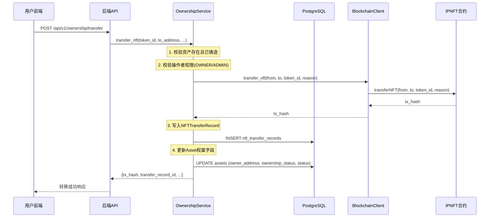
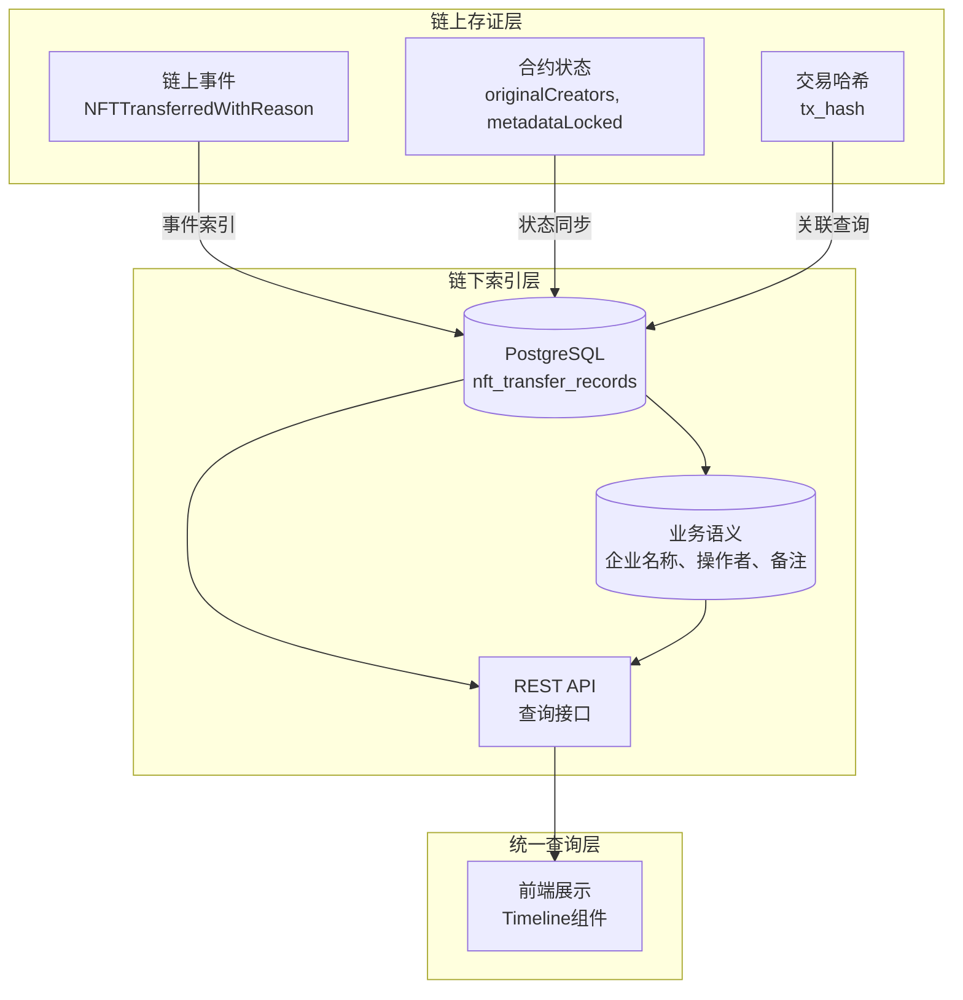

# 模块2素材：权属溯源与转移管理

## 元信息

| 字段 | 内容 |
|------|------|
| 模块名称 | 权属溯源与转移管理 |
| 对应章节 | 系统设计 - 权属溯源机制设计 |
| 分析日期 | 2026-04-05 |
| 代码依据 | IPNFT.sol, ownership_service.py, ownership.py, ownership.py(API), TransferModal.tsx, ownership/index.tsx, ownership/History.tsx |

---

## 1. 核心功能概览

### 1.1 功能矩阵

| 功能 | 描述 | 创新程度 | 对应代码 |
|------|------|----------|----------|
| 原创者永久溯源 | `originalCreators` mapping 永不丢失创作信息 | ⭐⭐⭐ | IPNFT.sol |
| 元数据双重锁定 | `lockMetadata()` + `lockRoyalty()` 不可逆锁定 | ⭐⭐⭐ | IPNFT.sol |
| 带审计日志的转移 | `transferNFT(reason)` 记录业务语义到链上事件 | ⭐⭐ | IPNFT.sol |
| 可配置转移限制 | 锁定时间 + 白名单策略，防投机套利 | ⭐⭐ | IPNFT.sol `_update()` |
| 链上链下双轨溯源 | 链上事件不可篡改 + 链下索引丰富业务语义 | ⭐⭐⭐ | ownership_service.py + NFTTransferRecord |

### 1.2 与传统ERC-721对比

| 特性 | 传统ERC-721 NFT | 本系统IPNFT |
|------|-----------------|-------------|
| 原创者信息 | ❌ 转移后丢失 | ✅ `originalCreators` 永久保留 |
| 元数据修改 | ✅ 可随意修改 | ✅ 锁定后不可篡改 |
| 转移原因 | ❌ 黑盒操作 | ✅ 写入链上事件 |
| 版税保护 | ❌ 无锁定机制 | ✅ 版税可锁定保护 |
| 转移限制 | ❌ 无内置限制 | ✅ 时间锁 + 白名单 |
| 溯源能力 | ❌ 仅链上事件 | ✅ 链上+链下双轨溯源 |

---

## 2. 原创者永久溯源机制

### 2.1 合约层实现（IPNFT.sol）

```solidity
// 原创者永久保留映射
mapping(uint256 => address) public originalCreators;

// 铸造时记录原创者（记录调用者而非接收者）
function mint(address to, string memory metadataURI) external onlyOwner whenNotPaused nonReentrant returns (uint256) {
    uint256 tokenId = _nextTokenId++;
    _safeMint(to, tokenId);
    _setTokenURI(tokenId, metadataURI);
    
    mintTimestamps[tokenId] = block.timestamp;
    // 关键设计：记录调用者（创作者），而非接收者
    originalCreators[tokenId] = msg.sender;
    
    emit NFTMinted(tokenId, msg.sender, to, metadataURI, block.timestamp);
    return tokenId;
}

// 查询原创者
function getOriginalCreator(uint256 tokenId) external view returns (address) {
    require(_ownerOf(tokenId) != address(0), "IPNFT: token does not exist");
    return originalCreators[tokenId];
}
```

### 2.2 设计特点

| 特性 | 实现方式 | 学术描述 |
|------|----------|----------|
| 永久保留 | mapping不随转移变更 | 创作归属的永久性映射机制 |
| 铸造时记录 | `msg.sender` 而非 `to` | 创作者身份与持有者身份分离 |
| 可公开查询 | `getOriginalCreator()` 外部视图函数 | 可验证的创作溯源接口 |
| 销毁时清理 | `burn()` 中 `delete originalCreators[tokenId]` | 生命周期终结时的状态清理 |

### 2.3 学术表达

> 本系统通过 `originalCreators` 映射机制，在NFT铸造时将创作者地址永久记录于区块链账本层。与传统ERC-721标准仅记录当前持有者不同，该映射在NFT全生命周期流转过程中保持不变，实现了创作归属的永久性溯源。即使在NFT多次转移后，仍可通过 `getOriginalCreator()` 接口查询初始创作者地址，解决了传统NFT平台中创作信息随权属变更而丢失的问题。

---

## 3. 元数据双重锁定机制

### 3.1 锁定类型

| 锁定类型 | 合约函数 | 锁定目标 | 学术描述 |
|----------|----------|----------|----------|
| 元数据锁定 | `lockMetadata(tokenId)` | `metadataLocked[tokenId]` | 关键信息的不可篡改保证 |
| 版税锁定 | `lockRoyalty(tokenId)` | `royaltyLocked[tokenId]` | 版税收益的永久性保护 |

### 3.2 元数据锁定实现

```solidity
// 元数据锁定状态
mapping(uint256 => bool) public metadataLocked;

// 锁定元数据（仅原创者可操作，不可逆）
function lockMetadata(uint256 tokenId) external {
    require(msg.sender == originalCreators[tokenId], "IPNFT: only creator can lock");
    require(!metadataLocked[tokenId], "IPNFT: metadata already locked");
    
    metadataLocked[tokenId] = true;
    emit MetadataLocked(tokenId, msg.sender);
}

// 更新URI时检查锁定状态
function updateTokenURI(uint256 tokenId, string memory newURI) external {
    require(_isAuthorized(ownerOf(tokenId), msg.sender, tokenId), "IPNFT: not authorized");
    require(!metadataLocked[tokenId], "IPNFT: metadata is locked");
    require(bytes(newURI).length > 0, "IPNFT: empty URI");
    
    _setTokenURI(tokenId, newURI);
    emit MetadataUpdated(tokenId, newURI);
}
```

### 3.3 版税锁定实现

```solidity
// 版税锁定状态
mapping(uint256 => bool) public royaltyLocked;

// 锁定版税（仅原创者可操作，不可逆）
function lockRoyalty(uint256 tokenId) external {
    require(msg.sender == originalCreators[tokenId], "IPNFT: only creator can lock");
    require(!royaltyLocked[tokenId], "IPNFT: royalty already locked");
    
    royaltyLocked[tokenId] = true;
    emit RoyaltyLocked(tokenId, msg.sender);
}

// 设置版税时检查锁定状态
function setTokenRoyalty(uint256 tokenId, address receiver, uint96 feeNumerator) external {
    require(_isAuthorized(ownerOf(tokenId), msg.sender, tokenId), "IPNFT: not authorized");
    require(!royaltyLocked[tokenId], "IPNFT: royalty is locked");
    require(receiver != address(0), "IPNFT: royalty receiver is zero address");
    require(feeNumerator <= 1000, "IPNFT: royalty too high");
    
    _setTokenRoyalty(tokenId, receiver, feeNumerator);
    emit RoyaltySet(tokenId, receiver, feeNumerator);
}
```

### 3.4 双重锁定对比表

| 维度 | 元数据锁定 | 版税锁定 |
|------|------------|----------|
| 操作权限 | 仅原创者 | 仅原创者 |
| 可逆性 | 不可逆 | 不可逆 |
| 保护目标 | 元数据URI不可篡改 | 版税信息不可篡改 |
| 触发事件 | `MetadataLocked` | `RoyaltyLocked` |
| 影响函数 | `updateTokenURI()` | `setTokenRoyalty()` |
| 查询接口 | `isMetadataLocked(tokenId)` | `isRoyaltyLocked(tokenId)` |

### 3.5 学术表达

> 本系统设计了双向约束的不可逆操作机制（Dual-Lock Mechanism），包含元数据锁定（Metadata Lock）与版税锁定（Royalty Lock）两个独立但互补的锁定机制。原创者可在适当时机调用 `lockMetadata()` 和 `lockRoyalty()` 函数，将NFT的关键信息永久固化于区块链账本层。锁定操作不可逆，确保了IP资产核心信息的不可篡改性，有效防止了恶意持有者对元数据和版税信息的篡改行为。

---

## 4. 带审计日志的转移机制

### 4.1 合约层转移函数

```solidity
/**
 * @dev 转移NFT并记录转移原因（用于审计追踪）
 * @param from 当前持有者地址
 * @param to 接收方地址
 * @param tokenId 代币ID
 * @param reason 转移原因（存储于事件日志中）
 */
function transferNFT(
    address from,
    address to,
    uint256 tokenId,
    string calldata reason
) external nonReentrant whenNotPaused {
    require(from != address(0), "IPNFT: transfer from zero address");
    require(to != address(0), "IPNFT: transfer to zero address");
    require(
        _isAuthorized(_ownerOf(tokenId), msg.sender, tokenId),
        "IPNFT: caller is not owner nor approved"
    );

    _transfer(from, to, tokenId);

    // 关键设计：将转移原因写入链上事件
    emit NFTTransferredWithReason(tokenId, from, to, msg.sender, reason, block.timestamp);
}
```

### 4.2 事件定义

```solidity
// 标准转移事件
event NFTTransferred(uint256 indexed tokenId, address indexed from, address indexed to);

// 带审计的转移事件（增强版）
event NFTTransferredWithReason(
    uint256 indexed tokenId,
    address indexed from,
    address indexed to,
    address operator,      // 操作者地址
    string reason,          // 转移原因
    uint256 timestamp       // 时间戳
);
```

### 4.3 后端层转移流程（ownership_service.py）

```python
async def transfer_nft(self, token_id, to_address, to_enterprise_id, operator_id, remarks):
    """执行NFT转移：链上调用 + 数据库同步。

    流程：
    1. 校验资产存在且已铸造
    2. 校验操作者权限（OWNER或ADMIN）
    3. 调用合约 transferNFT（链上执行）
    4. 写入NFTTransferRecord（链下审计）
    5. 更新Asset权属字段
    """
    # 1. 获取资产
    asset = await self.db.get_asset_by_token_id(token_id)
    if not asset or asset.status != AssetStatus.MINTED:
        raise BadRequestException("只有已铸造（MINTED）的资产才能转移")
    
    # 2. 权限校验
    if not await self.verify_transfer_permission(asset_dict, operator_id):
        raise ForbiddenException("需要OWNER或ADMIN角色")
    
    # 3. 链上转移
    blockchain = get_blockchain_client()
    tx_hash = await blockchain.transfer_nft(
        from_address=asset.owner_address,
        to_address=to_address,
        token_id=token_id,
        reason=remarks or "",
    )
    
    # 4. 写入转移记录
    record = NFTTransferRecord(
        token_id=token_id,
        contract_address=asset.nft_contract_address,
        transfer_type=TransferType.TRANSFER,
        from_address=asset.owner_address,
        from_enterprise_id=asset.current_owner_enterprise_id,
        from_enterprise_name=from_enterprise_name,
        to_address=to_address,
        to_enterprise_id=to_enterprise_id,
        to_enterprise_name=to_enterprise_name,
        operator_user_id=operator_id,
        tx_hash=tx_hash,
        status=TransferStatus.CONFIRMED,
        remarks=remarks,
        confirmed_at=now,
    )
    self.db.add(record)
    
    # 5. 更新资产权属
    asset.owner_address = to_address
    asset.current_owner_enterprise_id = to_enterprise_id
    asset.ownership_status = OwnershipStatus.TRANSFERRED if not to_enterprise_id else OwnershipStatus.ACTIVE
    asset.status = AssetStatus.TRANSFERRED
```

### 4.4 转移时序图（Mermaid）



### 4.5 学术表达

> 本系统设计了业务语义可追溯的转移凭证机制（Audit-Enabled Transfer Mechanism），在传统ERC-721的 `transferFrom()` 基础上扩展了 `transferNFT()` 函数，支持将转移原因（reason）作为字符串参数写入链上事件日志。同时，后端服务层通过 `NFTTransferRecord` 表记录完整的业务语义信息，包括转出方/转入方企业名称、操作者身份、转移类型等，形成了链上事件不可篡改与链下索引丰富业务语义相结合的双轨审计体系。

---

## 5. 可配置转移限制机制

### 5.1 时间锁限制

```solidity
// 转移时间锁
uint256 public transferLockTime; // 铸造后最小可转移时间（秒）
mapping(uint256 => uint256) public mintTimestamps; // 铸造时间戳

// 设置转移锁定期
function setTransferLockTime(uint256 lockTime) external onlyOwner {
    transferLockTime = lockTime;
}
```

### 5.2 白名单限制

```solidity
// 白名单配置
mapping(address => bool) public transferWhitelist;
bool public transferWhitelistEnabled;

// 启用/禁用白名单
function setTransferWhitelistEnabled(bool enabled) external onlyOwner {
    transferWhitelistEnabled = enabled;
}

// 添加/移除白名单地址
function setTransferWhitelist(address account, bool allowed) external onlyOwner {
    transferWhitelist[account] = allowed;
}
```

### 5.3 `_update()` 中的限制执行

```solidity
function _update(address to, uint256 tokenId, address auth)
    internal override(ERC721, ERC721Enumerable) returns (address)
{
    address from = _ownerOf(tokenId);
    
    // 仅对实际转移（非铸造/销毁）执行限制
    if (from != address(0) && to != address(0)) {
        // 时间锁检查
        require(
            block.timestamp >= mintTimestamps[tokenId] + transferLockTime,
            "IPNFT: transfer lock time not expired"
        );
        // 白名单检查（对接收方）
        if (transferWhitelistEnabled) {
            require(transferWhitelist[to], "IPNFT: recipient not whitelisted");
        }
    }
    
    address result = super._update(to, tokenId, auth);
    
    if (from != address(0) && to != address(0) && from != to) {
        emit NFTTransferred(tokenId, from, to);
    }
    
    return result;
}
```

### 5.4 转移限制配置表

| 配置项 | 默认值 | 修改权限 | 学术描述 |
|--------|--------|----------|----------|
| `transferLockTime` | 0秒 | 仅合约Owner | 转移时间锁定期 |
| `transferWhitelistEnabled` | false | 仅合约Owner | 白名单模式开关 |
| `transferWhitelist[address]` | 全false | 仅合约Owner | 白名单地址映射 |

### 5.5 学术表达

> 本系统实现了可配置的转移限制策略（Configurable Transfer Restriction Policy），包含时间锁（Time-Lock）和白名单（Whitelist）两种机制。时间锁机制通过 `mintTimestamps` 记录每个NFT的铸造时间戳，在 `_update()` 函数中校验当前时间是否满足 `mintTimestamps[tokenId] + transferLockTime` 条件，有效防止了铸造后的短期投机行为。白名单机制则通过 `transferWhitelist` 映射对接收方地址进行准入控制，仅允许预设的合法地址接收NFT转移，适用于企业内部资产管控场景。

---

## 6. 链上链下双轨溯源架构

### 6.1 架构总览



### 6.2 双轨对比表

| 维度 | 链上存证 | 链下索引 |
|------|----------|----------|
| 数据内容 | 事件日志、合约状态、交易哈希 | 企业名称、操作者身份、备注 |
| 不可篡改性 | ✅ 区块链保证 | ❌ 依赖数据库安全 |
| 查询效率 | 慢（需调用合约） | 快（SQL查询） |
| 存储成本 | 高（Gas费用） | 低（数据库存储） |
| 业务语义 | 有限（仅地址和基础数据） | 丰富（企业关联、操作者追踪） |
| 可审计性 | ✅ 公开可验证 | ⚠️ 依赖系统信任 |

### 6.3 NFTTransferRecord 数据模型（ownership.py）

```python
class NFTTransferRecord(Base):
    """NFT权属变更历史记录表。
    
    记录每一次链上转移操作，包括铸造、转移、许可、质押等。
    与MintRecord职责分离：MintRecord专注铸造审计，本表专注权属流转。
    """
    __tablename__ = "nft_transfer_records"
    
    # 关联资产
    token_id: Mapped[int]          # NFT Token ID
    contract_address: Mapped[str]   # 合约地址
    
    # 变更类型
    transfer_type: Mapped[TransferType]  # MINT/TRANSFER/LICENSE/STAKE/UNSTAKE/BURN
    
    # 转出方
    from_address: Mapped[str]             # 转出方钱包地址
    from_enterprise_id: Mapped[Optional[uuid.UUID]]  # 转出方企业ID
    from_enterprise_name: Mapped[Optional[str]]      # 转出方企业名称（冗余存储）
    
    # 转入方
    to_address: Mapped[str]               # 转入方钱包地址
    to_enterprise_id: Mapped[Optional[uuid.UUID]]    # 转入方企业ID
    to_enterprise_name: Mapped[Optional[str]]        # 转入方企业名称（冗余存储）
    
    # 操作者
    operator_user_id: Mapped[Optional[uuid.UUID]]    # 操作者用户ID
    
    # 链上信息
    tx_hash: Mapped[Optional[str]]        # 链上交易哈希
    block_number: Mapped[Optional[int]]   # 所在区块号
    block_timestamp: Mapped[Optional[datetime]]  # 区块时间戳
    
    # 状态与备注
    status: Mapped[TransferStatus]        # PENDING/CONFIRMED/FAILED/CANCELLED
    remarks: Mapped[Optional[str]]        # 备注
    
    # 时间戳
    created_at: Mapped[datetime]
    confirmed_at: Mapped[Optional[datetime]]
```

### 6.4 转移类型枚举（TransferType）

| 类型 | 枚举值 | 说明 | 学术描述 |
|------|--------|------|----------|
| 铸造 | `MINT` | 资产首次铸造为NFT | 初始权属确立 |
| 转移 | `TRANSFER` | 所有权转移至其他企业/地址 | 权属变更流转 |
| 授权 | `LICENSE` | 对外授予使用权（不转移所有权） | 使用权许可授权 |
| 质押 | `STAKE` | 质押获取收益 | 资产质押融资 |
| 解押 | `UNSTAKE` | 解除质押状态 | 质押解除与资产释放 |
| 销毁 | `BURN` | 永久销毁NFT | 资产生命周期终结 |

### 6.5 权属状态枚举（OwnershipStatus）

| 状态 | 说明 | 学术描述 |
|------|------|----------|
| `ACTIVE` | 有效持有中 | 有效权属状态 |
| `LICENSED` | 已对外许可使用 | 使用权许可状态 |
| `STAKED` | 已质押 | 资产质押状态 |
| `TRANSFERRED` | 已转移给他方 | 权属已变更 |

### 6.6 学术表达

> 本系统提出了链上链下双轨溯源架构（On-Chain/Off-Chain Dual-Track Provenance Architecture），将NFT权属变更的不可篡改存证与丰富的业务语义索引相结合。链上层面，通过智能合约事件日志（`NFTTransferredWithReason`）记录转移的核心要素（from/to地址、操作者、原因、时间戳），确保溯源数据的不可篡改性；链下层面，通过 `NFTTransferRecord` 表存储企业名称映射、操作者身份关联、转移类型分类等丰富的业务语义信息，提供高效的SQL查询能力。双轨架构既保证了溯源结果的可验证性，又满足了企业对业务审计的可读性需求。

---

## 7. 企业NFT资产统计与查询

### 7.1 企业权属统计（get_enterprise_stats）

```python
async def get_enterprise_stats(self, enterprise_id: UUID) -> Dict[str, int]:
    """获取企业NFT资产权属统计。"""
    stmt = select(
        func.count(Asset.id).label("total"),
        func.sum(case((Asset.ownership_status == OwnershipStatus.ACTIVE, 1), else_=0)).label("active"),
        func.sum(case((Asset.ownership_status == OwnershipStatus.LICENSED, 1), else_=0)).label("licensed"),
        func.sum(case((Asset.ownership_status == OwnershipStatus.STAKED, 1), else_=0)).label("staked"),
        func.sum(case((Asset.ownership_status == OwnershipStatus.TRANSFERRED, 1), else_=0)).label("transferred"),
    ).where(
        and_(
            Asset.current_owner_enterprise_id == enterprise_id,
            Asset.nft_token_id.isnot(None),
        )
    )
```

### 7.2 统计指标

| 指标 | 说明 | 学术描述 |
|------|------|----------|
| `total_count` | 企业NFT资产总数 | 企业数字资产总量 |
| `active_count` | 有效持有中数量 | 有效权属资产数量 |
| `licensed_count` | 已许可使用数量 | 使用权许可资产数量 |
| `staked_count` | 已质押数量 | 质押融资资产数量 |
| `transferred_count` | 已转移数量 | 已变更权属资产数量 |

---

## 8. 前端权属管理界面

### 8.1 权属看板页面（ownership/index.tsx）

**功能模块：**

| 模块 | 功能 | 组件 |
|------|------|------|
| 统计卡片 | 资产总数、有效、许可中、质押中 | Statistic |
| 筛选区域 | 资产类型、权属状态、关键词搜索 | Select + Search |
| 资产表格 | 资产列表、权属状态、持有者地址 | Table |
| 操作列 | 历史溯源、转移 | Button |

**权属状态配置：**

| 状态 | 颜色 | 图标 | 标签 |
|------|------|------|------|
| ACTIVE | success (绿色) | CheckCircleOutlined | 有效 |
| LICENSED | processing (蓝色) | ClockCircleOutlined | 许可中 |
| STAKED | warning (橙色) | LockOutlined | 质押中 |
| TRANSFERRED | default (灰色) | SwapOutlined | 已转移 |

### 8.2 历史溯源页面（ownership/History.tsx）

**功能特点：**
- 左侧：资产信息卡片（Descriptions组件）
- 右侧：流转历史时间线（Timeline组件）
- 支持交易哈希一键跳转至区块浏览器
- 支持地址复制

**转移类型配置：**

| 类型 | 颜色 | 图标 | 标签 |
|------|------|------|------|
| MINT | green | CheckCircleOutlined | 铸造 |
| TRANSFER | blue | SendOutlined | 转移 |
| LICENSE | purple | ClockCircleOutlined | 许可 |
| STAKE | orange | LockOutlined | 质押 |
| UNSTAKE | cyan | LockOutlined | 解除质押 |
| BURN | red | FireOutlined | 销毁 |

### 8.3 转移模态框（TransferModal.tsx）

**功能特点：**
- 转移须知警告提示
- 接收方地址格式校验（`/^0x[a-fA-F0-9]{40}$/`）
- 转移备注（可选）
- 成功反馈展示（交易哈希可复制）

---

## 9. API接口设计

### 9.1 权属管理API端点

| 方法 | 端点 | 描述 | 权限 |
|------|------|------|------|
| GET | `/api/v1/ownership/{enterprise_id}/assets` | 获取企业权属资产列表 | 企业成员 |
| GET | `/api/v1/ownership/{enterprise_id}/stats` | 获取企业权属统计 | 企业成员 |
| GET | `/api/v1/ownership/assets/{token_id}` | 获取单个NFT资产详情 | 登录用户 |
| GET | `/api/v1/ownership/assets/{token_id}/history` | 获取NFT权属变更历史 | 登录用户 |
| POST | `/api/v1/ownership/transfer` | 发起NFT转移 | 企业Owner/Admin |
| PATCH | `/api/v1/ownership/assets/{token_id}/status` | 更新权属状态（许可/质押） | 企业Owner/Admin |

### 9.2 转移请求/响应模型

**TransferRequest：**
```python
class TransferRequest(BaseModel):
    token_id: int                    # NFT Token ID
    to_address: str                  # 接收方钱包地址（0x...）
    to_enterprise_id: Optional[UUID] # 接收方企业ID（可选）
    remarks: Optional[str]           # 转移备注
```

**TransferResponse：**
```python
{
    "success": True,
    "tx_hash": "0x...",
    "transfer_record_id": "uuid",
    "token_id": 1,
    "from_address": "0x...",
    "to_address": "0x..."
}
```

---

## 10. 权限校验机制

### 10.1 企业成员校验

```python
async def verify_enterprise_member(self, enterprise_id: UUID, user_id: UUID) -> bool:
    """校验用户是否为企业成员（任意角色）。"""
    stmt = select(EnterpriseMember).where(
        and_(
            EnterpriseMember.enterprise_id == enterprise_id,
            EnterpriseMember.user_id == user_id,
        )
    )
    return (await self.db.execute(stmt)).scalar_one_or_none() is not None
```

### 10.2 转移权限校验

```python
async def verify_transfer_permission(self, asset_dict: Dict, user_id: UUID) -> bool:
    """校验用户是否有权限转移该资产（需要OWNER或ADMIN角色）。"""
    owner_enterprise_id = asset_dict.get("owner_enterprise_id")
    if not owner_enterprise_id:
        return False
    stmt = select(EnterpriseMember).where(
        and_(
            EnterpriseMember.enterprise_id == UUID(owner_enterprise_id),
            EnterpriseMember.user_id == user_id,
            EnterpriseMember.role.in_([MemberRole.OWNER, MemberRole.ADMIN]),
        )
    )
    return (await self.db.execute(stmt)).scalar_one_or_none() is not None
```

### 10.3 权限矩阵

| 操作 | Owner | Admin | Member | Viewer |
|------|:-----:|:-----:|:------:|:------:|
| 查看企业NFT资产 | ✅ | ✅ | ✅ | ✅ |
| 查看权属统计 | ✅ | ✅ | ✅ | ✅ |
| 查看转移历史 | ✅ | ✅ | ✅ | ✅ |
| 转移NFT | ✅ | ✅ | ❌ | ❌ |
| 更新权属状态 | ✅ | ✅ | ❌ | ❌ |

---

## 11. 链下状态变更（非转移操作）

### 11.1 update_ownership_status 方法

```python
async def update_ownership_status(self, token_id, new_status, operator_id, remarks):
    """更新资产权属状态（许可/质押等链下状态变更）。
    
    不涉及链上转移，仅更新数据库状态并写入历史记录。
    """
    # 状态映射到TransferType
    type_map = {
        OwnershipStatus.LICENSED: TransferType.LICENSE,
        OwnershipStatus.STAKED: TransferType.STAKE,
        OwnershipStatus.ACTIVE: TransferType.UNSTAKE,
    }
    transfer_type = type_map.get(OwnershipStatus(new_status), TransferType.TRANSFER)
    
    # 写入NFTTransferRecord（无tx_hash）
    record = NFTTransferRecord(
        token_id=token_id,
        contract_address=asset.nft_contract_address,
        transfer_type=transfer_type,
        from_address=asset.owner_address,
        from_enterprise_id=asset.current_owner_enterprise_id,
        to_address=asset.owner_address,
        to_enterprise_id=asset.current_owner_enterprise_id,
        operator_user_id=operator_id,
        status=TransferStatus.CONFIRMED,
        remarks=remarks,
        confirmed_at=datetime.now(timezone.utc),
    )
    
    # 更新资产权属状态
    asset.ownership_status = new_status
```

### 11.2 学术表达

> 本系统区分了链上转移操作与链下状态变更操作。对于许可（License）和质押（Stake）等不涉及所有权变更的业务场景，系统采用链下状态更新机制，通过 `update_ownership_status()` 方法仅更新数据库中的 `ownership_status` 字段，并在 `NFTTransferRecord` 中记录相应的操作审计日志（无tx_hash）。这种设计在保证业务灵活性的同时，维持了完整的操作可追溯性。

---

## 12. 索引与查询优化

### 12.1 NFTTransferRecord 索引设计

```python
__table_args__ = (
    Index("ix_nft_transfers_token_status", "token_id", "status"),
    Index("ix_nft_transfers_from_enterprise", "from_enterprise_id"),
    Index("ix_nft_transfers_to_enterprise", "to_enterprise_id"),
    Index("ix_nft_transfers_created", "created_at"),
)
```

| 索引名称 | 字段 | 用途 |
|----------|------|------|
| `ix_nft_transfers_token_status` | token_id + status | 按Token ID和状态查询转移记录 |
| `ix_nft_transfers_from_enterprise` | from_enterprise_id | 按转出企业查询转移历史 |
| `ix_nft_transfers_to_enterprise` | to_enterprise_id | 按转入企业查询转移历史 |
| `ix_nft_transfers_created` | created_at | 按时间排序查询 |

---

## 13. 学术表达素材

### 13.1 技术→学术表达对照

| 技术描述 | 学术表达 |
|----------|----------|
| originalCreators mapping | 原创者永久保留映射机制（Permanent Creator Attribution Mapping） |
| metadataLocked / royaltyLocked | 双向约束的不可逆操作机制（Dual-Lock Mechanism） |
| transferNFT(reason) | 业务语义可追溯的转移凭证（Audit-Enabled Transfer） |
| transferLockTime | 转移时间锁定期（Transfer Time-Lock） |
| transferWhitelist | 接收方白名单准入控制（Recipient Whitelist Access Control） |
| NFTTransferRecord | 权属变更审计日志表（Ownership Change Audit Log） |
| 链上事件 + 链下索引 | 链上链下双轨溯源架构（On-Chain/Off-Chain Dual-Track Provenance） |
| ownership_status | 权属状态标识（Ownership Status Indicator） |
| TransferType | 权属变更类型分类（Transfer Type Classification） |
| 企业名称冗余存储 | 历史数据完整性保障（Historical Data Integrity Preservation） |

### 13.2 核心贡献点提取

| 编号 | 贡献点 | 创新程度 | 对应代码 |
|------|--------|----------|----------|
| 1 | 原创者永久溯源机制，解决传统NFT创作信息丢失问题 | ⭐⭐⭐ | IPNFT.sol originalCreators |
| 2 | 元数据与版税双重锁定机制，保障IP资产核心信息不可篡改 | ⭐⭐⭐ | IPNFT.sol lockMetadata/lockRoyalty |
| 3 | 链上链下双轨溯源架构，兼顾可信性与业务可审计性 | ⭐⭐⭐ | ownership_service.py + NFTTransferRecord |
| 4 | 带审计日志的转移机制，将业务语义写入链上事件 | ⭐⭐ | IPNFT.sol transferNFT(reason) |
| 5 | 可配置转移限制策略（时间锁+白名单），防投机套利 | ⭐⭐ | IPNFT.sol _update() |

---

## 14. 代码索引

| 文件 | 内容 |
|------|------|
| `contracts/contracts/IPNFT.sol` | originalCreators, metadataLocked, royaltyLocked, transferNFT, _update, lockMetadata, lockRoyalty |
| `backend/app/services/ownership_service.py` | transfer_nft, update_ownership_status, get_enterprise_stats, get_enterprise_assets, get_transfer_history |
| `backend/app/models/ownership.py` | NFTTransferRecord, OwnershipStatus, TransferType, TransferStatus |
| `backend/app/api/v1/ownership.py` | 权属管理API端点（6个） |
| `backend/app/core/blockchain.py` | transfer_nft() 区块链调用 |
| `frontend/src/pages/NFT/ownership/index.tsx` | 权属看板页面 |
| `frontend/src/pages/NFT/ownership/History.tsx` | 历史溯源页面（Timeline展示） |
| `frontend/src/components/ownership/TransferModal.tsx` | 转移模态框组件 |
| `frontend/src/services/ownership.ts` | 权属管理API服务层 |
| `frontend/src/types/ownership.ts` | 权属管理TypeScript类型定义 |

---

*最后更新：2026-04-05*
