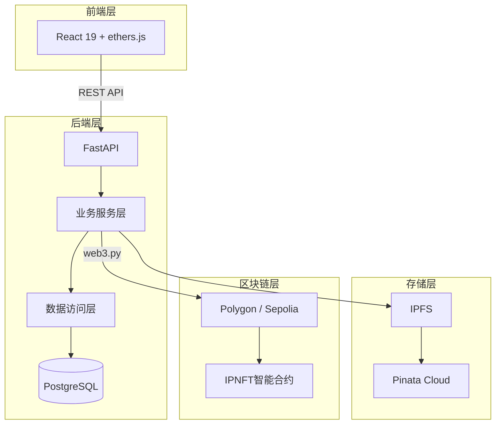
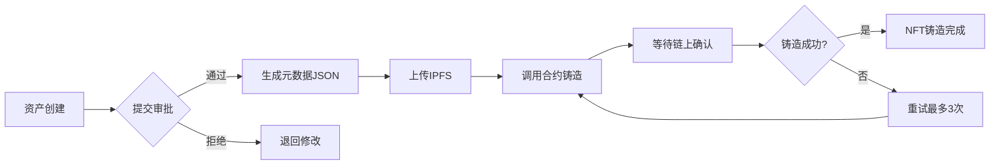
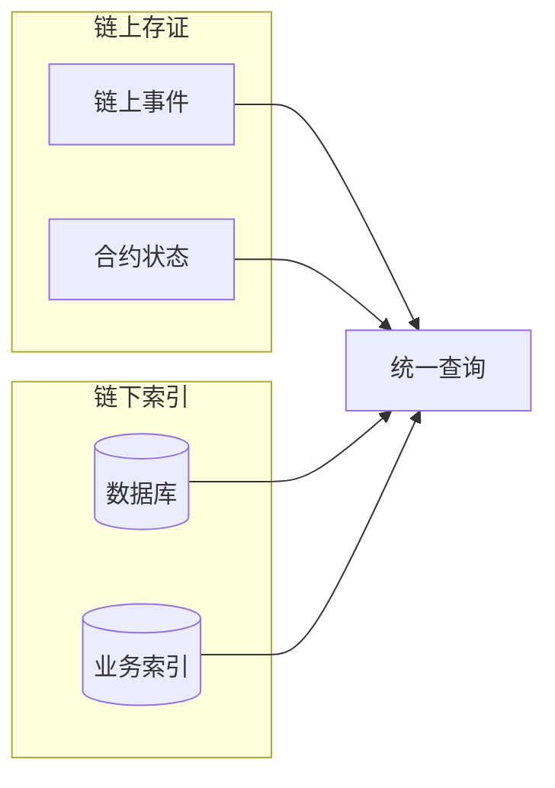

# 论文记忆 - IP-NFT 企业资产管理系统

## 元信息

| 字段 | 内容 |
|------|------|
| 项目名称 | IP-NFT 企业资产管理系统 |
| 项目路径 | C:\Users\hyperchain\Desktop\web3.0_system |
| 创建日期 | 2026-04-02 |
| 最后更新 | 2026-04-02 |
| 论文类型 | 学术论文（Web3/区块链方向） |
| 目标期刊/会议 | 待定 |
| 系统全称 | 企业级知识产权NFT管理系统（IP-NFT Management DApp） |

---

## 论文概览

### 研究主题

基于区块链的知识产权（IP）数字孪生系统，通过NFT作为IP资产的链上凭证，实现从IP登记、确权、溯源到商业化的全生命周期管理。

### 核心贡献

**（初稿，待完善）**

1. 提出基于区块链的IP资产数字孪生方法，通过`originalCreators`映射实现原创者永久溯源
2. 设计元数据与版税双向锁定机制，保障关键信息的不可篡改性
3. 设计链上链下协同溯源架构，兼顾可信性与业务可审计性
4. 实现多阶段铸造状态机，支持NFT铸造全链路实时追踪

---

## 重点讲解模块（已确定）

### 模块1：IP资产数字孪生与NFT铸造

**地位**：⭐⭐⭐ 核心业务流程，系统最重要模块

**覆盖章节**：系统设计 - IP资产数字孪生设计

**核心流程**：
```
资产创建 → 附件上传(IPFS) → 提交审批 → 审批通过 → NFT铸造(链上) → 铸造完成
```

**技术创新点**：

| 技术点 | 描述 | 创新程度 |
|--------|------|----------|
| 多阶段铸造状态机 | `mint_stage` + `mint_progress` 实时追踪铸造进度至秒级精度 | ⭐⭐⭐ |
| IPFS与区块链原子性设计 | 链下验证先行，链上铸造兜底，失败可重试 | ⭐⭐ |
| 铸造失败重试机制 | 最多3次自动重试，提升系统鲁棒性 | ⭐⭐ |
| 批量铸造Gas优化 | 单笔交易最多50个NFT，Gas费用从O(N)降到O(1) | ⭐⭐ |

**涉及技术栈**：
- 前端：React 19 + ethers.js 6
- 后端：FastAPI + SQLAlchemy 2.0 async + web3.py
- 存储：IPFS + Pinata Cloud
- 合约：IPNFT.sol (Solidity 0.8.20 + OpenZeppelin)

**核心文件**：
- 合约：`contracts/contracts/IPNFT.sol`
- 后端服务：`backend/app/services/nft_service.py`
- 后端模型：`backend/app/models/asset.py`
- 前端组件：`frontend/src/pages/NFT/*.tsx`

---

### 模块2：权属溯源与转移管理

**地位**：⭐⭐⭐ Web3核心价值体现

**覆盖章节**：系统设计 - 权属溯源机制设计

**核心功能**：

| 功能 | 描述 | 创新程度 |
|------|------|----------|
| 原创者永久溯源 | `originalCreators` mapping 永不丢失创作信息 | ⭐⭐⭐ |
| 元数据双重锁定 | `lockMetadata()` + `lockRoyalty()` 不可逆锁定 | ⭐⭐⭐ |
| 带审计日志的转移 | `transferNFT(reason)` 记录业务语义到链上事件 | ⭐⭐ |
| 可配置转移限制 | 锁定时间 + 白名单策略，防投机套利 | ⭐⭐ |
| 链上链下双轨溯源 | 链上事件不可篡改 + 链下索引丰富业务语义 | ⭐⭐⭐ |

**设计对比**：

| 特性 | 传统ERC-721 NFT | 本系统IPNFT |
|------|-----------------|-------------|
| 原创者信息 | ❌ 转移后丢失 | ✅ `originalCreators` 永久保留 |
| 元数据修改 | ✅ 可随意修改 | ✅ 锁定后不可篡改 |
| 转移原因 | ❌ 黑盒操作 | ✅ 写入链上事件 |
| 版税保护 | ❌ 无锁定机制 | ✅ 版税可锁定保护 |

**核心合约代码**：
```solidity
// 原创者永久保留
mapping(uint256 => address) public originalCreators;

// 元数据锁定
mapping(uint256 => bool) public metadataLocked;
function lockMetadata(uint256 tokenId) external onlyOriginalCreator {
    require(!metadataLocked[tokenId], "IPNFT: metadata already locked");
    metadataLocked[tokenId] = true;
}

// 带审计的转移
function transferNFT(address from, address to, uint256 tokenId, string calldata reason) 
    external nonReentrant whenNotPaused {
    // ... 转移逻辑
    emit NFTTransferredWithReason(tokenId, from, to, msg.sender, reason, block.timestamp);
}
```

**核心文件**：
- 合约：`contracts/contracts/IPNFT.sol`
- 权属服务：`backend/app/services/ownership_service.py`
- 转移记录模型：`backend/app/models/ownership.py`

---

## 进度追踪

### 论文各章节状态

| 章节 | 状态 | 备注 |
|------|------|------|
| 摘要 | 待撰写 | |
| 引言 | 待撰写 | |
| 相关工作 | 待撰写 | |
| **系统设计** | **进行中** | **重点章节，两个核心模块所在章节** |
| 实现 | 待撰写 | |
| 评估 | 待撰写 | |
| 讨论 | 待撰写 | |
| 结论 | 待撰写 | |

### 系统模块完成度

| 模块 | 完成度 | 备注 |
|------|--------|------|
| IP资产数字孪生与NFT铸造 | 60% | 需补充状态机详细分析和素材 |
| 权属溯源与转移管理 | 60% | 需补充双轨架构详细分析和素材 |
| 智能合约（IPNFT.sol） | 80% | 合约代码完整 |
| 后端服务层 | 70% | 核心服务实现完整 |
| 前端实现 | 70% | 核心页面实现完整 |
| 数据库设计 | 80% | ER图和模型完整 |

### 待完成任务

- [ ] 补充多阶段铸造状态机的详细伪代码和流程图
- [ ] 补充链上链下双轨溯源的架构图
- [ ] 整理智能合约的Gas效率对比数据
- [ ] 完善相关工作的文献调研
- [ ] 提取两个核心模块的贡献点列表

### 已完成任务

- [x] 系统架构分析
- [x] 智能合约设计模式识别
- [x] 确定重点讲解模块（模块1 + 模块2）
- [x] 核心亮点初步分析

---

## 素材库

### 架构设计

**系统整体架构图** - 见 `docs/System_Architecture_Document.md`

**前端架构** - React 19 + Zustand + ethers.js

**后端架构** - FastAPI + SQLAlchemy 2.0 async + web3.py

**合约架构** - IPNFT.sol (ERC-721 + ERC-2981 + Ownable + Pausable + ReentrancyGuard)

### 论文用架构图素材

**图1：系统整体架构图（简化版 - 适合学术论文）**



**图2：NFT铸造流程图**



**图3：权属溯源双轨架构图**



**架构图说明**：

| 层次 | 组件 | 说明 |
|------|------|------|
| 客户端层 | React前端 + ethers.js | 用户交互与区块链交互 |
| 后端服务层 | FastAPI + 业务服务 | API路由与业务逻辑 |
| 数据访问层 | Repository + PostgreSQL | 数据持久化 |
| 分布式存储层 | IPFS + Pinata | 元数据与附件存储 |
| 区块链层 | Polygon/Sepolia + IPNFT合约 | NFT铸造与权属存证 |

**核心数据流**：
1. **铸造流程**：资产创建 → IPFS存储 → 审批 → 智能合约铸造 → 链上存证
2. **溯源流程**：链上事件 + 链下索引 → 统一查询接口 → 完整溯源记录

### 设计模式

| 模式名称 | 应用场景 | 说明 |
|----------|----------|------|
| 代理模式 | 合约可升级 | UUPS代理模式（规划中） |
| 状态机模式 | NFT铸造流程 | 多阶段状态流转 |
| 仓库模式 | 数据访问层 | Repository层抽象 |
| 工厂模式 | NFT批量铸造 | batchMint工厂方法 |
| 观察者模式 | 链上事件监听 | 权属变更事件通知 |

### 核心算法/流程

**NFT铸造流程** - 详见 `docs/论文核心亮点分析.md` 3.1节

**权属转移流程** - 详见 `docs/论文核心亮点分析.md` 5.1节

**状态机流转**：
```
DRAFT → PENDING_APPROVAL → APPROVED → MINTING → MINTED
                              ↓
                          REJECTED → DRAFT (退回修改)
```

### 性能数据

| 指标 | 数值 | 说明 |
|------|------|------|
| 批量铸造上限 | 50个/批次 | 防止Gas超出限制 |
| 铸造重试次数 | 最多3次 | 可配置 |
| 交易确认等待 | 1个区块 | 可配置 |
| 铸造进度精度 | 秒级 | 通过时间戳追踪 |

### 学术表达对照

| 技术描述 | 学术表达 |
|----------|----------|
| 链上存储 | 区块链账本层持久化存储 |
| 原创者mapping | 原创者永久保留映射 |
| 元数据锁定 | 关键数据的不可篡改机制 |
| 链下索引 | 业务语义扩展索引 |
| 双重锁定 | 双向约束的不可逆操作机制 |

---

## 讨论记录

### 重要决策

| 日期 | 决策内容 | 理由 |
|------|----------|------|
| 2026-04-02 | 确定重点讲解模块：模块1(IP资产数字孪生) + 模块2(权属溯源) | 覆盖核心业务流程和Web3核心价值，涵盖智能合约+后端+数据库跨层设计 |
| 2026-04-02 | 暂不将智能合约安全设计作为独立重点模块 | 作为支撑内容而非独立章节讲解 |

### 待确认问题

- [ ] 论文目标期刊/会议未定
- [ ] 评估章节的实验设计尚未规划
- [ ] 是否需要添加对比实验（vs传统NFT平台）

### 讨论要点

- 2026-04-02：讨论了模块选择的权衡，选择了两个覆盖完整业务流程且创新点密集的模块

---

## 参考文献笔记

（待补充文献调研内容）

---

*最后更新：2026-04-02*
