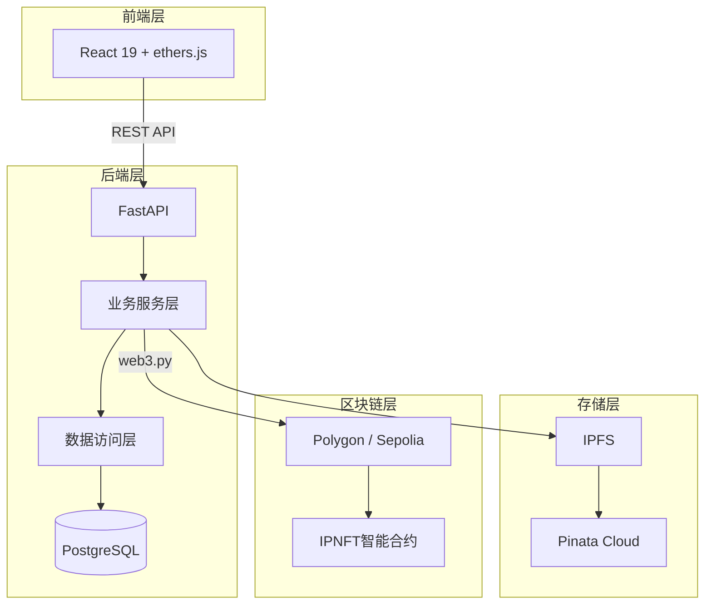
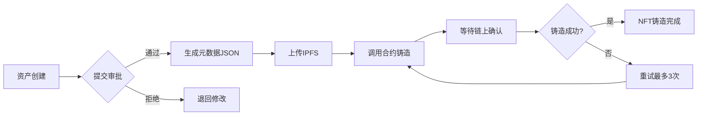
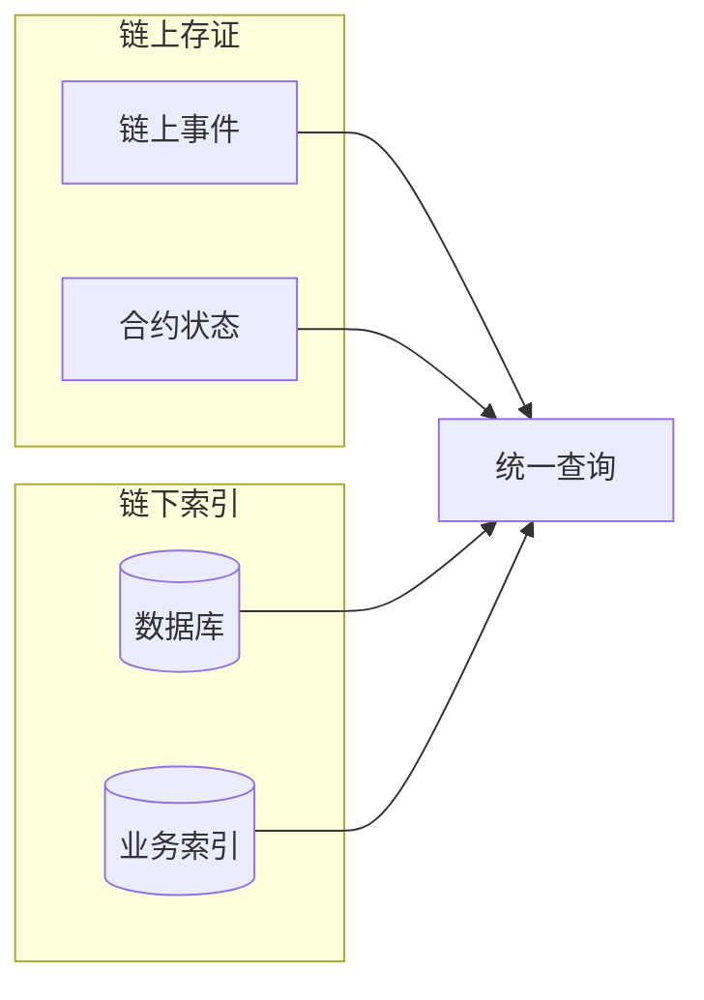
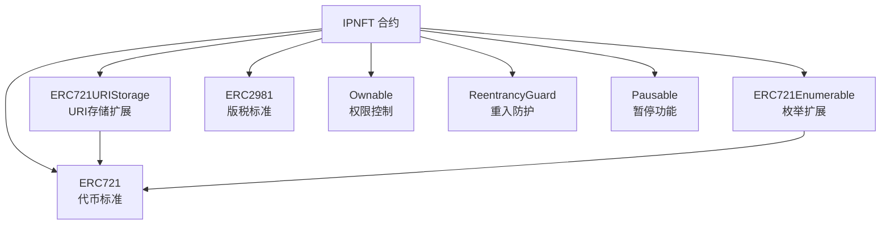
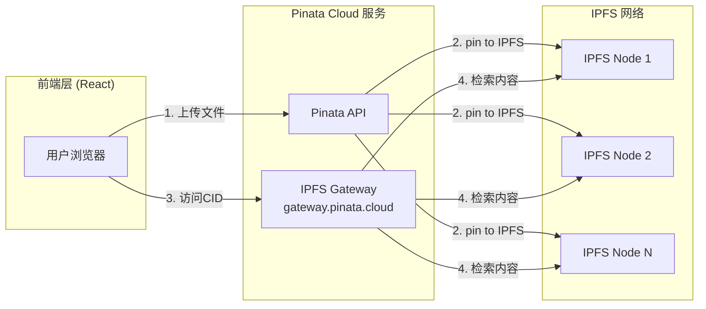
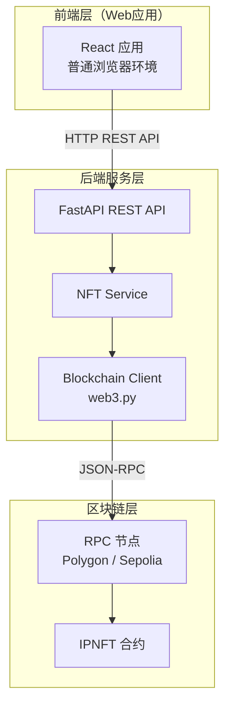
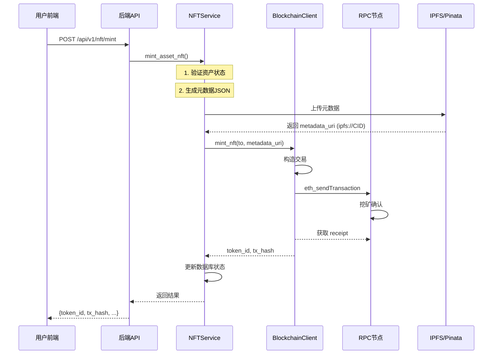
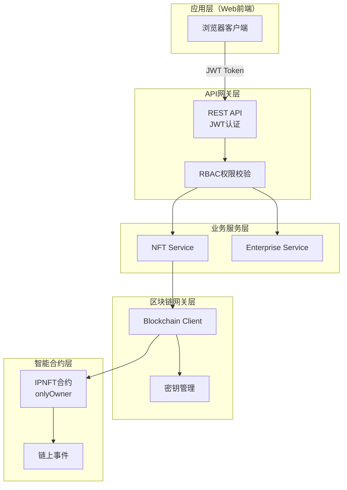

# 论文记忆 - IP-NFT 企业资产管理系统

## 元信息

| 字段 | 内容 |
|------|------|
| 项目名称 | IP-NFT 企业资产管理系统 |
| 项目路径 | C:\Users\hyperchain\Desktop\web3.0_system |
| 创建日期 | 2026-04-02 |
| 最后更新 | 2026-04-03 |
| 论文类型 | 学术论文（Web3/区块链方向） |
| 目标期刊/会议 | 待定 |
| 系统全称 | 企业级知识产权NFT管理系统（IP-NFT Management DApp） |

---

## 论文概览

### 研究主题

基于区块链的知识产权（IP）数字孪生系统，通过NFT作为IP资产的链上凭证，实现从IP登记、确权、溯源到商业化的全生命周期管理。

### 核心贡献

**（初稿，待完善）**

1. 提出基于区块链的IP资产数字孪生方法，通过`originalCreators`映射实现原创者永久溯源
2. 设计元数据与版税双向锁定机制，保障关键信息的不可篡改性
3. 设计链上链下协同溯源架构，兼顾可信性与业务可审计性
4. 实现多阶段铸造状态机，支持NFT铸造全链路实时追踪

---

## 重点讲解模块（已确定）

### 模块1：IP资产数字孪生与NFT铸造

**地位**：⭐⭐⭐ 核心业务流程，系统最重要模块

**覆盖章节**：系统设计 - IP资产数字孪生设计

**核心流程**：
```
资产创建 → 附件上传(IPFS) → 提交审批 → 审批通过 → NFT铸造(链上) → 铸造完成
```

**技术创新点**：

| 技术点 | 描述 | 创新程度 |
|--------|------|----------|
| 多阶段铸造状态机 | `mint_stage` + `mint_progress` 实时追踪铸造进度至秒级精度 | ⭐⭐⭐ |
| IPFS与区块链原子性设计 | 链下验证先行，链上铸造兜底，失败可重试 | ⭐⭐ |
| 铸造失败重试机制 | 最多3次自动重试，提升系统鲁棒性 | ⭐⭐ |
| 批量铸造Gas优化 | 单笔交易最多50个NFT，Gas费用从O(N)降到O(1) | ⭐⭐ |

**涉及技术栈**：
- 前端：React 19 + ethers.js 6
- 后端：FastAPI + SQLAlchemy 2.0 async + web3.py
- 存储：IPFS + Pinata Cloud
- 合约：IPNFT.sol (Solidity 0.8.20 + OpenZeppelin)

**核心文件**：
- 合约：`contracts/contracts/IPNFT.sol`
- 后端服务：`backend/app/services/nft_service.py`
- 后端模型：`backend/app/models/asset.py`
- 前端组件：`frontend/src/pages/NFT/*.tsx`

---

### 模块2：权属溯源与转移管理

**地位**：⭐⭐⭐ Web3核心价值体现

**覆盖章节**：系统设计 - 权属溯源机制设计

**核心功能**：

| 功能 | 描述 | 创新程度 |
|------|------|----------|
| 原创者永久溯源 | `originalCreators` mapping 永不丢失创作信息 | ⭐⭐⭐ |
| 元数据双重锁定 | `lockMetadata()` + `lockRoyalty()` 不可逆锁定 | ⭐⭐⭐ |
| 带审计日志的转移 | `transferNFT(reason)` 记录业务语义到链上事件 | ⭐⭐ |
| 可配置转移限制 | 锁定时间 + 白名单策略，防投机套利 | ⭐⭐ |
| 链上链下双轨溯源 | 链上事件不可篡改 + 链下索引丰富业务语义 | ⭐⭐⭐ |

**设计对比**：

| 特性 | 传统ERC-721 NFT | 本系统IPNFT |
|------|-----------------|-------------|
| 原创者信息 | ❌ 转移后丢失 | ✅ `originalCreators` 永久保留 |
| 元数据修改 | ✅ 可随意修改 | ✅ 锁定后不可篡改 |
| 转移原因 | ❌ 黑盒操作 | ✅ 写入链上事件 |
| 版税保护 | ❌ 无锁定机制 | ✅ 版税可锁定保护 |

**核心合约代码**：
```solidity
// 原创者永久保留
mapping(uint256 => address) public originalCreators;

// 元数据锁定
mapping(uint256 => bool) public metadataLocked;
function lockMetadata(uint256 tokenId) external onlyOriginalCreator {
    require(!metadataLocked[tokenId], "IPNFT: metadata already locked");
    metadataLocked[tokenId] = true;
}

// 带审计的转移
function transferNFT(address from, address to, uint256 tokenId, string calldata reason) 
    external nonReentrant whenNotPaused {
    // ... 转移逻辑
    emit NFTTransferredWithReason(tokenId, from, to, msg.sender, reason, block.timestamp);
}
```

**核心文件**：
- 合约：`contracts/contracts/IPNFT.sol`
- 权属服务：`backend/app/services/ownership_service.py`
- 转移记录模型：`backend/app/models/ownership.py`

---

## 进度追踪

### 论文各章节状态

| 章节 | 状态 | 备注 |
|------|------|------|
| 摘要 | 待撰写 | |
| 引言 | 待撰写 | |
| **相关工作** | **进行中** | **第2章技术理论，待完善2.4节** |
| **第2章 2.1-2.3节** | **✅素材完成** | **2.1区块链、2.2存储、2.3身份已完成素材提取** |
| **第3章 需求分析** | **✅素材完成** | **3.1业务场景、3.2非功能需求、3.3角色权限模型已提取** |
| **系统设计** | **进行中** | **重点章节，两个核心模块所在章节** |
| 实现 | 待撰写 | |
| 评估 | 待撰写 | |
| 讨论 | 待撰写 | |
| 结论 | 待撰写 | |

### 系统模块完成度

| 模块 | 完成度 | 备注 |
|------|--------|------|
| IP资产数字孪生与NFT铸造 | ✅ 95% | 素材已完整提取至 `module-1-minting.md` |
| 权属溯源与转移管理 | ✅ 95% | 素材已完整提取至 `module-2-ownership.md` |
| 智能合约（IPNFT.sol） | 80% | 合约代码完整 |
| 后端服务层 | 70% | 核心服务实现完整 |
| 前端实现 | 70% | 核心页面实现完整 |
| 数据库设计 | 80% | ER图和模型完整 |

### 待完成任务

- [x] 补充多阶段铸造状态机的详细伪代码和流程图
- [x] 整理模块1（IP资产数字孪生与NFT铸造）完整素材
- [x] 补充链上链下双轨溯源的架构图
- [x] 整理模块2（权属溯源与转移管理）完整素材
- [ ] 整理智能合约的Gas效率对比数据
- [ ] 完善相关工作的文献调研
- [x] 提取模块1的贡献点列表
- [x] 提取模块2的贡献点列表
- [ ] 整理智能合约的Gas效率对比数据

### 已完成任务

- [x] 系统架构分析
- [x] 智能合约设计模式识别
- [x] 确定重点讲解模块（模块1 + 模块2）
- [x] 核心亮点初步分析

---

## 素材库

### 架构设计

**系统整体架构图** - 见 `docs/System_Architecture_Document.md`

**前端架构** - React 19 + Zustand + ethers.js

**后端架构** - FastAPI + SQLAlchemy 2.0 async + web3.py

**合约架构** - IPNFT.sol (ERC-721 + ERC-2981 + Ownable + Pausable + ReentrancyGuard)

### 论文用架构图素材

**图1：系统整体架构图（简化版 - 适合学术论文）**



**图2：NFT铸造流程图**



**图3：权属溯源双轨架构图**



**架构图说明**：

| 层次 | 组件 | 说明 |
|------|------|------|
| 客户端层 | React前端 + ethers.js | 用户交互与区块链交互 |
| 后端服务层 | FastAPI + 业务服务 | API路由与业务逻辑 |
| 数据访问层 | Repository + PostgreSQL | 数据持久化 |
| 分布式存储层 | IPFS + Pinata | 元数据与附件存储 |
| 区块链层 | Polygon/Sepolia + IPNFT合约 | NFT铸造与权属存证 |

**核心数据流**：
1. **铸造流程**：资产创建 → IPFS存储 → 审批 → 智能合约铸造 → 链上存证
2. **溯源流程**：链上事件 + 链下索引 → 统一查询接口 → 完整溯源记录

### 设计模式

| 模式名称 | 应用场景 | 说明 |
|----------|----------|------|
| 代理模式 | 合约可升级 | UUPS代理模式（规划中） |
| 状态机模式 | NFT铸造流程 | 多阶段状态流转 |
| 仓库模式 | 数据访问层 | Repository层抽象 |
| 工厂模式 | NFT批量铸造 | batchMint工厂方法 |
| 观察者模式 | 链上事件监听 | 权属变更事件通知 |

### 核心算法/流程

**NFT铸造流程** - 详见 `docs/论文核心亮点分析.md` 3.1节

**权属转移流程** - 详见 `docs/论文核心亮点分析.md` 5.1节

**状态机流转**：
```
DRAFT → PENDING_APPROVAL → APPROVED → MINTING → MINTED
                              ↓
                          REJECTED → DRAFT (退回修改)
```

### 性能数据

| 指标 | 数值 | 说明 |
|------|------|------|
| 批量铸造上限 | 50个/批次 | 防止Gas超出限制 |
| 铸造重试次数 | 最多3次 | 可配置 |
| 交易确认等待 | 1个区块 | 可配置 |
| 铸造进度精度 | 秒级 | 通过时间戳追踪 |

### 学术表达对照

| 技术描述 | 学术表达 |
|----------|----------|
| 链上存储 | 区块链账本层持久化存储 |
| 原创者mapping | 原创者永久保留映射 |
| 元数据锁定 | 关键数据的不可篡改机制 |
| 链下索引 | 业务语义扩展索引 |
| 双重锁定 | 双向约束的不可逆操作机制 |

---

## 第2章 技术理论基础素材

### 2.1 区块链与智能合约原理

#### 2.1.1 以太坊与EVM架构

**技术原理：**
- Ethereum Virtual Machine (EVM) 是运行智能合约的图灵完备虚拟机
- 账户模型：EOA (外部拥有账户) 与 CA (合约账户) 两种类型
- 状态存储：世界状态 (World State) 包含所有账户的键值对映射
- 交易类型：创建合约与调用合约两类交易

**本系统实现：**
```solidity
// IPNFT.sol - 合约继承结构
contract IPNFT is 
    ERC721,           // 代币标准
    ERC721URIStorage, // 元数据存储扩展
    ERC721Enumerable, // 代币枚举扩展
    ERC2981,          // 版税标准
    Ownable,          // 所有权控制
    ReentrancyGuard,  // 重入攻击防护
    Pausable          // 紧急暂停功能
```

**合约继承层次图（Mermaid）：**


#### 2.1.2 ERC标准体系

**ERC-721 Non-Fungible Token 标准：**
- `tokenURI()` - 返回元数据URI
- `mint()` / `burn()` - 铸造与销毁
- `transferFrom()` / `safeTransferFrom()` - 所有权转移
- `balanceOf()` / `ownerOf()` - 余额与所有者查询

**ERC-2981 NFT 版税标准：**
```solidity
// 设置代币版税信息
function mintWithRoyalty(
    address to, 
    string memory metadataURI,
    address royaltyReceiver,
    uint96 royaltyFeeNumerator  // _basis points (500 = 5%)
) external returns (uint256)
```

**本系统扩展的标准接口：**
| 接口 | 功能 | 学术描述 |
|------|------|----------|
| `originalCreators[tokenId]` | 原创者追踪 | 创作归属的永久性映射机制 |
| `metadataLocked[tokenId]` | 元数据锁定 | 关键信息的不可篡改保证 |
| `transferNFT(..., reason)` | 带审计的转移 | 业务语义可追溯的转移凭证 |

#### 2.1.3 智能合约安全机制

**本系统采用的安全模式：**

| 安全机制 | 实现方式 | 防护目标 |
|----------|----------|----------|
| 重入锁 (ReentrancyGuard) | `nonReentrant` 修饰符 | 重入攻击 |
| 所有权控制 (Ownable) | `onlyOwner` 修饰符 | 未授权访问 |
| 暂停机制 (Pausable) | `whenNotPaused` 修饰符 | 紧急停止 |
| 输入验证 | `require` 语句 | 无效输入 |
| 转移限制 | `transferLockTime` + 白名单 | 投机行为防护 |

**关键安全代码示例：**
```solidity
// 原创者验证 - 永久保留创作归属
function lockMetadata(uint256 tokenId) external {
    require(msg.sender == originalCreators[tokenId], "IPNFT: only creator can lock");
    require(!metadataLocked[tokenId], "IPNFT: metadata already locked");
    metadataLocked[tokenId] = true;
    emit MetadataLocked(tokenId, msg.sender);
}

// 转移限制 - 时间锁 + 白名单
function _update(address to, uint256 tokenId, address auth) 
    internal override(ERC721, ERC721Enumerable) returns (address) {
    address from = _ownerOf(tokenId);
    if (from != address(0) && to != address(0)) {
        require(
            block.timestamp >= mintTimestamps[tokenId] + transferLockTime,
            "IPNFT: transfer lock time not expired"
        );
        if (transferWhitelistEnabled) {
            require(transferWhitelist[to], "IPNFT: recipient not whitelisted");
        }
    }
    // ...
}
```

---

### 2.2 分布式存储技术

#### 2.2.1 IPFS原理与架构

**星际文件系统 (IPFS) 核心概念：**
- **内容寻址 (Content Addressing)**：使用 Cryptographic Hash (CID) 唯一标识数据
- **Merkle DAG**：有向无环图结构，支持高效去重与验证
- **分布式路由**：基于 Kademlia 的 DHT (分布式哈希表) 路由
- **Bitswap 协议**：高效的块交换机制

**CID (Content Identifier) 特性：**
| 特性 | 学术描述 | 本系统应用 |
|------|----------|------------|
| 唯一性 | 内容密码学哈希保证全局唯一 | 每个IP资产对应唯一CID |
| 可验证 | 哈希校验确保数据完整性 | 上传后自动验证CID匹配 |
| 不可篡改 | 内容变化导致CID变化 | 保障IP元数据的真实性 |

#### 2.2.2 Pinata Cloud网关服务

**本系统存储架构：**



**前端IPFS上传实现 (ipfs.ts)：**
```typescript
// Pinata SDK 上传文件
export async function uploadFile(file: File, name?: string): Promise<IPFSUploadResult> {
  const client = getPinataClient();
  const result = await client.upload.public.file(file);
  
  return {
    cid: result.cid,
    size: result.size || 0,
    timestamp: new Date().toISOString(),
    gatewayUrl: `${PINATA_GATEWAY_URL}/${result.cid}`,
    name: name || file.name,
  };
}

// 上传JSON元数据
export async function uploadJSON(
  data: unknown,
  name: string = 'data.json',
  metadata?: Record<string, unknown>
): Promise<IPFSUploadResult> {
  const client = getPinataClient();
  const result = await client.upload.public.json({
    content: data,
    metadata: metadata ? { name, keyvalues: metadata } : { name },
  });
  // ...
}
```

**后端IPFS封装 (ipfs.py)：**
```python
class IPFSClient:
    """线程安全的IPFS客户端"""
    
    @retry_on_error(max_retries=MAX_RETRIES, exceptions=(IPFSConnectionError, IPFSError))
    def upload_file(self, file_content: bytes, file_name: str) -> str:
        """使用重试逻辑上传文件"""
        self._check_file_size(file_content)
        client = self._get_client()
        result = client.add_bytes(file_content)
        return result  # 返回 CID
    
    def verify_cid(self, cid: str, file_content: bytes) -> bool:
        """验证CID与内容匹配性"""
        client = self._get_client()
        computed_cid = client.add_bytes(file_content, only_hash=True)
        return computed_cid == cid
```

#### 2.2.3 链下存储的必要性分析

**存储权衡对比表：**

| 维度 | 链上存储 | 链下存储(IPFS) |
|------|----------|----------------|
| 存储成本 | 高 (Gas费用按字节计) | 低 (Pinata固定费用) |
| 访问速度 | 慢 (需要调用合约) | 快 (CDN加速网关) |
| 数据大小 | 受限 (KB级) | 大 (支持GB级) |
| 持久性 | 永久 (区块链保证) | 依赖Pinning服务 |
| 隐私性 | 低 (完全公开) | 可控 (私有网关) |

**本系统的存储策略：**
- **链上存储**：Token ID、原创者地址、版税信息、锁定状态、转移记录
- **链下存储**：IP元数据JSON、附件文件、版权证书扫描件

---

### 2.3 Web3交互架构与身份管理

#### 2.3.1 后端网关模式（Backend Gateway Architecture）

**架构概述：**

本系统采用**后端网关模式**进行区块链交互。与用户直接通过钱包连接前端的模式不同，本系统的前端应用作为普通Web客户端，通过REST API与后端服务通信，后端统一处理所有区块链操作。



**核心组件：**

| 组件 | 技术实现 | 职责 |
|------|----------|------|
| BlockchainClient | web3.py | 封装所有区块链交互逻辑 |
| NFTService | Python async | 业务逻辑编排与状态管理 |
| RPC Provider | HTTPProvider | 连接区块链节点 |
| Deployer Account | ECDSA私钥 | 签署交易、执行合约调用 |

**BlockchainClient 核心实现 (blockchain.py)：**
```python
class BlockchainClient:
    """区块链交互客户端"""
    
    def __init__(self, provider_url: str = None):
        self.provider_url = provider_url or settings.WEB3_PROVIDER_URL
        self.w3 = Web3(Web3.HTTPProvider(self.provider_url))
        self.deployer_address = settings.DEPLOYER_ADDRESS
        self._deployer_account = Account.from_key(settings.DEPLOYER_PRIVATE_KEY)
    
    async def mint_nft(self, to_address: str, metadata_uri: str, ...) -> tuple:
        """铸造NFT - 后端代表用户执行"""
        contract = self._get_contract()
        tx_hash = contract.functions.mint(to_address, metadata_uri).transact({
            'from': self.deployer_address  # 后端账户签署
        })
        receipt = self.w3.eth.wait_for_transaction_receipt(tx_hash)
        return token_id, tx_hash.hex()
```

#### 2.3.2 NFT铸造流程（后端网关模式）

**完整铸造时序：**



**地址解析优先级：**

后端支持三种方式指定NFT接收地址，按以下优先级解析：

```python
async def _resolve_minter_address(self, asset: Asset, requested_address: Optional[str]) -> str:
    # 优先级1: 请求参数指定
    if requested_address:
        return requested_address
    
    # 优先级2: 企业绑定钱包
    enterprise = await self.db.get(Enterprise, asset.enterprise_id)
    if enterprise and enterprise.wallet_address:
        return enterprise.wallet_address
    
    # 优先级3: 系统部署者账户
    return get_blockchain_client().deployer_address
```

#### 2.3.3 可选的签名验证机制

**签名验证作为可选增强：**

本系统支持在铸造时携带钱包签名信息，但**不强制要求**。签名验证采用EIP-191标准：

```python
def _verify_wallet_signature(
    wallet_address: str,
    signature: Optional[str],
    message: Optional[str],
) -> bool:
    """验证钱包签名（可选功能）"""
    if not signature or not message:
        return False
    
    # EIP-191 消息编码
    message_hash = encode_defunct(text=message)
    
    # 恢复签名者地址
    recovered_address = Web3().eth.account.recover_message(
        message_hash, 
        signature=signature
    )
    
    return recovered_address.lower() == wallet_address.lower()
```

**API请求示例：**
```python
class MintRequest(BaseModel):
    minter_address: Optional[str] = None      # NFT接收地址
    royalty_receiver: Optional[str] = None   # 版税接收人
    royalty_fee_bps: Optional[int] = None      # 版税比例(基点)
    signed_message: Optional[str] = None      # 签名原文（可选）
    wallet_signature: Optional[str] = None     # 签名值（可选）
```

#### 2.3.4 RBAC (基于角色的访问控制) 模型

**企业成员角色层级：**

| 角色 | 权限范围 | 学术描述 |
|------|----------|----------|
| Owner | 企业全部权限 + 转让所有权 | 最高信任级别的所有权主体 |
| Admin | 成员管理 + 核心业务操作 | 委托管理权限的受托方 |
| Member | 资产创建与编辑 | 业务操作权限的持有者 |
| Viewer | 只读访问 | 最低权限的知情权主体 |

**权限矩阵（企业业务层）：**

| 操作类型 | Owner | Admin | Member | Viewer |
|----------|:-----:|:-----:|:------:|:------:|
| 创建企业 | ✅ | - | - | - |
| 删除企业 | ✅ | - | - | - |
| 邀请/移除成员 | ✅ | ✅ | - | - |
| 创建资产 | ✅ | ✅ | ✅ | - |
| 编辑资产 | ✅ | ✅ | ✅ | - |
| 铸造NFT | ✅ | ✅ | - | - |
| 转移NFT | ✅ | ✅ | - | - |
| 查看资产 | ✅ | ✅ | ✅ | ✅ |

**智能合约层权限控制：**

```solidity
// 铸造权限控制 - 仅合约Owner可调用
function mint(address to, string memory metadataURI) 
    external 
    onlyOwner        // 合约所有权修饰符
    whenNotPaused    // 暂停状态检查
    nonReentrant     // 重入攻击防护
    returns (uint256)
{ ... }

// 原创者专属操作 - 元数据锁定
function lockMetadata(uint256 tokenId) external {
    require(
        msg.sender == originalCreators[tokenId], 
        "IPNFT: only creator can lock"
    );
    metadataLocked[tokenId] = true;
}

// 版税锁定 - 原创者可永久锁定版税信息
function lockRoyalty(uint256 tokenId) external {
    require(msg.sender == originalCreators[tokenId], "IPNFT: only creator can lock");
    royaltyLocked[tokenId] = true;
}
```

#### 2.3.5 身份与访问控制架构总览

**本系统的分层安全架构：**



**安全特性：**

| 特性 | 实现方式 | 学术描述 |
|------|----------|----------|
| 密钥隔离 | 后端统一管理私钥 | 委托代理模式降低密钥泄露风险 |
| 角色分离 | RBAC四级角色模型 | 最小权限原则的业务授权 |
| 合约权控 | onlyOwner等修饰符 | 智能合约层面的访问控制 |
| 事件审计 | 链上事件不可篡改 | 可验证的操作存证 |
| 原子性保证 | 事务回滚机制 | 链上链下状态一致性 |

---

## 学术表达对照表（扩展）

| 代码/技术描述 | 学术论文表达 |
|---------------|-------------|
| EVM | 以太坊虚拟机（去中心化计算平台） |
| 合约继承多层 | 模块化可组合扩展架构 |
| ReentrancyGuard | 重入攻击防护机制 |
| IPFS CID | 内容寻址标识符（基于密码学哈希） |
| Pinata Gateway | 分布式存储网关服务 |
| 后端网关模式 | 委托代理模式区块链交互架构 |
| web3.py | Python区块链交互库 |
| 部署者账户 | 系统操作权限账户 |
| 签名验证（可选） | 基于椭圆曲线密码学的所有权证明 |
| RBAC | 基于角色的访问控制模型 |
| onlyOwner修饰符 | 所有权验证机制 |
| 链上事件 | 可验证的状态变更日志 |

---

## 讨论记录

### 重要决策

| 日期 | 决策内容 | 理由 |
|------|----------|------|
| 2026-04-02 | 确定重点讲解模块：模块1(IP资产数字孪生) + 模块2(权属溯源) | 覆盖核心业务流程和Web3核心价值，涵盖智能合约+后端+数据库跨层设计 |
| 2026-04-02 | 暂不将智能合约安全设计作为独立重点模块 | 作为支撑内容而非独立章节讲解 |

### 待确认问题

- [ ] 论文目标期刊/会议未定
- [ ] 评估章节的实验设计尚未规划
- [ ] 是否需要添加对比实验（vs传统NFT平台）

### 讨论要点

- 2026-04-02：讨论了模块选择的权衡，选择了两个覆盖完整业务流程且创新点密集的模块
- 2026-04-03：修正2.3节内容 - 本系统采用后端网关架构（Backend Gateway Mode）进行区块链交互，前端为普通Web应用不直接连接区块链
- 2026-04-03：完成第3章需求分析素材提取 - 包含完整业务场景、状态机、审批流程、RBAC权限模型

---

## 参考文献笔记

（待补充文献调研内容）

---

*最后更新：2026-04-05*
